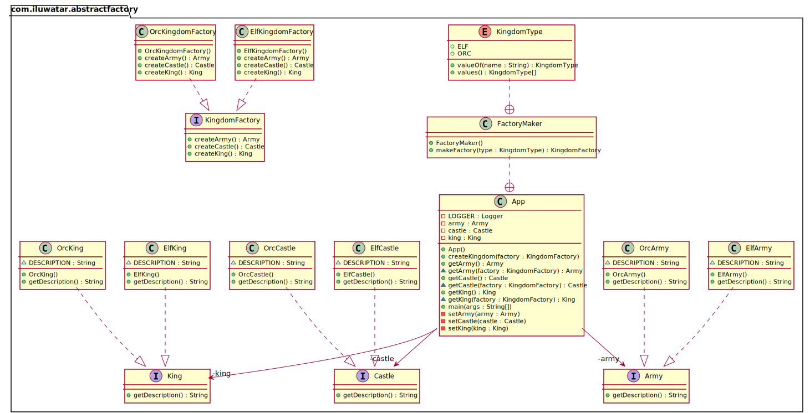

## Also known as

- Kit

## Intent

Provide an interface for creating families of related or dependent objects
without specifying their concrete classes.

## Explanation

Real-world example

> To create a kingdom we need objects with a common theme. The elven kingdom
> needs an elven king, elven castle, and elven army whereas the orcish kingdom
> needs an orcish king, orcish castle, and orcish army. There is a dependency
> between the objects in the kingdom.

In plain words

> A factory of factories; a factory that groups the individual but
> related/dependent factories together without specifying their concrete
> classes.

Wikipedia says

> The abstract factory pattern provides a way to encapsulate a group of
> individual factories that have a common theme without specifying their
> concrete classes

**Programmatic Example**

Translating the kingdom example above. First of all, we have some interfaces and
implementation for the objects in the kingdom.

```kotlin
internal interface Castle {
  val description: String
}

internal interface King {
  val description: String
}

internal interface Army {
  val description: String
}

// Elven implementations ->

internal class ElfCastle : Castle {
  override val description = "This is the elven castle!"
}

internal class ElfKing : King {
  override val description = "This is the elven king!"
}

internal class ElfArmy : Army {
  override val description = "This is the elven army!"
}

// Orcish implementations similarly -> ...
```

Then we have the abstraction and implementations for the kingdom factory.

```kotlin
internal interface KingdomFactory {
  fun createCastle(): Castle
  fun createKing(): King
  fun createArmy(): Army
}

internal class ElfKingdomFactory : KingdomFactory {
  override fun createCastle() = ElfCastle()
  override fun createKing() = ElfKing()
  override fun createArmy() = ElfArmy()
}

internal class OrcKingdomFactory : KingdomFactory {
  override fun createCastle() = OrcCastle()
  override fun createKing() = OrcKing()
  override fun createArmy() = OrcArmy()
}
```

Now we have the abstract factory that lets us make a family of related objects
i.e. elven kingdom factory creates elven castle, king and army, etc.

```kotlin
val factory = ElfKingdomFactory()
val castle = factory.createCastle()
val king = factory.createKing()
val army = factory.createArmy()

castle.description
king.description
army.description
```

Program output:

```shell
This is the elven castle!
This is the elven king!
This is the elven Army!
```

Now, we can design a factory for our different kingdom factories. In this
example, we created `FactoryMaker`, responsible for returning an instance of
either `ElfKingdomFactory` or `OrcKingdomFactory`.  
The client can use `FactoryMaker` to create the desired concrete factory which,
in turn, will produce different concrete objects (derived from `Army`, `King`,
`Castle`).  
In this example, we also used an enum to parameterize which type of kingdom
factory the client will ask for.

```kotlin
internal data class Kingdom(
  val king: King,
  val castle: Castle,
  val army: Army,
) {
  object FactoryMaker {
    enum class KingdomType {
      ELF,
      ORC
    }
    
    fun makeFactory(type: KingdomType): KingdomFactory {
      return when (type) {
        KingdomType.ELF -> ElfKingdomFactory()
        KingdomType.ORC -> OrcKingdomFactory()
      }
    }
  }
}
```

Now we can use the abstract factory to create the kingdoms

```kotlin
logger.info("elf kingdom")
val elfKingdom = createKingdom(KingdomType.ELF)
logger.info(elfKingdom.army.description)
logger.info(elfKingdom.castle.description)
logger.info(elfKingdom.king.description)

logger.info("orc kingdom")
val orcKingdom = createKingdom(KingdomType.ORC)
logger.info(orcKingdom.army.description)
logger.info(orcKingdom.castle.description)
logger.info(orcKingdom.king.description)
```

Program output:

```shell
elf kingdom
This is the elven castle!
This is the elven king!
This is the elven Army!
orc kingdom
This is the orc castle!
This is the orc king!
This is the orc Army!
```

## Class diagram



## Applicability

Use the Abstract Factory pattern when

* The system should be independent of how its products are created, composed,
  and represented
* The system should be configured with one of the multiple families of products
* The family of related product objects is designed to be used together, and
  you need to enforce this constraint
* You want to provide a class library of products, and you want to reveal just
  their interfaces, not their implementations
* The lifetime of the dependency is conceptually shorter than the lifetime of
  the consumer.
* You need a run-time value to construct a particular dependency
* You want to decide which product to call from a family at runtime.
* You need to supply one or more parameters only known at run-time before you
  can resolve a dependency.
* When you need consistency among products
* You don’t want to change existing code when adding new products or families of
  products to the program.

Example use cases

* Selecting to call to the appropriate implementation of FileSystemAcmeService
  or DatabaseAcmeService or NetworkAcmeService at runtime.
* Unit test case writing becomes much easier
* UI tools for different OS

## Consequences

* Dependency injection in java hides the service class dependencies that can
  lead to runtime errors that would have been caught at compile time.
* While the pattern is great when creating predefined objects, adding the new
  ones might be challenging.
* The code becomes more complicated than it should be since a lot of new
  interfaces and classes are introduced along with the pattern.

## Tutorials

* [Abstract Factory Pattern Tutorial](https://www.journaldev.com/1418/abstract-factory-design-pattern-in-java)

## Related patterns

* [Factory Method](../factory-method/README.md)
* Factory Kit

[//]: # (TODO: link after adding the pattern)

## Credits

* [Design Patterns: Elements of Reusable Object-Oriented Software](https://www.amazon.com/gp/product/0201633612/ref=as_li_tl?ie=UTF8&camp=1789&creative=9325&creativeASIN=0201633612&linkCode=as2&tag=javadesignpat-20&linkId=675d49790ce11db99d90bde47f1aeb59)
* [Head First Design Patterns: A Brain-Friendly Guide](https://www.amazon.com/gp/product/0596007124/ref=as_li_tl?ie=UTF8&camp=1789&creative=9325&creativeASIN=0596007124&linkCode=as2&tag=javadesignpat-20&linkId=6b8b6eea86021af6c8e3cd3fc382cb5b)
