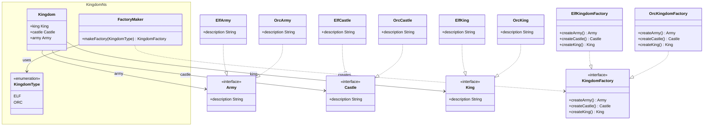

## Also known as

- Kit

## Intent

Provide an interface for creating families of related
or dependent objects without specifying their concrete
classes.

## Explanation

### Real-world example

> To create a kingdom we need objects with a common
> theme. The elven kingdom needs an elven king, elven
> castle, and elven army whereas the orcish kingdom
> needs an orcish king, orcish castle, and orcish army.
> There is a dependency between the objects in the
> kingdom.

### In plain words

> A factory of factories; a factory that groups the
> individual but related/dependent factories together
> without specifying their concrete classes.

### Wikipedia says

> The abstract factory pattern provides a way to
> encapsulate a group of individual factories that have
> a common theme without specifying their concrete
> classes.

### **Programmatic Example**

Translating the kingdom example above. First of all,
we have some interfaces and implementations for the
objects in the kingdom.

```kotlin
internal interface Castle {
    val description: String
}

internal interface King {
    val description: String
}

internal interface Army {
    val description: String
}

// Elven implementations ->

internal class ElfCastle : Castle {
    override val description = "This is the elven castle!"
}

internal class ElfKing : King {
    override val description = "This is the elven king!"
}

internal class ElfArmy : Army {
    override val description = "This is the elven army!"
}

// Orcish implementations similarly -> ...
```

Then we have the abstraction and implementations for
the kingdom factory.

```kotlin
internal interface KingdomFactory {
    fun createCastle(): Castle
    fun createKing(): King
    fun createArmy(): Army
}

internal class ElfKingdomFactory : KingdomFactory {
    override fun createCastle() = ElfCastle()
    override fun createKing() = ElfKing()
    override fun createArmy() = ElfArmy()
}

internal class OrcKingdomFactory : KingdomFactory {
    override fun createCastle() = OrcCastle()
    override fun createKing() = OrcKing()
    override fun createArmy() = OrcArmy()
}
```

Now we have the abstract factory that lets us make a
family of related objects -- the elven kingdom factory
creates elven castle, king and army, etc.

```kotlin
val factory = ElfKingdomFactory()
val castle = factory.createCastle()
val king = factory.createKing()
val army = factory.createArmy()

castle.description
king.description
army.description
```

Program output:

```text
This is the elven castle!
This is the elven king!
This is the elven army!
```

We also created a `FactoryMaker`, responsible for
returning an instance of either `ElfKingdomFactory` or
`OrcKingdomFactory`. The client can use `FactoryMaker`
to create the desired concrete factory which, in turn,
will produce different concrete objects (derived from
`Army`, `King`, `Castle`). We also used an enum to
parameterize which type of kingdom factory the client
will ask for.

```kotlin
internal data class Kingdom(
    val king: King,
    val castle: Castle,
    val army: Army,
) {
    object FactoryMaker {
        enum class KingdomType {
            ELF,
            ORC,
        }

        fun makeFactory(type: KingdomType): KingdomFactory =
            when (type) {
                KingdomType.ELF -> ElfKingdomFactory()
                KingdomType.ORC -> OrcKingdomFactory()
            }
    }
}
```

Now we can use the abstract factory to create the
kingdoms:

```kotlin
logger.info("elf kingdom")
val elfKingdom = createKingdom(KingdomType.ELF)
logger.info(elfKingdom.army.description)
logger.info(elfKingdom.castle.description)
logger.info(elfKingdom.king.description)

logger.info("orc kingdom")
val orcKingdom = createKingdom(KingdomType.ORC)
logger.info(orcKingdom.army.description)
logger.info(orcKingdom.castle.description)
logger.info(orcKingdom.king.description)
```

Program output:

```text
elf kingdom
This is the elven army!
This is the elven castle!
This is the elven king!
orc kingdom
This is the orc army!
This is the orc castle!
This is the orc king!
```

## Class diagram


```mermaid
classDiagram
    namespace KingdomNs {
        class Kingdom {
            +king King
            +castle Castle
            +army Army
        }
        class FactoryMaker {
            +makeFactory(KingdomType) KingdomFactory
        }
        class KingdomType {
            <<enumeration>>
            ELF
            ORC
        }
    }
    class Army {
        <<interface>>
        +description String
    }
    class Castle {
        <<interface>>
        +description String
    }
    class King {
        <<interface>>
        +description String
    }
    class KingdomFactory {
        <<interface>>
        +createArmy() Army
        +createCastle() Castle
        +createKing() King
    }
    class ElfArmy {
        +description String
    }
    class ElfCastle {
        +description String
    }
    class ElfKing {
        +description String
    }
    class ElfKingdomFactory {
        +createArmy() Army
        +createCastle() Castle
        +createKing() King
    }
    class OrcArmy {
        +description String
    }
    class OrcCastle {
        +description String
    }
    class OrcKing {
        +description String
    }
    class OrcKingdomFactory {
        +createArmy() Army
        +createCastle() Castle
        +createKing() King
    }
    FactoryMaker ..> KingdomFactory : creates
    FactoryMaker --> KingdomType : uses
    Kingdom --> King : king
    Kingdom --> Castle : castle
    Kingdom --> Army : army
    ElfArmy ..|> Army
    ElfCastle ..|> Castle
    ElfKing ..|> King
    ElfKingdomFactory ..|> KingdomFactory
    OrcArmy ..|> Army
    OrcCastle ..|> Castle
    OrcKing ..|> King
    OrcKingdomFactory ..|> KingdomFactory
```

## Applicability

Use the Abstract Factory pattern when:

- The system should be independent of how its products
  are created, composed, and represented.
- The system should be configured with one of multiple
  families of products.
- A family of related product objects is designed to be
  used together, and you need to enforce this
  constraint.
- You want to provide a class library of products, and
  you want to reveal just their interfaces, not their
  implementations.

## Consequences

Benefits:

- Easily switch between product families without code
  modifications.
- Client code only interacts with abstract interfaces,
  promoting decoupling and maintainability.

Trade-offs:

- Adding new product types requires changes to the
  abstract factory interface and all its
  implementations.
- The code becomes more complex due to the many
  interfaces and classes introduced.

## Related Patterns

- [Factory Method](../factory-method/README.md):
  Abstract Factory uses factory methods to create
  products.
- [Factory](../factory/README.md): A simpler version
  that does not deal with families of products.

## Credits

- [Design Patterns: Elements of Reusable Object-Oriented
  Software](https://amzn.to/3w0pvKI)
- [Head First Design Patterns: Building Extensible and
  Maintainable Object-Oriented
  Software](https://amzn.to/49NGldq)
