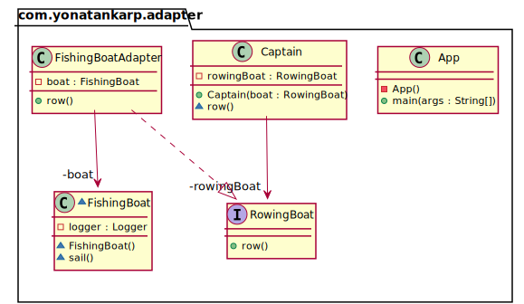

## Also known as
Wrapper

## Intent

Convert the interface of a class into another interface the clients expect.
Adapter lets classes work together that couldn't otherwise because of
incompatible interfaces.

## Explanation

Real-world example

> Consider that you have some pictures on your memory card, and you need to
> transfer them to your computer. To transfer them, you need some kind of
> adapter that is compatible with your computer ports so that you can attach a
> memory card to your computer. In this case card reader is an adapter.
> Another example would be the famous power adapter; a three-legged plug can't
> be connected to a two-pronged outlet, it needs to use a power adapter that
> makes it compatible with the two-pronged outlets.
> Yet another example would be a translator translating words spoken by one
> person to another

In plain words

> Adapter pattern lets you wrap an otherwise incompatible object in an adapter
> to make it compatible with another class.

Wikipedia says

> In software engineering, the adapter pattern is a software design pattern that
> allows the interface of an existing class to be used as another interface. It
> is often used to make existing classes work with others without modifying
> their source code.

**Programmatic Example**

Consider a captain that can only use rowing boats and cannot sail at all.

First, we have interfaces `RowingBoat` and `FishingBoat`

```kotlin
interface RowingBoat {
    fun row()
}

internal class FishingBoat {
    fun sail() {
        logger.info("The fishing boat is sailing")
    }
}
```

And captain expects an implementation of `RowingBoat` interface to be able to
move

```kotlin
class Captain(private val rowingBoat: RowingBoat) {
    fun row() = rowingBoat.row()
}
```

Now let's say the pirates are coming and our captain needs to escape but there
is only a fishing boat available. We need to create an adapter that allows the
captain to operate the fishing boat with his rowing boat skills.

```kotlin
internal class FishingBoatAdapter(private val boat: FishingBoat) : RowingBoat {
    override fun row() {
        boat.sail()
    }
}
```

And now the `Captain` can use the `FishingBoat` to escape the pirates.

```kotlin
val fishingBoat = FishingBoat()
val adopter = FishingBoatAdapter(fishingBoat)
val captain = Captain(adopter)
captain.row()
```

Alternatively, we can use Kotlin's extension function for our adapter. We will
create an extension function for the `FishingBoat` that would return an instance
of the `RowingBoat` interface. We can do so by using the `object` and implement
the interface inside the method itself.

```kotlin
fun FishingBoat.toRowingBoat(): RowingBoat {
    return object : RowingBoat {
        override fun row() {
            sail()
        }
    }
}
```

And now the `Captain` can use the `FishingBoat` to escape the pirates
as follows which is more Kotlin idiomatic:

```kotlin
val fishingBoat = FishingBoat()
val captain = Captain(fishingBoat.toRowingBoat())
captain.row()
```

## Class diagram



## Applicability
Use the Adapter pattern when

* You want to use an existing class, and its interface does not match the one
  you need
* You want to create a reusable class that cooperates with unrelated or
  unforeseen classes, that is, classes that don't necessarily have compatible
  interfaces
* You need to use several existing subclasses, but it's impractical to adapt
  their interface by subclassing everyone. An object adapter can adapt the
  interface of its parent class.
* Most of the applications using third-party libraries use adapters as a middle
  layer between the application and the 3rd party library to decouple the
  application from the library. If another library has to be used only an
  adapter for the new library is required without having to change the
  application code.

## Tutorials

* [Dzone](https://dzone.com/articles/adapter-design-pattern-in-java)
* [Refactoring Guru](https://refactoring.guru/design-patterns/adapter/java/example)
* [Baeldung](https://www.baeldung.com/java-adapter-pattern)

## Consequences
Class and object adapters have different trade-offs. A class adapter

*	Adapts Adaptee to Target by committing to a concrete Adaptee class. As a
    consequence, a class adapter won’t work when we want to adapt a class and
    all its subclasses.
*	Lets Adapter override some of Adaptee’s behavior since Adapter is a subclass
    of Adaptee.
*	Introduces only one object, and no additional pointer indirection is needed
    to get to the adaptee.

An object adapter

*	Lets a single Adapter work with many Adaptees, that is, the Adaptee itself
    and all of its subclasses (if any). The Adapter can also add functionality
    to all Adaptees at once.
*	Makes it harder to override Adaptee behavior. It will require subclassing
    Adaptee and making the Adapter refer to the subclass rather than the Adaptee
    itself.

## Credits

* [Design Patterns: Elements of Reusable Object-Oriented Software](https://www.amazon.com/gp/product/0201633612/ref=as_li_tl?ie=UTF8&camp=1789&creative=9325&creativeASIN=0201633612&linkCode=as2&tag=javadesignpat-20&linkId=675d49790ce11db99d90bde47f1aeb59)
* [J2EE Design Patterns](https://www.amazon.com/gp/product/0596004273/ref=as_li_tl?ie=UTF8&camp=1789&creative=9325&creativeASIN=0596004273&linkCode=as2&tag=javadesignpat-20&linkId=48d37c67fb3d845b802fa9b619ad8f31)
* [Head First Design Patterns: A Brain-Friendly Guide](https://www.amazon.com/gp/product/0596007124/ref=as_li_tl?ie=UTF8&camp=1789&creative=9325&creativeASIN=0596007124&linkCode=as2&tag=javadesignpat-20&linkId=6b8b6eea86021af6c8e3cd3fc382cb5b)
* [Refactoring to Patterns](https://www.amazon.com/gp/product/0321213351/ref=as_li_tl?ie=UTF8&camp=1789&creative=9325&creativeASIN=0321213351&linkCode=as2&tag=javadesignpat-20&linkId=2a76fcb387234bc71b1c61150b3cc3a7)
