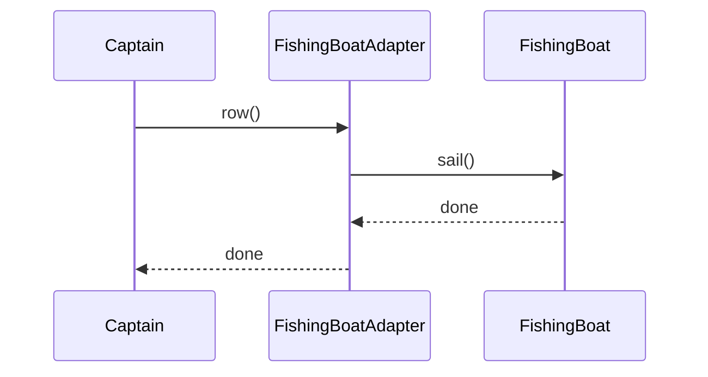
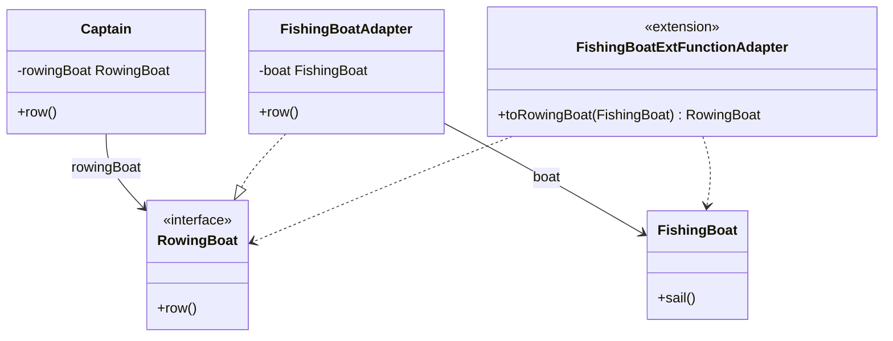

## Also known as

- Wrapper

## Intent

Convert the interface of a class into another interface
the clients expect. Adapter lets classes work together
that couldn't otherwise because of incompatible
interfaces.

## Explanation

### Real-world example

> Consider that you have some pictures on your memory
> card, and you need to transfer them to your computer.
> To transfer them, you need some kind of adapter that
> is compatible with your computer ports so that you can
> attach a memory card to your computer. In this case
> the card reader is an adapter.

### In plain words

> Adapter pattern lets you wrap an otherwise
> incompatible object in an adapter to make it
> compatible with another class.

### Wikipedia says

> In software engineering, the adapter pattern is a
> software design pattern that allows the interface of
> an existing class to be used as another interface. It
> is often used to make existing classes work with
> others without modifying their source code.


```mermaid
sequenceDiagram
    participant Captain
    participant FishingBoatAdapter
    participant FishingBoat

    Captain->>FishingBoatAdapter: row()
    FishingBoatAdapter->>FishingBoat: sail()
    FishingBoat-->>FishingBoatAdapter: done
    FishingBoatAdapter-->>Captain: done
```

### **Programmatic Example**

Consider a captain that can only use rowing boats and
cannot sail at all.

First, we have interfaces `RowingBoat` and
`FishingBoat`:

```kotlin
interface RowingBoat {
    fun row()
}

internal class FishingBoat {
    fun sail() {
        logger.info("The fishing boat is sailing")
    }
}
```

And captain expects an implementation of `RowingBoat`
interface to be able to move:

```kotlin
class Captain(private val rowingBoat: RowingBoat) {
    fun row() = rowingBoat.row()
}
```

Now let's say the pirates are coming and our captain
needs to escape but there is only a fishing boat
available. We need to create an adapter that allows the
captain to operate the fishing boat with his rowing
boat skills.

```kotlin
internal class FishingBoatAdapter(
    private val boat: FishingBoat,
) : RowingBoat {
    override fun row() {
        boat.sail()
    }
}
```

And now the `Captain` can use the `FishingBoat` to
escape the pirates.

```kotlin
val fishingBoat = FishingBoat()
val adapter = FishingBoatAdapter(fishingBoat)
val captain = Captain(adapter)
captain.row()
```

Alternatively, we can use Kotlin's extension function
for our adapter:

```kotlin
fun FishingBoat.toRowingBoat(): RowingBoat =
    object : RowingBoat {
        override fun row() {
            sail()
        }
    }
```

And now the `Captain` can use the `FishingBoat` more
idiomatically:

```kotlin
val fishingBoat = FishingBoat()
val captain = Captain(fishingBoat.toRowingBoat())
captain.row()
```

## Class diagram


```mermaid
classDiagram
    class Captain {
        -rowingBoat RowingBoat
        +row()
    }
    class FishingBoat {
        +sail()
    }
    class FishingBoatAdapter {
        -boat FishingBoat
        +row()
    }
    class RowingBoat {
        <<interface>>
        +row()
    }
    FishingBoatAdapter --> FishingBoat : boat
    Captain --> RowingBoat : rowingBoat
    FishingBoatAdapter ..|> RowingBoat
    class FishingBoatExtFunctionAdapter {
        <<extension>>
        +toRowingBoat(FishingBoat) RowingBoat
    }
    FishingBoatExtFunctionAdapter ..> FishingBoat
    FishingBoatExtFunctionAdapter ..> RowingBoat
```

## Applicability

Use the Adapter pattern when:

- You want to use an existing class and its interface
  does not match the one you need.
- You want to create a reusable class that cooperates
  with unrelated or unforeseen classes.
- You need to use several existing subclasses, but it's
  impractical to adapt their interface by subclassing
  everyone.

## Consequences

Benefits:

- Allows reuse of existing classes even when their
  interfaces are incompatible.
- Provides flexibility by introducing only one
  additional object without changing the adaptee.

Trade-offs:

- An object adapter makes it harder to override adaptee
  behavior; it requires subclassing the adaptee.
- Adds a layer of indirection, which can complicate
  debugging.

## Related Patterns

- [Decorator](../decorator/README.md): Changes
  responsibilities without changing the interface,
  while Adapter changes the interface.
- [Bridge](../bridge/README.md): Separates abstraction
  from implementation; Adapter makes unrelated classes
  work together.

## Credits

- [Design Patterns: Elements of Reusable Object-Oriented
  Software](https://amzn.to/3w0pvKI)
- [Head First Design Patterns: Building Extensible and
  Maintainable Object-Oriented
  Software](https://amzn.to/49NGldq)
- [J2EE Design Patterns](https://amzn.to/4dpzgmx)
- [Refactoring to Patterns](https://amzn.to/3VOO4F5)
