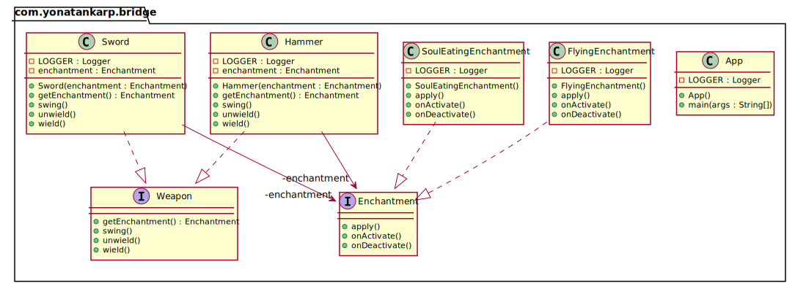

## Also known as

- Handle/Body

## Intent

Decouple an abstraction from its implementation so that the two can vary
independently.

## Explanation

Real-world example

> Consider you have a weapon with different enchantments, and you are supposed
> to allow mixing different weapons with different enchantments. What would you
> do? Create multiple copies of each of the weapons for each of the enchantments
> or would you just create separate enchantment and set it for the weapon as
> needed? Bridge pattern allows you to do the second.

In Plain Words

> Bridge pattern is about favoring composition over inheritance. Implementation
> details are pushed from a hierarchy to another object with a separate
> hierarchy.

Wikipedia says

> The bridge pattern is a design pattern used in software engineering that is
> meant to "decouple an abstraction from its implementation so that the two can
> vary independently"

**Programmatic Example**

Translating our weapon example from above. Here we have the `Weapon` hierarchy:

```kotlin
interface Weapon {
  fun wield()
  fun swing()
  fun unwield()
  val enchantment: Enchantment
}

class Sword(override val enchantment: Enchantment) : Weapon {
  override fun wield() {
    logger.info("The sword is wielded.")
    enchantment.onActivate()
  }

  override fun swing() {
    logger.info("The sword is swung.")
    enchantment.apply()
  }

  override fun unwield() {
    logger.info("The sword is unwielded.")
    enchantment.onDeactivate()
  }
}

class Hammer(override val enchantment: Enchantment) : Weapon {
  override fun wield() {
    logger.info("The hammer is wielded.")
    enchantment.onActivate()
  }

  override fun swing() {
    logger.info("The hammer is swung.")
    enchantment.apply()
  }

  override fun unwield() {
    logger.info("The hammer is unwielded.")
    enchantment.onDeactivate()
  }
}
```

Here's the separate enchantment hierarchy:

```kotlin
interface Enchantment {
  fun onActivate()
  fun apply()
  fun onDeactivate()
}

class FlyingEnchantment : Enchantment {
  override fun onActivate() {
    logger.info("The item begins to glow faintly.")
  }

  override fun apply() {
    logger.info("The item flies and strikes the enemies finally returning to owner's hand.")
  }

  override fun onDeactivate() {
    logger.info("The item's glow fades.")
  }
}

class SoulEatingEnchantment : Enchantment {
  override fun onActivate() {
    logger.info("The item spreads bloodlust.")
  }

  override fun apply() {
    logger.info("The item eats the soul of enemies.")
  }

  override fun onDeactivate() {
    logger.info("Bloodlust slowly disappears.")
  }
}
```

Here are both hierarchies in action:

```kotlin
logger.info("The knight receives an enchanted sword.")
val enchantedSword = Sword(SoulEatingEnchantment())
enchantedSword.wield()
enchantedSword.swing()
enchantedSword.unwield()

logger.info("The valkyrie receives an enchanted hammer.")
val hammer = Hammer(FlyingEnchantment())
hammer.wield()
hammer.swing()
hammer.unwield()
```

Here's the console output.

```text
The knight receives an enchanted sword.
The sword is wielded.
The item spreads bloodlust.
The sword is swung.
The item eats the soul of enemies.
The sword is unwielded.
Bloodlust slowly disappears.
The valkyrie receives an enchanted hammer.
The hammer is wielded.
The item begins to glow faintly.
The hammer is swung.
The item flies and strikes the enemies finally returning to owner's hand.
The hammer is unwielded.
The item's glow fades.
```

## Class diagram



## Applicability

Use the Bridge pattern when

* You want to avoid a permanent binding between an abstraction and its
  implementation. This might be the case, for example, when the implementation
  must be selected or switched at run-time.
* Both the abstractions and their implementations should be extensible by
  subclassing. In this case, the Bridge pattern lets you combine the different
  abstractions and implementations and extend them independently.
* Changes in the implementation of an abstraction should have no impact on
  clients; that is, their code should not have to be recompiled.
* You have a proliferation of classes. Such a class hierarchy indicates the need
  for splitting an object into two parts. Rumbaugh uses the term "nested 
  generalizations" to refer to such class hierarchies.
* You want to share an implementation among multiple objects (perhaps using
  reference counting), and this fact should be hidden from the client. A simple
  example is Coplien's String class, in which multiple objects can share the
  same string representation.

## Tutorial

* [Bridge Pattern Tutorial](https://www.journaldev.com/1491/bridge-design-pattern-java)

## Credits

* [Design Patterns: Elements of Reusable Object-Oriented Software](https://www.amazon.com/gp/product/0201633612/ref=as_li_tl?ie=UTF8&camp=1789&creative=9325&creativeASIN=0201633612&linkCode=as2&tag=javadesignpat-20&linkId=675d49790ce11db99d90bde47f1aeb59)
* [Head First Design Patterns: A Brain-Friendly Guide](https://www.amazon.com/gp/product/0596007124/ref=as_li_tl?ie=UTF8&camp=1789&creative=9325&creativeASIN=0596007124&linkCode=as2&tag=javadesignpat-20&linkId=6b8b6eea86021af6c8e3cd3fc382cb5b)
