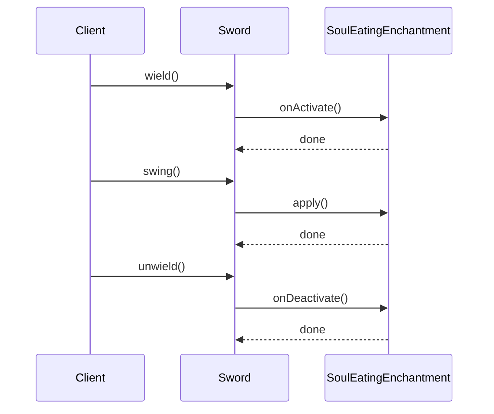
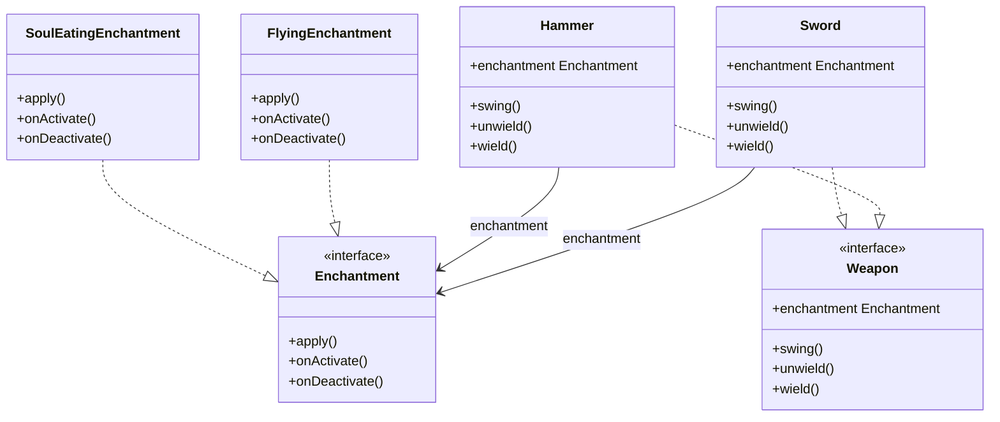

## Also known as

- Handle/Body

## Intent

Decouple an abstraction from its implementation so
that the two can vary independently.

## Explanation

### Real-world example

> Consider you have a weapon with different
> enchantments, and you are supposed to allow mixing
> different weapons with different enchantments. Would
> you create multiple copies of each weapon for each
> enchantment, or create separate enchantments and set
> them for the weapon as needed? Bridge pattern allows
> you to do the second.

### In plain words

> Bridge pattern is about favoring composition over
> inheritance. Implementation details are pushed from a
> hierarchy to another object with a separate hierarchy.

### Wikipedia says

> The bridge pattern is a design pattern used in
> software engineering that is meant to "decouple an
> abstraction from its implementation so that the two
> can vary independently."


```mermaid
sequenceDiagram
    participant Client
    participant Sword
    participant SoulEatingEnchantment

    Client->>Sword: wield()
    Sword->>SoulEatingEnchantment: onActivate()
    SoulEatingEnchantment-->>Sword: done
    Client->>Sword: swing()
    Sword->>SoulEatingEnchantment: apply()
    SoulEatingEnchantment-->>Sword: done
    Client->>Sword: unwield()
    Sword->>SoulEatingEnchantment: onDeactivate()
    SoulEatingEnchantment-->>Sword: done
```

### **Programmatic Example**

Translating our weapon example from above. Here we
have the `Weapon` hierarchy:

```kotlin
internal interface Weapon {
    val enchantment: Enchantment
    fun wield()
    fun swing()
    fun unwield()
}

internal class Sword(
    override val enchantment: Enchantment,
) : Weapon {
    override fun wield() {
        logger.info("The sword is wielded.")
        enchantment.onActivate()
    }

    override fun swing() {
        logger.info("The sword is swung.")
        enchantment.apply()
    }

    override fun unwield() {
        logger.info("The sword is unwielded.")
        enchantment.onDeactivate()
    }
}
```

Here's the separate enchantment hierarchy:

```kotlin
internal interface Enchantment {
    fun onActivate()
    fun apply()
    fun onDeactivate()
}

internal class FlyingEnchantment : Enchantment {
    override fun onActivate() {
        logger.info("The item begins to glow faintly.")
    }

    override fun apply() {
        logger.info(
            "The item flies and strikes the enemies"
                + " finally returning to owner's hand."
        )
    }

    override fun onDeactivate() {
        logger.info("The item's glow fades.")
    }
}

internal class SoulEatingEnchantment : Enchantment {
    override fun onActivate() {
        logger.info("The item spreads bloodlust.")
    }

    override fun apply() {
        logger.info(
            "The item eats the soul of enemies."
        )
    }

    override fun onDeactivate() {
        logger.info("Bloodlust slowly disappears.")
    }
}
```

Here are both hierarchies in action:

```kotlin
logger.info("The knight receives an enchanted sword.")
val enchantedSword = Sword(SoulEatingEnchantment())
enchantedSword.wield()
enchantedSword.swing()
enchantedSword.unwield()

logger.info("The valkyrie receives an enchanted hammer.")
val hammer = Hammer(FlyingEnchantment())
hammer.wield()
hammer.swing()
hammer.unwield()
```

Program output:

```text
The knight receives an enchanted sword.
The sword is wielded.
The item spreads bloodlust.
The sword is swung.
The item eats the soul of enemies.
The sword is unwielded.
Bloodlust slowly disappears.
The valkyrie receives an enchanted hammer.
The hammer is wielded.
The item begins to glow faintly.
The hammer is swung.
The item flies and strikes the enemies finally returning to owner's hand.
The hammer is unwielded.
The item's glow fades.
```

## Class diagram


```mermaid
classDiagram
    class Enchantment {
        <<interface>>
        +apply()
        +onActivate()
        +onDeactivate()
    }
    class FlyingEnchantment {
        +apply()
        +onActivate()
        +onDeactivate()
    }
    class SoulEatingEnchantment {
        +apply()
        +onActivate()
        +onDeactivate()
    }
    class Weapon {
        <<interface>>
        +enchantment Enchantment
        +swing()
        +unwield()
        +wield()
    }
    class Sword {
        +enchantment Enchantment
        +swing()
        +unwield()
        +wield()
    }
    class Hammer {
        +enchantment Enchantment
        +swing()
        +unwield()
        +wield()
    }
    Sword --> Enchantment : enchantment
    Hammer --> Enchantment : enchantment
    FlyingEnchantment ..|> Enchantment
    Hammer ..|> Weapon
    SoulEatingEnchantment ..|> Enchantment
    Sword ..|> Weapon
```

## Applicability

Use the Bridge pattern when:

- You want to avoid a permanent binding between an
  abstraction and its implementation, for example when
  the implementation must be selected at run-time.
- Both the abstractions and their implementations
  should be extensible by subclassing independently.
- Changes in the implementation of an abstraction
  should have no impact on clients.
- You have a proliferation of classes indicating the
  need for splitting an object into two parts.

## Consequences

Benefits:

- Decouples interface and implementation, allowing
  them to vary independently.
- Improves extensibility — you can extend abstraction
  and implementation hierarchies independently.
- Hides implementation details from clients.

Trade-offs:

- Increases complexity due to the extra layer of
  indirection.
- Can complicate the system architecture for clients
  unfamiliar with the pattern.

## Related Patterns

- [Adapter](../adapter/README.md): Adapter changes
  an interface after design; Bridge designs the
  abstraction and implementation to vary independently
  from the start.
- [Strategy](../strategy/README.md): Similar structure
  but different intent — Strategy changes behavior,
  Bridge separates abstraction from implementation.

## Credits

- [Design Patterns: Elements of Reusable Object-Oriented
  Software](https://amzn.to/3w0pvKI)
- [Head First Design Patterns: Building Extensible and
  Maintainable Object-Oriented
  Software](https://amzn.to/49NGldq)
