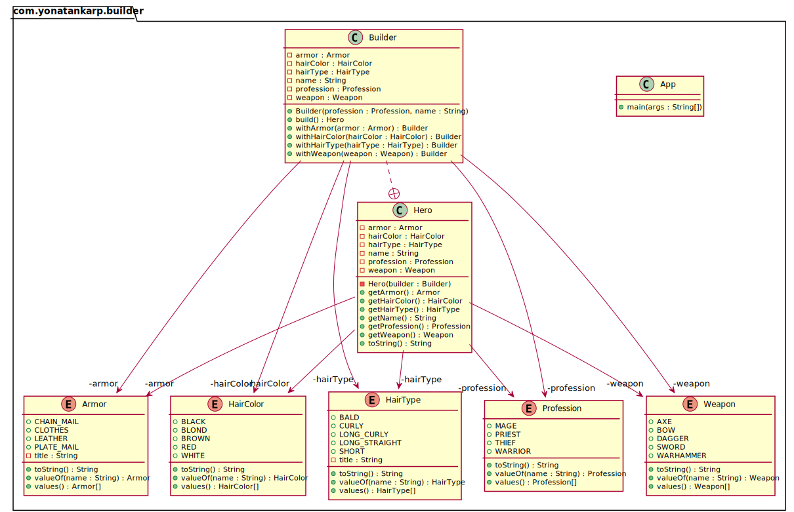

## Intent

Separate the construction of a complex object from its representation so that
the same construction process can create different representations.

## Explanation

Real-world example

> Imagine a character generator for a role-playing game. The easiest option is
> to let the computer create the character for you. If you want to manually
> select the character details like profession, gender, hair color, etc. the
> character generation becomes a step-by-step process that completes when all
> the selections are ready.

In plain words

> Allows you to create different flavors of an object while avoiding constructor
> pollution. Useful when there could be several flavors of an object. Or when
> there are a lot of steps involved in creation of an object.

Wikipedia says

> The builder pattern is an object creation software design pattern with the
> intentions of finding a solution to the telescoping constructor anti-pattern.

Having said that let me add a bit about what telescoping constructor
anti-pattern is. At one point or the other, we have all seen a constructor like
below:

```kotlin
data class Hero(
  val profession: Profession,
  val name: String,
  val hairType: HairType?,
  val hairColor: HairColor?,
  val armor: Armor?,
  val weapon: Weapon?
)
```

As you can see the number of constructor parameters can quickly get out of hand,
and it may become difficult to understand the arrangement of parameters. Plus
this parameter list could keep on growing if you would want to add more options
in the future. This is called telescoping constructor anti-pattern.

**Programmatic Example**

The sane alternative is to use the Builder pattern. First of all, we have our
hero that we want to create:

```kotlin
data class Hero(
  val profession: Profession,
  val name: String,
  val hairType: HairType?,
  val hairColor: HairColor?,
  val armor: Armor?,
  val weapon: Weapon?
) {
  private constructor(builder: Builder) : this(
    builder.profession,
    builder.name,
    builder.hairType,
    builder.hairColor,
    builder.armor,
    builder.weapon
  )
}
```

Then we have the builder:

```kotlin
class Builder(profession: Profession?, name: String?) {
  val profession: Profession
  val name: String
  var hairType: HairType? = null
  var hairColor: HairColor? = null
  var armor: Armor? = null
  var weapon: Weapon? = null

  init {
    require(!(profession == null || name == null)) { "profession and name can not be null" }
    this.profession = profession
    this.name = name
  }

  fun withHairType(hairType: HairType?): Builder = apply {
    this.hairType = hairType
  }

  fun withHairColor(hairColor: HairColor?): Builder = apply {
    this.hairColor = hairColor
  }

  fun withArmor(armor: Armor?): Builder = apply {
    this.armor = armor
  }

  fun withWeapon(weapon: Weapon?): Builder = apply {
    this.weapon = weapon
  }

  fun build() = Hero(this)
}
```

Then it can be used as:

```kotlin
val mage = Hero.Builder(Profession.MAGE, "Riobard")
  .withHairColor(HairColor.BLACK)
  .withWeapon(Weapon.DAGGER)
  .build() 
```

However, Kotlin provides an alternative to the Builder pattern with named
arguments and default parameter values:

```kotlin
data class Hero(
    val profession: Profession,
    val name: String,
    val hairType: HairType? = null,
    val hairColor: HairColor? = null,
    val armor: Armor? = null,
    val weapon: Weapon? = null
)
```

Then it can be used as:

```kotlin
val mage = Hero(
    profession = Profession.MAGE,
    name = "Riobard",
    hairColor = HairColor.BLACK,
    weapon = Weapon.DAGGER
)
```

Not only that the code is simpler, we are also enforcing the required parameters
at compile time.

## Class diagram



## Applicability

Use the Builder pattern when

* The algorithm for creating a complex object should be independent of the parts
  that make up the object and how they're assembled
* The construction process must allow different representations for the object
  that's constructed

## Tutorials

* [Refactoring Guru](https://refactoring.guru/design-patterns/builder)
* [Oracle Blog](https://blogs.oracle.com/javamagazine/post/exploring-joshua-blochs-builder-design-pattern-in-java)
* [Journal Dev](https://www.journaldev.com/1425/builder-design-pattern-in-java)

## Credits

* [Design Patterns: Elements of Reusable Object-Oriented Software](https://www.amazon.com/gp/product/0201633612/ref=as_li_tl?ie=UTF8&camp=1789&creative=9325&creativeASIN=0201633612&linkCode=as2&tag=javadesignpat-20&linkId=675d49790ce11db99d90bde47f1aeb59)
* [Effective Java](https://www.amazon.com/gp/product/0134685997/ref=as_li_tl?ie=UTF8&camp=1789&creative=9325&creativeASIN=0134685997&linkCode=as2&tag=javadesignpat-20&linkId=4e349f4b3ff8c50123f8147c828e53eb)
* [Head First Design Patterns: A Brain-Friendly Guide](https://www.amazon.com/gp/product/0596007124/ref=as_li_tl?ie=UTF8&camp=1789&creative=9325&creativeASIN=0596007124&linkCode=as2&tag=javadesignpat-20&linkId=6b8b6eea86021af6c8e3cd3fc382cb5b)
* [Refactoring to Patterns](https://www.amazon.com/gp/product/0321213351/ref=as_li_tl?ie=UTF8&camp=1789&creative=9325&creativeASIN=0321213351&linkCode=as2&tag=javadesignpat-20&linkId=2a76fcb387234bc71b1c61150b3cc3a7)
* [Kotlin Design Patterns and Best Practices](https://www.amazon.de/Kotlin-Design-Patterns-Best-Practices/dp/1801815720/ref=sr_1_1?keywords=kotlin+design+patterns+and+best+practices&qid=1694244553&sprefix=kotlin+design%2Caps%2C101&sr=8-1)
