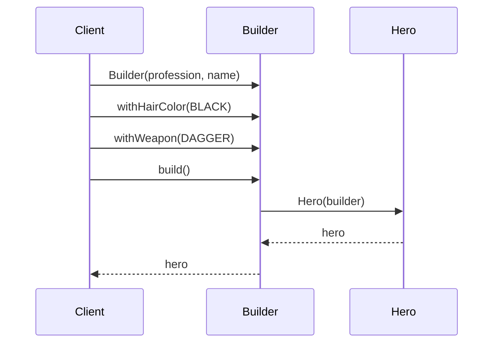
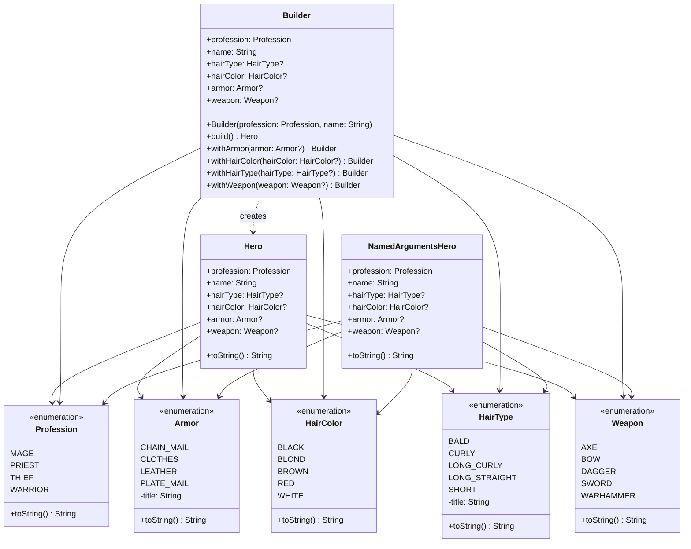

## Intent

Separate the construction of a complex object from its
representation so that the same construction process can
create different representations.

## Explanation

### Real-world example

> Imagine a character generator for a role-playing game.
> The easiest option is to let the computer create the
> character for you. If you want to manually select the
> character details like profession, gender, hair color,
> etc. the character generation becomes a step-by-step
> process that completes when all the selections are ready.

### In plain words

> Allows you to create different flavors of an object while
> avoiding constructor pollution. Useful when there could be
> several flavors of an object. Or when there are a lot of
> steps involved in creation of an object.

### Wikipedia says

> The builder pattern is an object creation software design
> pattern with the intentions of finding a solution to the
> telescoping constructor anti-pattern.


```mermaid
sequenceDiagram
    participant Client
    participant Builder
    participant Hero
    Client->>Builder: Builder(profession, name)
    Client->>Builder: withHairColor(BLACK)
    Client->>Builder: withWeapon(DAGGER)
    Client->>Builder: build()
    Builder->>Hero: Hero(builder)
    Hero-->>Builder: hero
    Builder-->>Client: hero
```

Having said that let me add a bit about what telescoping
constructor anti-pattern is. At one point or the other, we
have all seen a constructor like below:

```kotlin
data class Hero(
    val profession: Profession,
    val name: String,
    val hairType: HairType?,
    val hairColor: HairColor?,
    val armor: Armor?,
    val weapon: Weapon?,
)
```

As you can see the number of constructor parameters can
quickly get out of hand, and it may become difficult to
understand the arrangement of parameters. Plus this
parameter list could keep on growing if you would want to
add more options in the future. This is called telescoping
constructor anti-pattern.

### **Programmatic Example**

The sane alternative is to use the Builder pattern. First
of all, we have our hero that we want to create:

```kotlin
internal data class Hero(
    val profession: Profession,
    val name: String,
    val hairType: HairType?,
    val hairColor: HairColor?,
    val armor: Armor?,
    val weapon: Weapon?,
) {
    private constructor(builder: Builder) : this(
        builder.profession,
        builder.name,
        builder.hairType,
        builder.hairColor,
        builder.armor,
        builder.weapon,
    )
}
```

Then we have the builder:

```kotlin
internal class Builder(
    profession: Profession?,
    name: String?,
) {
    val profession: Profession =
        requireNotNull(profession) { "profession can not be null" }
    val name: String =
        requireNotNull(name) { "name can not be null" }
    var hairType: HairType? = null
    var hairColor: HairColor? = null
    var armor: Armor? = null
    var weapon: Weapon? = null

    fun withHairType(hairType: HairType?): Builder = apply {
        this.hairType = hairType
    }

    fun withHairColor(hairColor: HairColor?): Builder = apply {
        this.hairColor = hairColor
    }

    fun withArmor(armor: Armor?): Builder = apply {
        this.armor = armor
    }

    fun withWeapon(weapon: Weapon?): Builder = apply {
        this.weapon = weapon
    }

    fun build() = Hero(this)
}
```

Then it can be used as:

```kotlin
val mage = Hero.Builder(Profession.MAGE, "Riobard")
    .withHairColor(HairColor.BLACK)
    .withWeapon(Weapon.DAGGER)
    .build()
```

However, Kotlin provides an alternative to the Builder
pattern with named arguments and default parameter values:

```kotlin
internal data class NamedArgumentsHero(
    val profession: Profession,
    val name: String,
    val hairType: HairType? = null,
    val hairColor: HairColor? = null,
    val armor: Armor? = null,
    val weapon: Weapon? = null,
)
```

Then it can be used as:

```kotlin
val mage = NamedArgumentsHero(
    profession = Profession.MAGE,
    name = "Riobard",
    hairColor = HairColor.BLACK,
    weapon = Weapon.DAGGER,
)
```

Not only is the code simpler, we are also enforcing the
required parameters at compile time.

Program output:

```text
This is a mage named Riobard with black hair and wielding a dagger.
This is a warrior named Amberjill with blond long curly hair wearing chain mail and wielding a sword.
This is a thief named Desmond with bald head and wielding a bow.
```

## Class diagram


```mermaid
classDiagram
    class Armor {
        <<enumeration>>
        CHAIN_MAIL
        CLOTHES
        LEATHER
        PLATE_MAIL
        -title: String
        +toString() String
    }
    class HairColor {
        <<enumeration>>
        BLACK
        BLOND
        BROWN
        RED
        WHITE
        +toString() String
    }
    class HairType {
        <<enumeration>>
        BALD
        CURLY
        LONG_CURLY
        LONG_STRAIGHT
        SHORT
        -title: String
        +toString() String
    }
    class Profession {
        <<enumeration>>
        MAGE
        PRIEST
        THIEF
        WARRIOR
        +toString() String
    }
    class Weapon {
        <<enumeration>>
        AXE
        BOW
        DAGGER
        SWORD
        WARHAMMER
        +toString() String
    }
    class Hero {
        +profession: Profession
        +name: String
        +hairType: HairType?
        +hairColor: HairColor?
        +armor: Armor?
        +weapon: Weapon?
        +toString() String
    }
    class Builder {
        +profession: Profession
        +name: String
        +hairType: HairType?
        +hairColor: HairColor?
        +armor: Armor?
        +weapon: Weapon?
        +Builder(profession: Profession, name: String)
        +build() Hero
        +withArmor(armor: Armor?) Builder
        +withHairColor(hairColor: HairColor?) Builder
        +withHairType(hairType: HairType?) Builder
        +withWeapon(weapon: Weapon?) Builder
    }
    class NamedArgumentsHero {
        +profession: Profession
        +name: String
        +hairType: HairType?
        +hairColor: HairColor?
        +armor: Armor?
        +weapon: Weapon?
        +toString() String
    }
    Hero --> Profession
    Hero --> Armor
    Hero --> HairColor
    Hero --> HairType
    Hero --> Weapon
    Builder ..> Hero : creates
    Builder --> Profession
    Builder --> Armor
    Builder --> HairColor
    Builder --> HairType
    Builder --> Weapon
    NamedArgumentsHero --> Profession
    NamedArgumentsHero --> Armor
    NamedArgumentsHero --> HairColor
    NamedArgumentsHero --> HairType
    NamedArgumentsHero --> Weapon
```

## Applicability

Use the Builder pattern when

- The algorithm for creating a complex object should be
  independent of the parts that make up the object and how
  they're assembled
- The construction process must allow different
  representations for the object that's constructed
- It's particularly useful when a product requires a lot
  of steps to be created and when these steps need to be
  executed in a specific sequence

## Consequences

Benefits:

- More control over the construction process compared to
  other creational patterns
- Supports constructing objects step-by-step, defer
  construction steps or run steps recursively
- Can construct objects that require a complex assembly of
  sub-objects. The final product is detached from the parts
  that make it up, as well as their assembly process
- Single Responsibility Principle. You can isolate complex
  construction code from the business logic of the product

Trade-offs:

- The overall complexity of the code can increase since the
  pattern requires creating multiple new classes
- May increase memory usage due to the necessity of
  creating multiple builder objects

## Related Patterns

- [Abstract Factory](https://java-design-patterns.com/patterns/abstract-factory/):
  Can be used in conjunction with Builder to build parts of
  a complex object.
- [Prototype](https://java-design-patterns.com/patterns/prototype/):
  Builders often create objects from a prototype.
- [Step Builder](https://java-design-patterns.com/patterns/step-builder/):
  A variation of the Builder pattern that generates a
  complex object using a step-by-step approach.

## Credits

- [Design Patterns: Elements of Reusable Object-Oriented Software](https://amzn.to/3w0pvKI)
- [Effective Java](https://amzn.to/4cGk2Jz)
- [Head First Design Patterns: Building Extensible and Maintainable Object-Oriented Software](https://amzn.to/49NGldq)
- [Refactoring to Patterns](https://amzn.to/3VOO4F5)
