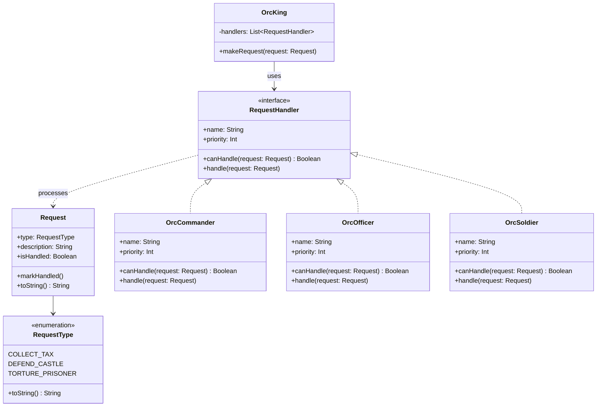

## Also known as

- Chain of Command
- Chain of Objects
- Responsibility Chain

## Intent

Decouple the sender of a request from its receivers by
giving more than one object a chance to handle the request.
The receiving objects are chained and the request is passed
along the chain until an object handles it.

## Explanation

### Real-world example

> A technical support call center is a real-world example
> of the Chain of Responsibility pattern. When a customer
> calls in with an issue, the call is first received by a
> front-line support representative. If the issue is simple,
> the representative handles it directly. If the issue is
> more complex, the representative forwards the call to a
> second-level support technician. This process continues,
> with the call being escalated through multiple levels of
> support until it reaches a specialist who can resolve the
> problem.

### In plain words

> It helps to build a chain of objects. A request enters
> from one end and keeps going from an object to another
> until it finds a suitable handler.

### Wikipedia says

> In object-oriented design, the chain-of-responsibility
> pattern is a design pattern consisting of a source of
> command objects and a series of processing objects. Each
> processing object contains logic that defines the types
> of command objects that it can handle; the rest are passed
> to the next processing object in the chain.

### **Programmatic Example**

In this example the Orc King gives loud orders to his army.
The closest one to react is the commander, then an officer,
and then a soldier. The commander, officer, and soldier form
a chain of responsibility.

First, we have the `RequestType` enum and the `Request`
class:

```kotlin
enum class RequestType {
    COLLECT_TAX,
    DEFEND_CASTLE,
    TORTURE_PRISONER,
    ;

    override fun toString() = name.lowercase()
}

class Request(
    val type: RequestType,
    val description: String,
) {
    var isHandled: Boolean = false
        private set

    fun markHandled() {
        isHandled = true
    }

    override fun toString() = description
}
```

Next, we show the `RequestHandler` interface and its
implementations:

```kotlin
interface RequestHandler {
    val name: String
    val priority: Int
    fun canHandle(request: Request): Boolean
    fun handle(request: Request)
}

internal class OrcCommander : RequestHandler {
    override val name = "Orc commander"
    override val priority = 2

    override fun canHandle(request: Request) =
        request.type == RequestType.DEFEND_CASTLE

    override fun handle(request: Request) {
        request.markHandled()
        logger.info("$name handling request \"$request\"")
    }
}

// OrcOfficer and OrcSoldier are defined similarly ...
```

The `OrcKing` gives the orders and forms the chain:

```kotlin
class OrcKing {
    private val handlers: List<RequestHandler> = listOf(
        OrcCommander(),
        OrcOfficer(),
        OrcSoldier(),
    )

    fun makeRequest(request: Request) {
        handlers
            .sortedBy { it.priority }
            .firstOrNull { it.canHandle(request) }
            ?.handle(request)
    }
}
```

The chain of responsibility in action:

```kotlin
fun main() {
    val king = OrcKing()
    king.makeRequest(
        Request(RequestType.DEFEND_CASTLE, "defend castle"),
    )
    king.makeRequest(
        Request(RequestType.TORTURE_PRISONER, "torture prisoner"),
    )
    king.makeRequest(
        Request(RequestType.COLLECT_TAX, "collect tax"),
    )
}
```

The console output:

```text
Orc commander handling request "defend castle"
Orc officer handling request "torture prisoner"
Orc soldier handling request "collect tax"
```

## Class diagram



## Applicability

Use the Chain of Responsibility pattern when

- More than one object may handle a request, and the
  handler is not known a priori. The handler should be
  ascertained automatically.
- You want to issue a request to one of several objects
  without specifying the receiver explicitly.
- The set of objects that can handle a request should be
  specified dynamically.

## Consequences

Benefits:

- Reduced coupling. The sender of a request does not need
  to know the concrete handler that will process the
  request.
- Increased flexibility in assigning responsibilities to
  objects. You can add or change responsibilities for
  handling a request by changing the members and order of
  the chain.
- Allows you to set a default handler if no concrete
  handler can handle the request.

Trade-offs:

- It can be challenging to debug and understand the flow,
  especially if the chain is long and complex.
- The request might end up unhandled if the chain does not
  include a catch-all handler.
- Performance concerns might arise due to potentially going
  through several handlers before finding the right one,
  or not finding it at all.

## Credits

- [Design Patterns: Elements of Reusable Object-Oriented Software](https://amzn.to/3w0pvKI)
- [Head First Design Patterns: Building Extensible and Maintainable Object-Oriented Software](https://amzn.to/49NGldq)
- [Pattern-Oriented Software Architecture, Volume 1: A System of Patterns](https://amzn.to/3PAJUg5)
- [Refactoring to Patterns](https://amzn.to/3VOO4F5)
