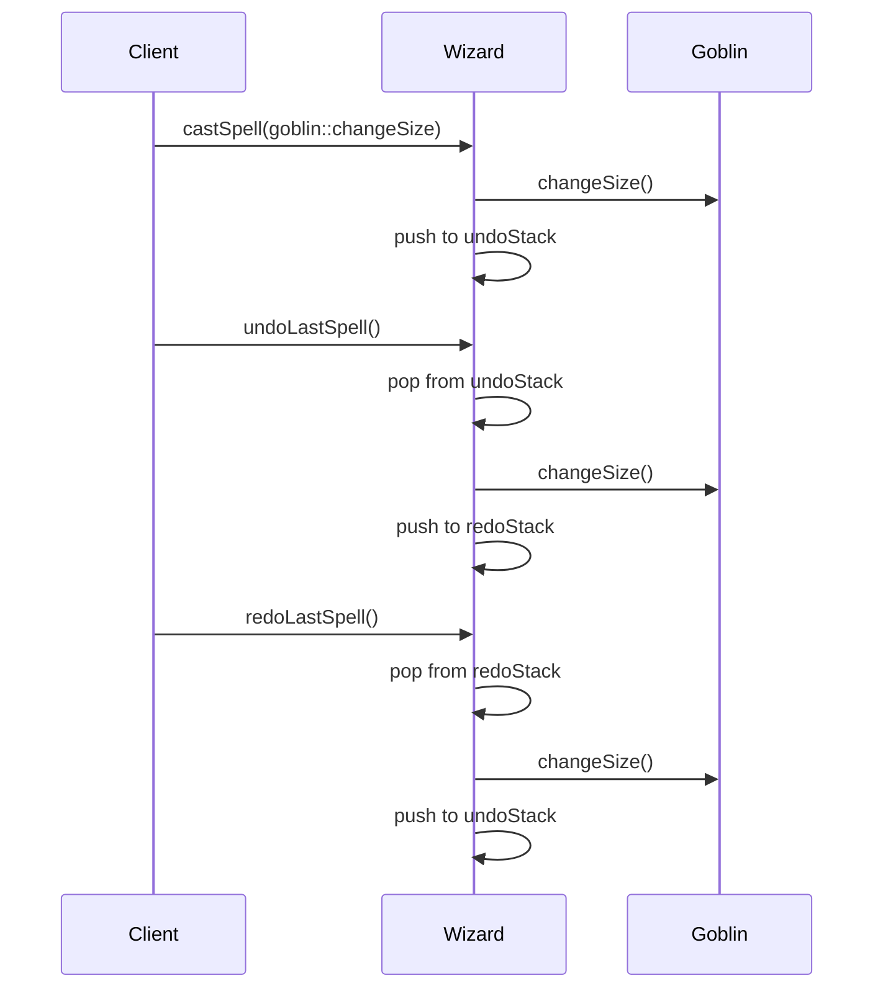
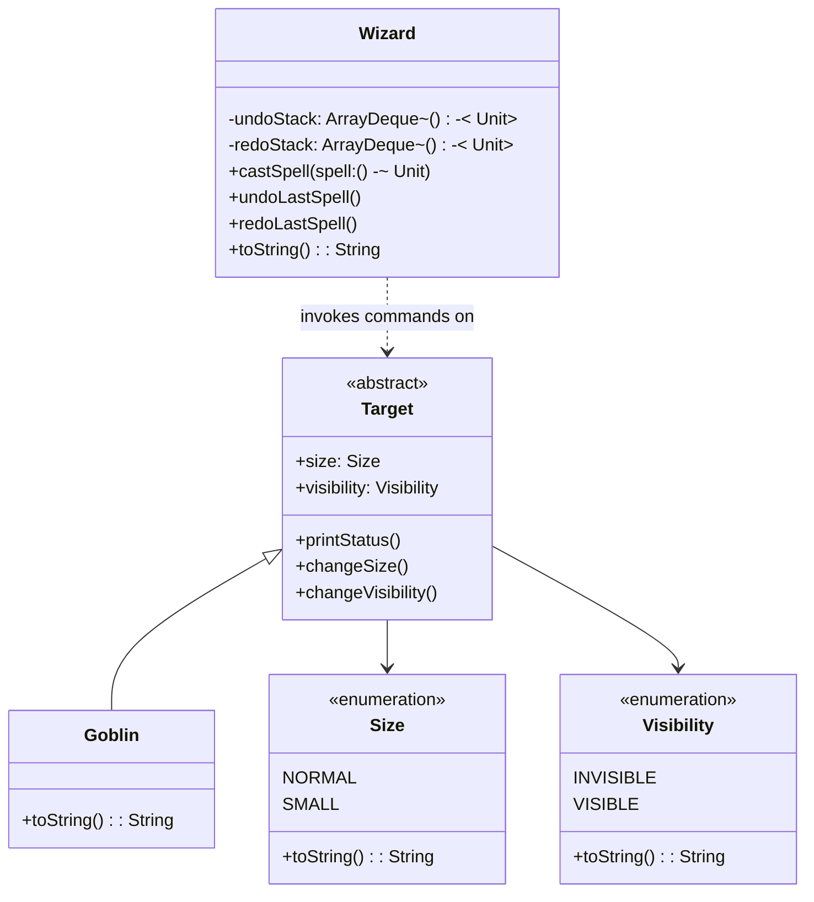

## Also known as

- Action
- Transaction

## Intent

Encapsulate a request as an object, thereby letting you
parameterize clients with different requests, queue or log
requests, and support undoable operations.

## Explanation

Real-world example

> Imagine a smart home system where you can control devices
> such as lights, thermostats, and security cameras through a
> central application. Each command to operate these devices is
> encapsulated as an object, enabling the system to queue,
> execute sequentially, and undo commands if necessary. This
> approach decouples control logic from device implementation,
> allowing easy addition of new devices or features without
> altering the core application.

In plain words

> Storing requests as command objects allows performing an
> action or undoing it at a later time.

Wikipedia says

> In object-oriented programming, the command pattern is a
> behavioral design pattern in which an object is used to
> encapsulate all information needed to perform an action or
> trigger an event at a later time.

Sequence diagram



### **Programmatic Example**

In the Command pattern, objects are used to encapsulate all
information needed to perform an action or trigger an event at
a later time. This pattern is particularly useful for
implementing undo functionality in applications.

In our example, a `Wizard` casts spells on a `Goblin`. Each
spell is a command object that can be executed and undone. The
spells are executed on the goblin one by one. The first spell
shrinks the goblin and the second makes him invisible. Then the
wizard reverses the spells one by one.

First, we have the `Size` and `Visibility` enumerations that
define the target's state.

```kotlin
internal enum class Size {
    NORMAL,
    SMALL,
    ;

    override fun toString() = name.lowercase()
}

internal enum class Visibility {
    INVISIBLE,
    VISIBLE,
    ;

    override fun toString() = name.lowercase()
}
```

`Target` is the abstract base class. A target has a `Size` and
a `Visibility` that can be toggled.

```kotlin
internal abstract class Target(
    var size: Size,
    var visibility: Visibility,
) {
    fun printStatus() {
        logger.info("$this, [size=$size] [visibility=$visibility]")
    }

    fun changeSize() {
        size =
            if (size == Size.NORMAL) Size.SMALL else Size.NORMAL
    }

    fun changeVisibility() {
        visibility =
            if (visibility == Visibility.INVISIBLE) {
                Visibility.VISIBLE
            } else {
                Visibility.INVISIBLE
            }
    }
}
```

`Goblin` is the concrete target.

```kotlin
internal class Goblin : Target(
    size = Size.NORMAL,
    visibility = Visibility.VISIBLE,
) {
    override fun toString() = "Goblin"
}
```

`Wizard` is the invoker. Commands are represented as simple
`() -> Unit` lambdas. The wizard keeps an undo stack and a redo
stack so that spells can be reversed and replayed.

```kotlin
internal class Wizard {
    private val undoStack = ArrayDeque<() -> Unit>()
    private val redoStack = ArrayDeque<() -> Unit>()

    fun castSpell(spell: () -> Unit) {
        spell()
        undoStack.addLast(spell)
    }

    fun undoLastSpell() {
        if (undoStack.isNotEmpty()) {
            val previousSpell = undoStack.removeLast()
            redoStack.addLast(previousSpell)
            previousSpell()
        }
    }

    fun redoLastSpell() {
        if (redoStack.isNotEmpty()) {
            val previousSpell = redoStack.removeLast()
            undoStack.addLast(previousSpell)
            previousSpell()
        }
    }

    override fun toString() = "Wizard"
}
```

Here is the full example of the wizard casting spells.

```kotlin
fun main() {
    val wizard = Wizard()
    val goblin = Goblin()

    goblin.printStatus()

    wizard.castSpell(goblin::changeSize)
    goblin.printStatus()

    wizard.castSpell(goblin::changeVisibility)
    goblin.printStatus()

    wizard.undoLastSpell()
    goblin.printStatus()

    wizard.undoLastSpell()
    goblin.printStatus()

    wizard.redoLastSpell()
    goblin.printStatus()

    wizard.redoLastSpell()
    goblin.printStatus()
}
```

Program output:

```text
Goblin, [size=normal] [visibility=visible]
Goblin, [size=small] [visibility=visible]
Goblin, [size=small] [visibility=invisible]
Goblin, [size=small] [visibility=visible]
Goblin, [size=normal] [visibility=visible]
Goblin, [size=small] [visibility=visible]
Goblin, [size=small] [visibility=invisible]
```

## Class diagram



## Applicability

Use the Command pattern when you want to:

- Parameterize objects with actions to perform, offering an
  object-oriented alternative to callbacks. Commands can be
  registered and executed later.
- Specify, queue, and execute requests at different times,
  allowing commands to exist independently of the original
  request.
- Support undo functionality, where the command's execute
  operation stores state and includes an un-execute operation
  to reverse previous actions.
- Log changes to reapply them after a system crash by adding
  load and store operations to the command interface.
- Structure a system around high-level operations built on
  primitive operations, which is common in transaction-based
  systems.

## Consequences

Benefits:

- Decouples the object that invokes the operation from the
  one that knows how to perform it.
- It is easy to add new commands because you do not have to
  change existing classes.
- You can assemble a set of commands into a composite command.

Trade-offs:

- Increases the number of classes for each individual command.
- Can complicate the design by adding multiple layers between
  senders and receivers.

## Credits

- [Design Patterns: Elements of Reusable Object-Oriented Software](https://amzn.to/3w0pvKI)
- [Head First Design Patterns: Building Extensible and Maintainable Object-Oriented Software](https://amzn.to/49NGldq)
- [J2EE Design Patterns](https://amzn.to/4dpzgmx)
- [Refactoring to Patterns](https://amzn.to/3VOO4F5)
