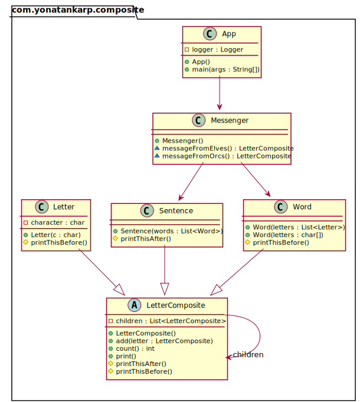

## Intent

Compose objects into tree structures to represent part-whole hierarchies.
Composite lets clients treat individual objects and compositions of objects
uniformly.

## Explanation

Real-world example

> Every sentence is composed of words which are in turn composed of characters.
> Each of these objects are printable, and they can have something printed
> before or after them like sentence always ends with full stop and word always
> has space before it.

In plain words

> Composite pattern lets clients uniformly treat the individual objects.

Wikipedia says

> In software engineering, the composite pattern is a partitioning design
> pattern. The composite pattern describes that a group of objects is to be
> treated in the same way as a single instance of an object. The intent of a
> composite is to "compose" objects into tree structures to represent part-whole
> hierarchies. Implementing the composite pattern lets clients treat individual
> objects and compositions uniformly.

**Programmatic Example**

Taking our sentence example from above. Here we have the base class
`LetterComposite` and the different printable types `Letter`, `Word` and
`Sentence`.

```kotlin
abstract class LetterComposite {

  private val children = mutableListOf<LetterComposite>()
  fun add(letter: LetterComposite) {
    children.add(letter)
  }

  fun count() = children.size

  protected open fun printThisBefore() {}
  protected open fun printThisAfter() {}
  
  fun print() {
    printThisBefore()
    children.forEach { it.print() }
    printThisAfter()
  }
}

/**
 * Letter.
 */
class Letter(private val character: Char) : LetterComposite() {
  override fun printThisBefore() = print(character)
}

/**
 * Word.
 */
class Word : LetterComposite {
  constructor(letters: List<Letter>) {
    letters.forEach { add(it) }
  }
  
  constructor(vararg letters: Char) {
    for (letter in letters) {
      add(Letter(letter))
    }
  }

  override fun printThisBefore() = print(" ")
}

/**
 * Sentence.
 */
class Sentence(words: List<Word>) : LetterComposite() {
  init {
    words.forEach(::add)
  }

  override fun printThisAfter() = print(".\n")
}
```

Then we have a messenger to carry messages:

```kotlin
internal class Messenger {
  fun messageFromOrcs(): LetterComposite {
    val words = listOf(
      Word('W', 'h', 'e', 'r', 'e'),
      Word('t', 'h', 'e', 'r', 'e'),
      Word('i', 's'),
      Word('a'),
      Word('w', 'h', 'i', 'p'),
      Word('t', 'h', 'e', 'r', 'e'),
      Word('i', 's'),
      Word('a'),
      Word('w', 'a', 'y')
    )
    return Sentence(words)
  }

  fun messageFromElves(): LetterComposite {
    val words = listOf(
      Word('M', 'u', 'c', 'h'),
      Word('w', 'i', 'n', 'd'),
      Word('p', 'o', 'u', 'r', 's'),
      Word('f', 'r', 'o', 'm'),
      Word('y', 'o', 'u', 'r'),
      Word('m', 'o', 'u', 't', 'h')
    )
    return Sentence(words)
  }
}
```

And then it can be used as:

```kotlin
val messenger = Messenger()

logger.info("Message from the orcs: ")
messenger.messageFromOrcs().print()

logger.info("Message from the elves: ")
messenger.messageFromElves().print()
```

The console output:

```
Message from the orcs: 
 Where there is a whip there is a way.
Message from the elves: 
 Much wind pours from your mouth.
```

## Class diagram



## Applicability

Use the Composite pattern when

* You want to represent part-whole hierarchies of objects.
* You want clients to be able to ignore the difference between compositions of
  objects and individual objects. Clients will treat all objects in the
  composite structure uniformly.

## Credits

* [Design Patterns: Elements of Reusable Object-Oriented Software](https://www.amazon.com/gp/product/0201633612/ref=as_li_tl?ie=UTF8&camp=1789&creative=9325&creativeASIN=0201633612&linkCode=as2&tag=javadesignpat-20&linkId=675d49790ce11db99d90bde47f1aeb59)
* [Head First Design Patterns: A Brain-Friendly Guide](https://www.amazon.com/gp/product/0596007124/ref=as_li_tl?ie=UTF8&camp=1789&creative=9325&creativeASIN=0596007124&linkCode=as2&tag=javadesignpat-20&linkId=6b8b6eea86021af6c8e3cd3fc382cb5b)
* [Refactoring to Patterns](https://www.amazon.com/gp/product/0321213351/ref=as_li_tl?ie=UTF8&camp=1789&creative=9325&creativeASIN=0321213351&linkCode=as2&tag=javadesignpat-20&linkId=2a76fcb387234bc71b1c61150b3cc3a7)
