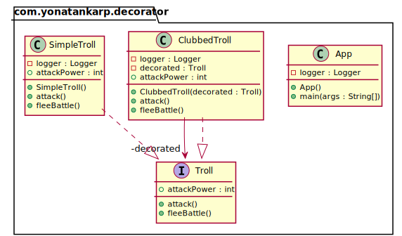

## Also known as

- Wrapper

## Intent

Attach additional responsibilities to an object dynamically. Decorators provide
a flexible alternative to subclassing for extending functionality.

## Explanation

Real-world example

> There is an angry troll living in the nearby hills. Usually, it goes
> bare-handed, but sometimes it has a weapon. To arm the troll it's not
> necessary to create a new troll but to decorate it dynamically with a suitable
> weapon.

In plain words

> Decorator pattern lets you dynamically change the behavior of an object at run
> time by wrapping them in an object of a decorator class.

Wikipedia says

> In object-oriented programming, the decorator pattern is a design pattern that
> allows behavior to be added to an individual object, either statically or
> dynamically, without affecting the behavior of other objects from the same
> class. The decorator pattern is often useful for adhering to the Single
> Responsibility Principle, as it allows functionality to be divided between
> classes with unique areas of concern as well as to the Open-Closed Principle,
> by allowing the functionality of a class to be extended without being
> modified.

**Programmatic Example**

Let's take the troll example. First of all we have a `SimpleTroll` implementing
the `Troll` interface:

```kotlin
interface Troll {
    fun attack()

    fun fleeBattle()

    val attackPower: Int
}

class SimpleTroll : Troll {
    override fun attack() {
        logger.info("The troll tries to grab you!")
    }

    override fun fleeBattle() {
        logger.info("The troll shrieks in horror and runs away!")
    }

    override val attackPower: Int
        get() = 10
}
```

Next, we want to add a club for the troll. We can do it dynamically by using a
decorator:

```kotlin
class ClubbedTroll(private val decorated: Troll) : Troll {

  override fun attack() {
    decorated.attack()
    logger.info("The troll swings at you with a club!")
  }

  override fun fleeBattle() {
    decorated.fleeBattle()
  }

  override val attackPower: Int
    get() = decorated.attackPower + 10
}
```

Here's the troll in action:

```kotlin
// simple troll
val logger = LoggerFactory.getLogger("com.yonatankarp.decorator")

// simple troll
logger.info("A simple looking troll approaches.")
val troll = SimpleTroll()
troll.attack()
troll.fleeBattle()
logger.info("Simple troll power: ${troll.attackPower}.\n")

// change the behavior of the simple troll by adding a decorator
logger.info("A troll with huge club surprises you.")
val clubbedTroll = ClubbedTroll(troll)
clubbedTroll.attack()
clubbedTroll.fleeBattle()
logger.info("Clubbed troll power: ${clubbedTroll.attackPower}.\n")
```

Program output:

```text
A simple looking troll approaches.
The troll tries to grab you!
The troll shrieks in horror and runs away!
Simple troll power: 10.

A troll with huge club surprises you.
The troll tries to grab you!
The troll swings at you with a club!
The troll shrieks in horror and runs away!
Clubbed troll power: 20.
```

## Class diagram



## Applicability

Decorator is used to:

* Add responsibilities to individual objects dynamically and transparently, that
  is, without affecting other objects.
* For responsibilities that can be withdrawn.
* When extension by subclassing is impractical. Sometimes a large number of
  independent extensions are possible and would produce an explosion of
  subclasses to support every combination. Or a class definition may be hidden
  or otherwise unavailable for subclassing.

## Tutorials

* [Decorator Pattern Tutorial](https://www.journaldev.com/1540/decorator-design-pattern-in-java-example)

## Credits

* [Design Patterns: Elements of Reusable Object-Oriented Software](https://www.amazon.com/gp/product/0201633612/ref=as_li_tl?ie=UTF8&camp=1789&creative=9325&creativeASIN=0201633612&linkCode=as2&tag=javadesignpat-20&linkId=675d49790ce11db99d90bde47f1aeb59)
* [Functional Programming in Java: Harnessing the Power of Java 8 Lambda Expressions](https://www.amazon.com/gp/product/1937785467/ref=as_li_tl?ie=UTF8&camp=1789&creative=9325&creativeASIN=1937785467&linkCode=as2&tag=javadesignpat-20&linkId=7e4e2fb7a141631491534255252fd08b)
* [J2EE Design Patterns](https://www.amazon.com/gp/product/0596004273/ref=as_li_tl?ie=UTF8&camp=1789&creative=9325&creativeASIN=0596004273&linkCode=as2&tag=javadesignpat-20&linkId=48d37c67fb3d845b802fa9b619ad8f31)
* [Head First Design Patterns: A Brain-Friendly Guide](https://www.amazon.com/gp/product/0596007124/ref=as_li_tl?ie=UTF8&camp=1789&creative=9325&creativeASIN=0596007124&linkCode=as2&tag=javadesignpat-20&linkId=6b8b6eea86021af6c8e3cd3fc382cb5b)
* [Refactoring to Patterns](https://www.amazon.com/gp/product/0321213351/ref=as_li_tl?ie=UTF8&camp=1789&creative=9325&creativeASIN=0321213351&linkCode=as2&tag=javadesignpat-20&linkId=2a76fcb387234bc71b1c61150b3cc3a7)
* [J2EE Design Patterns](https://www.amazon.com/gp/product/0596004273/ref=as_li_tl?ie=UTF8&camp=1789&creative=9325&creativeASIN=0596004273&linkCode=as2&tag=javadesignpat-20&linkId=f27d2644fbe5026ea448791a8ad09c94)
