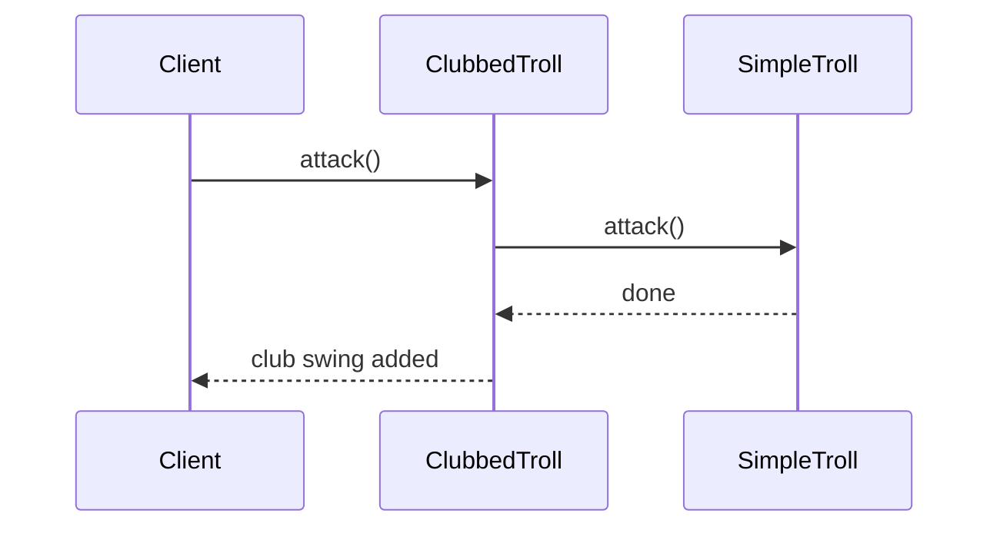
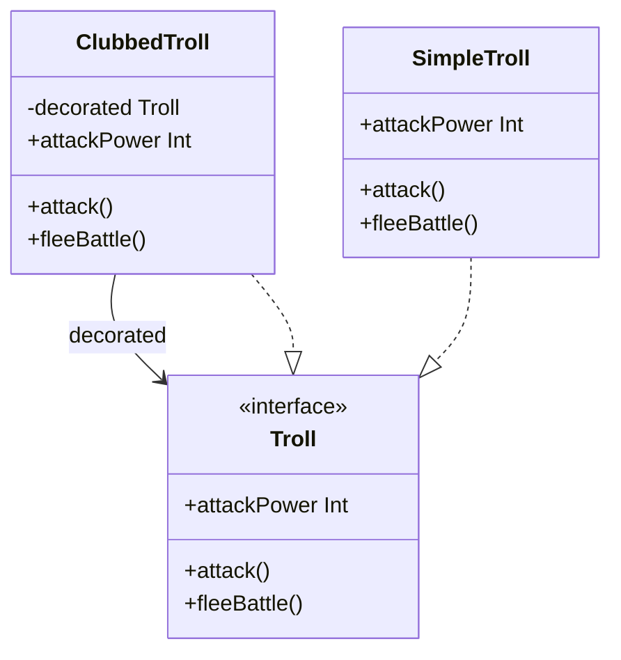

## Also known as

- Wrapper

## Intent

Attach additional responsibilities to an object
dynamically. Decorators provide a flexible alternative
to subclassing for extending functionality.

## Explanation

### Real-world example

> There is an angry troll living in the nearby hills.
> Usually, it goes bare-handed, but sometimes it has a
> weapon. To arm the troll it's not necessary to create
> a new troll but to decorate it dynamically with a
> suitable weapon.

### In plain words

> Decorator pattern lets you dynamically change the
> behavior of an object at run time by wrapping them in
> an object of a decorator class.

### Wikipedia says

> In object-oriented programming, the decorator pattern
> is a design pattern that allows behavior to be added
> to an individual object, either statically or
> dynamically, without affecting the behavior of other
> objects from the same class. The decorator pattern is
> often useful for adhering to the Single Responsibility
> Principle, as it allows functionality to be divided
> between classes with unique areas of concern as well
> as to the Open-Closed Principle, by allowing the
> functionality of a class to be extended without being
> modified.


```mermaid
sequenceDiagram
    participant Client
    participant ClubbedTroll
    participant SimpleTroll

    Client->>ClubbedTroll: attack()
    ClubbedTroll->>SimpleTroll: attack()
    SimpleTroll-->>ClubbedTroll: done
    ClubbedTroll-->>Client: club swing added
```

### **Programmatic Example**

Let's take the troll example. First of all we have a
`SimpleTroll` implementing the `Troll` interface:

```kotlin
interface Troll {
    val attackPower: Int
    fun attack()
    fun fleeBattle()
}

class SimpleTroll : Troll {
    override val attackPower: Int
        get() = ATTACK_POWER

    override fun attack() {
        logger.info("The troll tries to grab you!")
    }

    override fun fleeBattle() {
        logger.info(
            "The troll shrieks in horror and runs away!"
        )
    }
}
```

Next, we want to add a club for the troll. We can do
it dynamically by using a decorator:

```kotlin
class ClubbedTroll(
    private val decorated: Troll,
) : Troll {
    override val attackPower: Int
        get() = decorated.attackPower + CLUB_ATTACK_POWER

    override fun attack() {
        decorated.attack()
        logger.info(
            "The troll swings at you with a club!"
        )
    }

    override fun fleeBattle() {
        decorated.fleeBattle()
    }
}
```

Here's the troll in action:

```kotlin
logger.info("A simple looking troll approaches.")
val troll = SimpleTroll()
troll.attack()
troll.fleeBattle()
logger.info("Simple troll power: ${troll.attackPower}.\n")

logger.info("A troll with huge club surprises you.")
val clubbedTroll = ClubbedTroll(troll)
clubbedTroll.attack()
clubbedTroll.fleeBattle()
logger.info("Clubbed troll power: ${clubbedTroll.attackPower}.\n")
```

Program output:

```text
A simple looking troll approaches.
The troll tries to grab you!
The troll shrieks in horror and runs away!
Simple troll power: 10.

A troll with huge club surprises you.
The troll tries to grab you!
The troll swings at you with a club!
The troll shrieks in horror and runs away!
Clubbed troll power: 20.
```

## Class diagram


```mermaid
classDiagram
    class Troll {
        <<interface>>
        +attackPower Int
        +attack()
        +fleeBattle()
    }
    class SimpleTroll {
        +attackPower Int
        +attack()
        +fleeBattle()
    }
    class ClubbedTroll {
        -decorated Troll
        +attackPower Int
        +attack()
        +fleeBattle()
    }
    ClubbedTroll --> Troll : decorated
    ClubbedTroll ..|> Troll
    SimpleTroll ..|> Troll
```

## Applicability

Use the Decorator pattern when:

- You want to add responsibilities to individual
  objects dynamically and transparently, without
  affecting other objects.
- For responsibilities that can be withdrawn.
- When extension by subclassing is impractical due to
  an explosion of subclasses or hidden class
  definitions.

## Consequences

Benefits:

- Greater flexibility than static inheritance.
- Avoids feature-laden classes high up in the
  hierarchy.
- Responsibilities can be added or removed at runtime.

Trade-offs:

- A decorator and its component aren't identical, so
  tests for object type will fail.
- Can lead to many small objects that look alike,
  making configuration harder.

## Related Patterns

- [Adapter](../adapter/README.md): Changes an object's
  interface, while Decorator changes its
  responsibilities.
- [Composite](../composite/README.md): Decorators can
  be viewed as a degenerate composite with only one
  component.
- [Strategy](../strategy/README.md): Decorator changes
  the skin; Strategy changes the guts.

## Credits

- [Design Patterns: Elements of Reusable Object-Oriented
  Software](https://amzn.to/3w0pvKI)
- [Functional Programming in
  Java](https://amzn.to/3JUIc5Q)
- [Head First Design Patterns: Building Extensible and
  Maintainable Object-Oriented
  Software](https://amzn.to/49NGldq)
- [J2EE Design Patterns](https://amzn.to/4dpzgmx)
- [Refactoring to Patterns](https://amzn.to/3VOO4F5)
