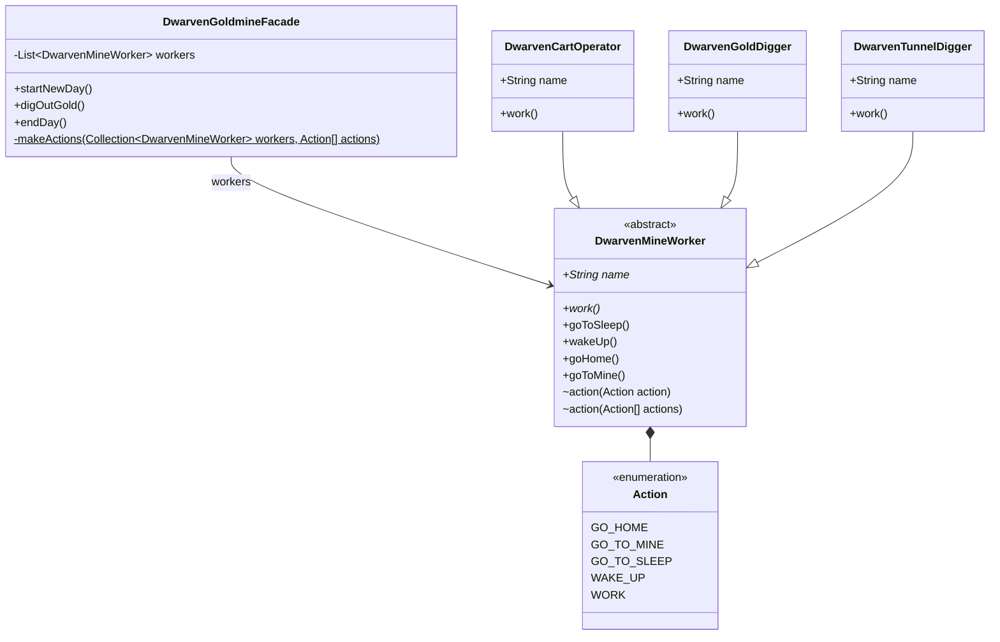

## Intent

Provide a unified interface to a set of interfaces in a subsystem. Facade
defines a higher-level interface that makes the subsystem easier to use.

## Explanation

### Real-world example

> How does a goldmine work? "Well, the miners go down there and dig gold!" you
> say. That is what you believe because you are using a simple interface that
> goldmine provides on the outside, internally it has to do a lot of stuff to
> make it happen. This simple interface to the complex subsystem is a facade.

### In plain words

> Facade pattern provides a simplified interface to a complex subsystem.

### Wikipedia says

> A facade is an object that provides a simplified interface to a larger body of
> code, such as a class library.

### **Programmatic Example**

Let's take our goldmine example from above. Here we have the dwarven mine worker
hierarchy. First there's a base class `DwarvenMineWorker`:

```kotlin
abstract class DwarvenMineWorker {

    abstract val name: String

    abstract fun work()

    fun goToSleep() = logger.info("$name goes to sleep.")

    fun wakeUp() = logger.info("$name wakes up.")

    fun goHome() = logger.info("$name goes home.")

    fun goToMine() = logger.info("$name goes to the mine.")

    internal fun action(action: Action) =
        when (action) {
            Action.GO_TO_SLEEP -> goToSleep()
            Action.WAKE_UP -> wakeUp()
            Action.GO_HOME -> goHome()
            Action.GO_TO_MINE -> goToMine()
            Action.WORK -> work()
        }

    /**
     * Perform actions.
     */
    internal fun action(vararg actions: Action) {
        actions.forEach { action: Action -> this.action(action) }
    }

    internal enum class Action {
        GO_TO_SLEEP,
        WAKE_UP,
        GO_HOME,
        GO_TO_MINE,
        WORK
    }
}
```

Then we have the concrete dwarf classes `DwarvenTunnelDigger`,
`DwarvenGoldDigger` and `DwarvenCartOperator`:

```kotlin
/**
 * DwarvenTunnelDigger
 */
class DwarvenTunnelDigger : DwarvenMineWorker() {
    override fun work() = logger.info("$name creates another promising tunnel.")

    override val name: String
        get() = "Dwarven tunnel digger"
}

/**
 * DwarvenGoldDigger
 */
class DwarvenGoldDigger : DwarvenMineWorker() {
    override fun work() = logger.info("$name digs for gold.")

    override val name: String
        get() = "Dwarf gold digger"
}

/**
 * DwarvenCartOperator
 */
class DwarvenCartOperator : DwarvenMineWorker() {
    override fun work() =
        logger.info("$name moves gold chunks out of the mine.")

    override val name: String
        get() = "Dwarf cart operator"
}
```

To operate all these goldmine workers we have the `DwarvenGoldmineFacade`:

```kotlin
class DwarvenGoldmineFacade {

    private val workers: List<DwarvenMineWorker> = listOf(
        DwarvenGoldDigger(),
        DwarvenCartOperator(),
        DwarvenTunnelDigger()
    )

    fun startNewDay() {
        makeActions(workers, Action.WAKE_UP, Action.GO_TO_MINE)
    }

    fun digOutGold() {
        makeActions(workers, Action.WORK)
    }

    fun endDay() {
        makeActions(workers, Action.GO_HOME, Action.GO_TO_SLEEP)
    }

    private fun makeActions(
        workers: Collection<DwarvenMineWorker>,
        vararg actions: Action
    ) {
        workers.forEach { worker: DwarvenMineWorker ->
            worker.action(*actions)
        }
    }
}
```

Now let's use the facade:

```kotlin
val facade = DwarvenGoldmineFacade()
facade.startNewDay()
facade.digOutGold()
facade.endDay()
```

Program output:

```text
Dwarf gold digger wakes up.
Dwarf gold digger goes to the mine.
Dwarf cart operator wakes up.
Dwarf cart operator goes to the mine.
Dwarven tunnel digger wakes up.
Dwarven tunnel digger goes to the mine.
Dwarf gold digger digs for gold.
Dwarf cart operator moves gold chunks out of the mine.
Dwarven tunnel digger creates another promising tunnel.
Dwarf gold digger goes home.
Dwarf gold digger goes to sleep.
Dwarf cart operator goes home.
Dwarf cart operator goes to sleep.
Dwarven tunnel digger goes home.
Dwarven tunnel digger goes to sleep.
```

## Class diagram



## Applicability

Use the Facade pattern when

- You want to provide a simple interface to a complex subsystem. Subsystems
  often get more complex as they evolve. Most patterns, when applied, result in
  more and smaller classes. This makes the subsystem more reusable and easier to
  customize, but it also becomes harder to use for clients that don't need to
  customize it. A facade can provide a simple default view of the subsystem that
  is good enough for most clients. Only clients needing more customization will
  need to look beyond the facade.
- There are many dependencies between clients and the implementation classes of
  an abstraction. Introduce a facade to decouple the subsystem from clients and
  other subsystems, thereby promoting subsystem independence and portability.
- You want to layer your subsystems. Use a facade to define an entry point to
  each subsystem level. If subsystems are dependent, then you can simplify the
  dependencies between them by making them communicate with each other solely
  through their facades.

## Consequences

Benefits:

- Isolates clients from subsystem components, reducing
  the number of objects that clients deal with.
- Promotes weak coupling between the subsystem and its
  clients.

Trade-offs:

- The facade can become a god object coupled to all
  classes of the subsystem if not designed carefully.

## Related Patterns

- [Adapter](../adapter/README.md): Adapter changes
  the interface of an existing object, while Facade
  defines a new simplified interface.
- [Flyweight](../flyweight/README.md): Flyweight shows
  how to make lots of little objects, while Facade
  shows how to make a single object that represents an
  entire subsystem.

## Credits

- [Design Patterns: Elements of Reusable Object-Oriented
  Software](https://amzn.to/3w0pvKI)
- [Head First Design Patterns: Building Extensible and
  Maintainable Object-Oriented
  Software](https://amzn.to/49NGldq)
