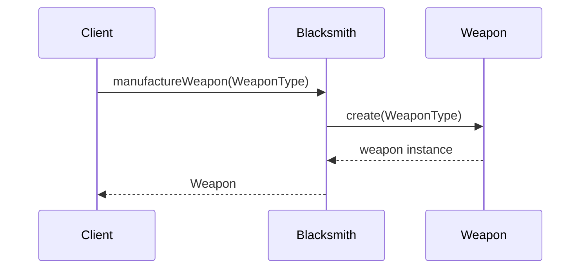
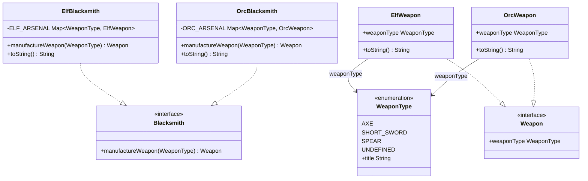

## Also known as

- Virtual Constructor

## Intent

Define an interface for creating an object, but let
subclasses decide which class to instantiate. Factory
Method lets a class defer instantiation to subclasses.

## Explanation

### Real-world example

> Blacksmith manufactures weapons. Elves require Elvish
> weapons and orcs require Orcish weapons. Depending on
> the customer at hand the right type of blacksmith is
> summoned.

### In plain words

> It provides a way to delegate the instantiation logic
> to child classes.

### Wikipedia says

> In class-based programming, the factory method pattern
> is a creational pattern that uses factory methods to
> deal with the problem of creating objects without having
> to specify the exact class of the object that will be
> created. This is done by creating objects by calling a
> factory method -- either specified in an interface and
> implemented by child classes, or implemented in a base
> class and optionally overridden by derived
> classes -- rather than by calling a constructor.



### **Programmatic Example**

Taking our blacksmith example above. First of all, we
have a `WeaponType` enumeration and a `Weapon` interface:

```kotlin
internal enum class WeaponType(val title: String) {
    AXE("axe"),
    SHORT_SWORD("short sword"),
    SPEAR("spear"),
    UNDEFINED(""),
}

internal interface Weapon {
    val weaponType: WeaponType
}
```

There are two concrete weapon implementations --
`ElfWeapon` and `OrcWeapon`:

```kotlin
internal class ElfWeapon(
    override val weaponType: WeaponType,
) : Weapon {
    override fun toString() = "an elven $weaponType"
}

internal class OrcWeapon(
    override val weaponType: WeaponType,
) : Weapon {
    override fun toString() = "an orcish $weaponType"
}
```

The `Blacksmith` interface declares the factory method,
and concrete blacksmiths implement it:

```kotlin
internal interface Blacksmith {
    fun manufactureWeapon(weaponType: WeaponType): Weapon
}

internal class ElfBlacksmith : Blacksmith {
    override fun manufactureWeapon(
        weaponType: WeaponType,
    ): Weapon =
        ELF_ARSENAL.getOrElse(weaponType) {
            throw IllegalArgumentException(
                "Weapon type $weaponType is not supported"
                    + " by elf blacksmith."
            )
        }
}

internal class OrcBlacksmith : Blacksmith {
    override fun manufactureWeapon(
        weaponType: WeaponType,
    ): Weapon =
        ORC_ARSENAL.getOrElse(weaponType) {
            throw IllegalArgumentException(
                "Weapon type $weaponType is not supported"
                    + " by the orc blacksmith."
            )
        }
}
```

When the customers come, the correct type of blacksmith
is summoned and requested weapons are manufactured:

```kotlin
val orcBlacksmith = OrcBlacksmith()
manufactureWeapon(orcBlacksmith, WeaponType.SPEAR)
manufactureWeapon(orcBlacksmith, WeaponType.AXE)

val elfBlacksmith = ElfBlacksmith()
manufactureWeapon(elfBlacksmith, WeaponType.SPEAR)
manufactureWeapon(elfBlacksmith, WeaponType.AXE)
```

Program output:

```text
The orc blacksmith manufactured spear
The orc blacksmith manufactured axe
The elf blacksmith manufactured spear
The elf blacksmith manufactured axe
```

## Class diagram



## Applicability

Use the Factory Method pattern when:

- A class cannot anticipate the class of objects it must
  create.
- A class wants its subclasses to specify the objects it
  creates.
- Classes delegate responsibility to one of several
  helper subclasses, and you want to localize the
  knowledge of which helper subclass is the delegate.

## Consequences

Benefits:

- Eliminates the need to bind application-specific
  classes into your code. The code only deals with the
  product interface, so it can work with any
  user-defined concrete product classes.
- Provides hooks for subclasses, giving them an
  extensible way to provide an extended version of an
  object.

Trade-offs:

- Clients might have to subclass the creator class just
  to create a particular product object.

## Related Patterns

- [Abstract Factory](../abstract-factory/README.md):
  Often implemented with factory methods. An abstract
  factory groups several factory methods that create a
  family of related products.
- [Prototype](../prototype/README.md): A factory method
  that returns a new instance of a class that is a clone
  of a prototype class.

## Credits

- [Design Patterns: Elements of Reusable Object-Oriented
  Software](https://amzn.to/3w0pvKI)
- [Head First Design Patterns: Building Extensible and
  Maintainable Object-Oriented
  Software](https://amzn.to/49NGldq)
- [Refactoring to Patterns](https://amzn.to/3VOO4F5)
