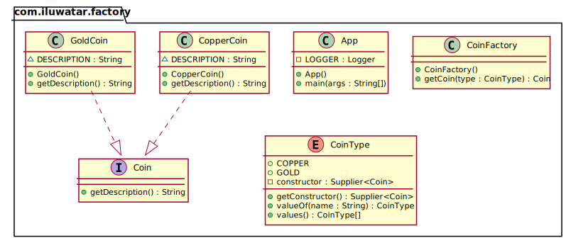

## Also known as

- Simple Factory
- Static Factory Method

## Intent

Providing a static method encapsulated in a class called the factory, to hide
the implementation logic and make client code focus on usage rather than
initializing new objects.

## Explanation

Real-world example

> Imagine an alchemist who is about to manufacture coins. The alchemist must be
> able to create both gold and copper coins and switching between them must be
> possible without modifying the existing source code. The factory pattern makes
> it possible by providing a static construction method which can be called with
> relevant parameters.

Wikipedia says

> Factory is an object for creating other objects – formally a factory is a
> function or method that returns objects of a varying prototype or class.

**Programmatic Example**

We have an interface `Coin` and two implementations `GoldCoin` and `CopperCoin`.

```kotlin
internal interface Coin {
    val description: String
}

internal class GoldCoin : Coin {
    override val description = "This is a gold coin."
}

internal class CopperCoin : Coin {
    override val description = "This is a copper coin."
}
```

Enumeration above represents types of coins that we support (`GoldCoin` and
`CopperCoin`).

```kotlin
internal enum class CoinType(val constructor: () -> Coin) {
    COPPER({ CopperCoin() }),
    GOLD({ GoldCoin() }),
}
```

Then we have the static method `getCoin` to create coin objects encapsulated in
the factory class `CoinFactory`.

```kotlin
internal object CoinFactory {
    fun getCoin(type: CoinType): Coin = type.constructor()
}
```

Now on the client code we can create different types of coins using the factory
class.

```kotlin
logger.info("The alchemist begins his work.")
val copper = CoinFactory.getCoin(CoinType.COPPER)
val gold = CoinFactory.getCoin(CoinType.GOLD)
logger.info(copper.description)
logger.info(gold.description)
```

Program output:

```shell
The alchemist begins his work.
This is a copper coin.
This is a gold coin.
```

## Class Diagram



## Applicability

Use the factory pattern when you only care about the creation of a object, not
how to create and manage it.

Pros

* Allows keeping all objects creation in one place.
* Allows to write loosely coupled code. Some of its main advantages include
  better testability, easy-to-understand code, swappable components, scalability
  and isolated features.

Cons

* The code becomes more complicated than it should be.

## Related patterns

* [Factory Method](../factory-method/README.md)
* [Abstract Factory](../abstract-factory/README.md)
* Factory Kit

[//]: # (TODO: link after adding the pattern)
