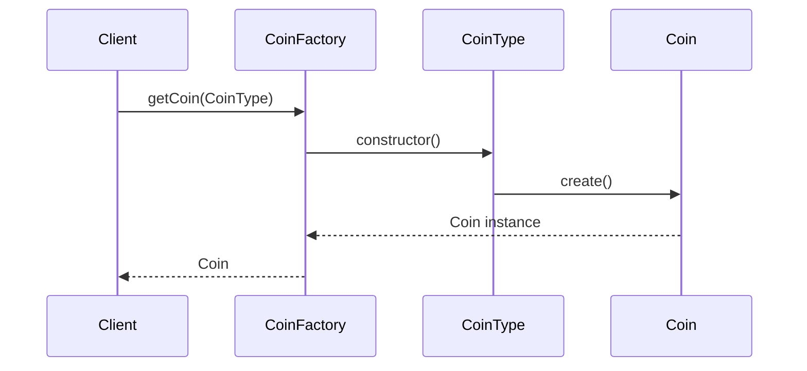
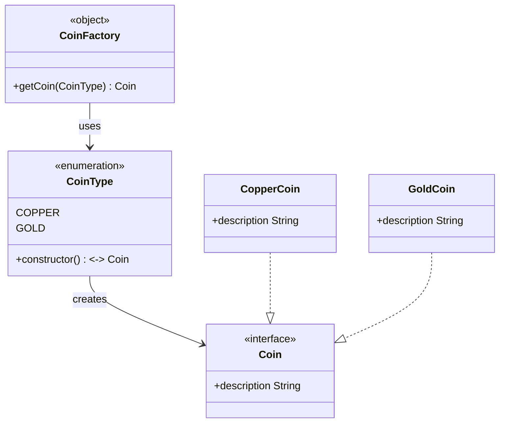

## Also known as

- Simple Factory
- Static Factory Method

## Intent

Providing a static method encapsulated in a class
called the factory, to hide the implementation logic
and make client code focus on usage rather than
initializing new objects.

## Explanation

### Real-world example

> Imagine an alchemist who is about to manufacture
> coins. The alchemist must be able to create both gold
> and copper coins and switching between them must be
> possible without modifying the existing source code.
> The factory pattern makes it possible by providing a
> static construction method which can be called with
> relevant parameters.

### Wikipedia says

> Factory is an object for creating other objects --
> formally a factory is a function or method that
> returns objects of a varying prototype or class.


```mermaid
sequenceDiagram
    participant Client
    participant CoinFactory
    participant CoinType
    participant Coin

    Client->>CoinFactory: getCoin(CoinType)
    CoinFactory->>CoinType: constructor()
    CoinType->>Coin: create()
    Coin-->>CoinFactory: Coin instance
    CoinFactory-->>Client: Coin
```

### **Programmatic Example**

We have an interface `Coin` and two implementations
`GoldCoin` and `CopperCoin`.

```kotlin
internal interface Coin {
    val description: String
}

internal class GoldCoin : Coin {
    override val description = "This is a gold coin."
}

internal class CopperCoin : Coin {
    override val description = "This is a copper coin."
}
```

The `CoinType` enumeration maps each type to its
constructor lambda:

```kotlin
internal enum class CoinType(
    val constructor: () -> Coin,
) {
    COPPER({ CopperCoin() }),
    GOLD({ GoldCoin() }),
}
```

Then we have the static method `getCoin` to create
coin objects encapsulated in the factory class
`CoinFactory`.

```kotlin
internal object CoinFactory {
    fun getCoin(type: CoinType): Coin =
        type.constructor()
}
```

Now on the client code we can create different types
of coins using the factory class.

```kotlin
logger.info("The alchemist begins his work.")
val copper = CoinFactory.getCoin(CoinType.COPPER)
val gold = CoinFactory.getCoin(CoinType.GOLD)
logger.info(copper.description)
logger.info(gold.description)
```

Program output:

```text
The alchemist begins his work.
This is a copper coin.
This is a gold coin.
```

## Class diagram


```mermaid
classDiagram
    class Coin {
        <<interface>>
        +description String
    }
    class CoinFactory {
        <<object>>
        +getCoin(CoinType) Coin
    }
    class CoinType {
        <<enumeration>>
        COPPER
        GOLD
        +constructor () ~-~ Coin
    }
    class CopperCoin {
        +description String
    }
    class GoldCoin {
        +description String
    }
    CoinFactory --> CoinType : uses
    CoinType --> Coin : creates
    CopperCoin ..|> Coin
    GoldCoin ..|> Coin
```

## Applicability

Use the Factory pattern when:

- The class does not know beforehand the exact types
  and dependencies of the objects it needs to create.
- A method returns one of several possible classes that
  share a common super class and you want to
  encapsulate the logic of which object to create.

## Consequences

Benefits:

- Allows keeping all object creation in one place and
  writing loosely coupled code with better testability,
  swappable components, and scalability.
- Supports the Open/Closed Principle -- new types can
  be introduced without changing existing code.

Trade-offs:

- The code can become more complicated due to the
  introduction of additional classes.

## Related Patterns

- [Factory Method](../factory-method/README.md)
- [Abstract Factory](../abstract-factory/README.md)
- [Builder](../builder/README.md): Separates the
  construction of a complex object from its
  representation.

## Credits

- [Design Patterns: Elements of Reusable Object-Oriented
  Software](https://amzn.to/3w0pvKI)
- [Effective Java](https://amzn.to/4cGk2Jz)
- [Head First Design Patterns: Building Extensible and
  Maintainable Object-Oriented
  Software](https://amzn.to/49NGldq)
