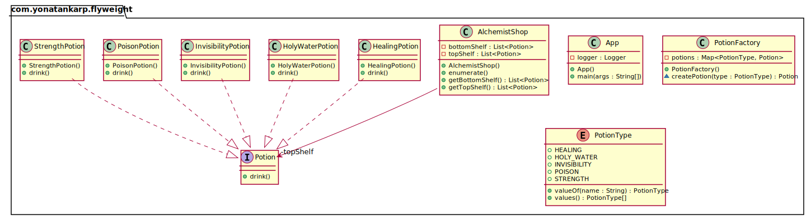

## Intent

Use sharing to support large numbers of fine-grained objects efficiently.

## Explanation

Real-world example

> Alchemist's shop has shelves full of magic potions. Many of the potions are
> the same so there is no need to create a new object for each of them. Instead,
> one object instance can represent multiple shelf items so the memory footprint
> remains small.

In plain words

> It is used to minimize memory usage or computational expenses by sharing as
> much as possible with similar objects.

Wikipedia says

> In computer programming, flyweight is a software design pattern. A flyweight
> is an object that minimizes memory use by sharing as much data as possible
> with other similar objects; it is a way to use objects in large numbers when
> a simple repeated representation would use an unacceptable amount of memory.

**Programmatic example**

Translating our alchemist shop example from above. First of all, we have
different potion types:

```kotlin
interface Potion {
  fun drink()
}

/**
 * HealingPotion.
 */
class HealingPotion : Potion {
  override fun drink() =
    logger.info("You feel healed. (Potion=${hashCode()})")
}

/**
 * HolyWaterPotion.
 */
class HolyWaterPotion : Potion {
  override fun drink() =
    logger.info("You feel blessed. (Potion=${hashCode()})")
}

/**
 * InvisibilityPotion.
 */
class InvisibilityPotion : Potion {
  override fun drink() =
    logger.info("You become invisible. (Potion=${hashCode()})")
}
```

Then the actual Flyweight class `PotionFactory`, which is the factory for
creating potions.

```kotlin
class PotionFactory {
  private val potions: MutableMap<PotionType, Potion> =
    EnumMap(PotionType::class.java)

  fun createPotion(type: PotionType): Potion =
    potions[type]
      ?: when (type) {
        HEALING -> HealingPotion()
        HOLY_WATER -> HolyWaterPotion()
        INVISIBILITY -> InvisibilityPotion()
        POISON -> PoisonPotion()
        STRENGTH -> StrengthPotion()
      }
        .also { potions[type] = it }
}
```

`AlchemistShop` contains two shelves of magic potions. The potions are created
using the aforementioned `PotionFactory`.

```kotlin
class AlchemistShop {
  val topShelf: List<Potion> = run {
    val factory = PotionFactory()
    listOf(
      factory.createPotion(INVISIBILITY),
      factory.createPotion(INVISIBILITY),
      factory.createPotion(STRENGTH),
      factory.createPotion(HEALING),
      factory.createPotion(INVISIBILITY),
      factory.createPotion(STRENGTH),
      factory.createPotion(HEALING),
      factory.createPotion(HEALING)
    )
  }

  val bottomShelf: List<Potion> = run {
    val factory = PotionFactory()
    listOf(
      factory.createPotion(POISON),
      factory.createPotion(POISON),
      factory.createPotion(POISON),
      factory.createPotion(HOLY_WATER),
      factory.createPotion(HOLY_WATER)
    )
  }
  
  fun drinkPotions() {
    logger.info("Drinking top shelf potions")
    topShelf.forEach(Potion::drink)
    logger.info("Drinking bottom shelf potions")
    bottomShelf.forEach(Potion::drink)
  }
}
```

In our scenario, a brave visitor enters the alchemist shop and drinks all the
potions.

```kotlin
// create the alchemist shop with the potions
val alchemistShop = AlchemistShop()
// a brave visitor enters the alchemist shop and drinks all the potions
alchemistShop.drinkPotions()
```

Program output:

```text
Drinking top shelf potions
You become invisible. (Potion=149047107)
You become invisible. (Potion=149047107)
You feel strong. (Potion=1413246829)
You feel healed. (Potion=334203599)
You become invisible. (Potion=149047107)
You feel strong. (Potion=1413246829)
You feel healed. (Potion=334203599)
You feel healed. (Potion=334203599)
Drinking bottom shelf potions
Urgh! This is poisonous. (Potion=1372082959)
Urgh! This is poisonous. (Potion=1372082959)
Urgh! This is poisonous. (Potion=1372082959)
You feel blessed. (Potion=1946403944)
You feel blessed. (Potion=1946403944)
```

## Class diagram



## Applicability

The Flyweight pattern's effectiveness depends heavily on how and where it's
used. Apply the Flyweight pattern when all the following are true:

* An application uses a large number of objects.
* Storage costs are high because of the sheer quantity of objects.
* Most of the object state can be made extrinsic.
* Many groups of objects may be replaced by relatively few shared objects once
  the extrinsic state is removed.
* The application doesn't depend on object identity. Since flyweight objects may
  be shared, identity tests will return true for conceptually distinct objects.

## Credits

* [Design Patterns: Elements of Reusable Object-Oriented Software](https://www.amazon.com/gp/product/0201633612/ref=as_li_tl?ie=UTF8&camp=1789&creative=9325&creativeASIN=0201633612&linkCode=as2&tag=javadesignpat-20&linkId=675d49790ce11db99d90bde47f1aeb59)
* [Head First Design Patterns: A Brain-Friendly Guide](https://www.amazon.com/gp/product/0596007124/ref=as_li_tl?ie=UTF8&camp=1789&creative=9325&creativeASIN=0596007124&linkCode=as2&tag=javadesignpat-20&linkId=6b8b6eea86021af6c8e3cd3fc382cb5b)
