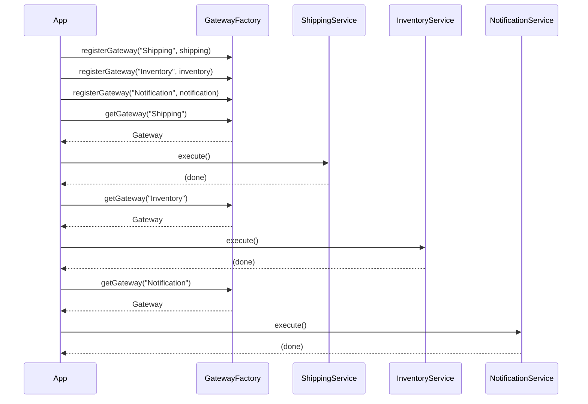
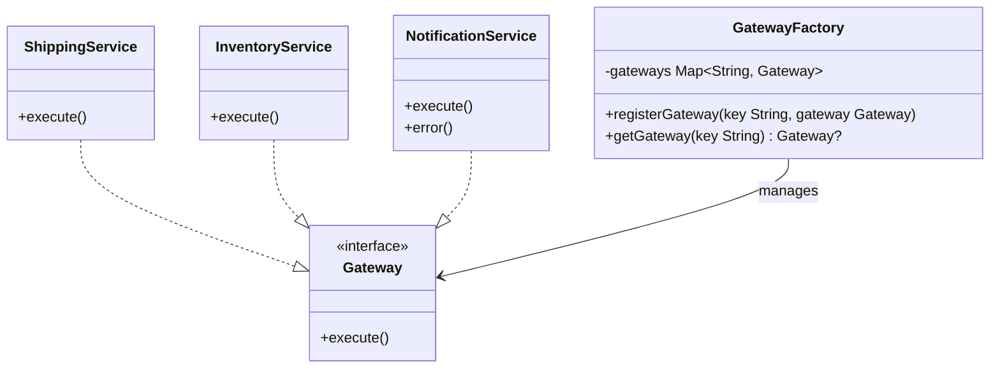

## Also known as

- Service Gateway

## Intent

Provide a unified and simplified interface to a set of
external services, encapsulating the details of each
service behind a common contract.

## Explanation

### Real-world example

> A logistics company interacts with multiple third-party
> services for shipping, inventory, and notifications. Each
> service has its own API and data format. A gateway sits
> between the company's internal systems and these external
> services, translating requests and responses so that
> internal code never deals with protocol-level details
> directly.

### In plain words

> Gateway provides a single interface that lets an internal
> system call any external service without knowing the
> service's implementation details.

### Wikipedia says

> A server that acts as an API front-end, receives API
> requests, enforces throttling and security policies,
> passes requests to the back-end service and then passes
> the response back to the requester.



### **Programmatic Example**

First we define a `Gateway` functional interface. Every
external service implements this single method.

```kotlin
fun interface Gateway {
    fun execute()
}
```

Three external services sit behind the gateway. Each logs
its execution and simulates a time-consuming remote call.

```kotlin
internal class ShippingService : Gateway {
    override fun execute() {
        logger.info("Executing Shipping Service")
        Thread.sleep(SIMULATED_DELAY_MS)
    }
}

internal class InventoryService : Gateway {
    override fun execute() {
        logger.info("Executing Inventory Service")
        Thread.sleep(SIMULATED_DELAY_MS)
    }
}

internal class NotificationService : Gateway {
    override fun execute() {
        logger.info("Executing Notification Service")
        Thread.sleep(SIMULATED_DELAY_MS)
    }

    fun error() {
        throw RuntimeException(
            "Notification Service encountered an error"
        )
    }
}
```

The `GatewayFactory` maintains a registry of services keyed
by name. Clients register services once, then retrieve them
by key whenever they need to call them.

```kotlin
internal class GatewayFactory {
    private val gateways = mutableMapOf<String, Gateway>()

    fun registerGateway(key: String, gateway: Gateway) {
        gateways[key] = gateway
    }

    fun getGateway(key: String): Gateway? = gateways[key]
}
```

Here is how the application wires everything together and
calls each service through the gateway.

```kotlin
val factory = GatewayFactory()
factory.registerGateway("Shipping", ShippingService())
factory.registerGateway("Inventory", InventoryService())
factory.registerGateway("Notification", NotificationService())

factory.getGateway("Shipping")?.execute()
factory.getGateway("Inventory")?.execute()
factory.getGateway("Notification")?.execute()
```

Running the example produces the following output.

```text
Executing Shipping Service
Executing Inventory Service
Executing Notification Service
```

## Class diagram



## Applicability

Use the Gateway pattern when:

- You need a unified interface to interact with multiple
  external services or APIs
- You want to decouple your application logic from the
  specifics of each external system
- You need a single point of control for protocol
  translation, data transformation, or request routing
- You are building a microservices architecture and want
  to manage inter-service communication through
  well-defined interfaces

## Consequences

Benefits:

- Reduces complexity by hiding external API details behind
  a simple interface
- Promotes loose coupling between application code and
  external dependencies
- Makes the system easier to test — services can be
  replaced with test doubles via the common interface

Trade-offs:

- Introduces an additional layer that could impact
  performance if not designed carefully
- Requires care to avoid a monolithic gateway that becomes
  a bottleneck or single point of failure

## Credits

- [Enterprise Integration Patterns: Designing, Building, and Deploying Messaging Solutions](https://amzn.to/3WcFVui)
- [Patterns of Enterprise Application Architecture](https://amzn.to/3WfKBPR)
- [Gateway (Martin Fowler)](https://martinfowler.com/articles/gateway-pattern.html)
