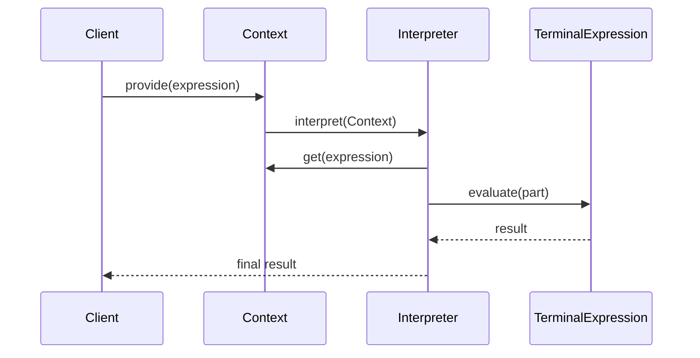
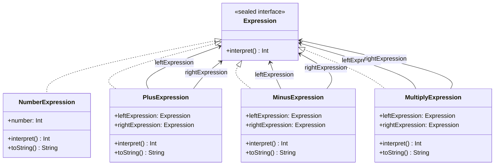

## Intent

Define a grammatical representation for a language and
provide an interpreter to handle this grammar.

## Explanation

### Real-world example

> Consider a calculator application designed to interpret
> and calculate expressions entered by users. The
> application uses the Interpreter pattern to parse and
> evaluate arithmetic expressions such as `"5 + 3 * 2"`.
> Here, the Interpreter translates each part of the
> expression into objects that represent numbers and
> operations. These objects follow a defined grammar that
> allows the application to understand and compute the
> result correctly based on the rules of arithmetic. Each
> element of the expression corresponds to a class in the
> program's structure, simplifying the parsing and
> evaluation process for any inputted arithmetic formula.

### In plain words

> The Interpreter design pattern defines a representation
> for a language's grammar along with an interpreter that
> uses the representation to interpret sentences in the
> language.

### Wikipedia says

> In computer programming, the interpreter pattern is a
> design pattern that specifies how to evaluate sentences
> in a language. The basic idea is to have a class for
> each symbol (terminal or nonterminal) in a specialized
> computer language. The syntax tree of a sentence in the
> language is an instance of the composite pattern and is
> used to evaluate (interpret) the sentence for a client.



### **Programmatic Example**

To interpret basic math, we need a hierarchy of
expressions. The `Expression` sealed interface is the
base, and concrete implementations handle specific parts
of the grammar.

```kotlin
internal sealed interface Expression {
    fun interpret(): Int
}
```

The simplest expression is `NumberExpression`, which holds
a single integer value.

```kotlin
internal data class NumberExpression(val number: Int) : Expression {
    constructor(s: String) : this(s.toInt())

    override fun interpret() = number

    override fun toString() = "number"
}
```

More complex expressions represent binary operations such
as `PlusExpression`, `MinusExpression`, and
`MultiplyExpression`. Here is the first of them; the
others are similar.

```kotlin
internal data class PlusExpression(
    val leftExpression: Expression,
    val rightExpression: Expression,
) : Expression {
    override fun interpret() = leftExpression.interpret() + rightExpression.interpret()

    override fun toString() = "+"
}
```

Now we can show the interpreter pattern in action, parsing
a postfix arithmetic expression using a stack.

```kotlin
fun main() {
    val tokenString = "4 3 2 - 1 + *"
    val stack = ArrayDeque<Expression>()

    tokenString.split(" ").forEach { token ->
        if (isOperator(token)) {
            val right = stack.removeLast()
            val left = stack.removeLast()
            logger.info("popped from stack left: {} right: {}", left.interpret(), right.interpret())
            val operator = getOperatorInstance(token, left, right)
            logger.info("operator: {}", operator)
            val result = operator.interpret()
            val resultExpression = NumberExpression(result)
            stack.addLast(resultExpression)
            logger.info("push result to stack: {}", resultExpression.interpret())
        } else {
            val expression = NumberExpression(token)
            stack.addLast(expression)
            logger.info("push to stack: {}", expression.interpret())
        }
    }

    logger.info("result: {}", stack.removeLast().interpret())
}
```

Executing the program produces the following console
output.

```text
push to stack: 4
push to stack: 3
push to stack: 2
popped from stack left: 3 right: 2
operator: -
push result to stack: 1
push to stack: 1
popped from stack left: 1 right: 1
operator: +
push result to stack: 2
popped from stack left: 4 right: 2
operator: *
push result to stack: 8
result: 8
```

## Class diagram



## Applicability

Use the Interpreter design pattern when there is a
language to interpret, and you can represent statements
in the language as abstract syntax trees. The Interpreter
pattern works best when:

- The grammar is simple. For complex grammars, the class
  hierarchy becomes large and unmanageable. Tools such as
  parser generators are a better alternative in such
  cases.
- Efficiency is not a critical concern. The most
  efficient interpreters are usually not implemented by
  interpreting parse trees directly but by first
  translating them into another form. For example,
  regular expressions are often transformed into state
  machines.

## Consequences

Benefits:

- Adds new operations to interpret expressions easily
  without changing the grammar or classes of data.
- Implements grammar directly in the language, making it
  easy to modify or extend.

Trade-offs:

- Can become complex and inefficient for large grammars.
- Each rule in the grammar results in a class, leading to
  a large number of classes for complex grammars.

## Related Patterns

- [Composite](../composite/README.md): Often used
  together, where the Interpreter pattern leverages the
  Composite pattern to represent the grammar as a tree
  structure.
- [Flyweight](../flyweight/README.md): Useful for sharing
  state to reduce memory usage in the Interpreter
  pattern, particularly for interpreters that deal with
  repetitive elements in a language.

## Credits

- [Design Patterns: Elements of Reusable Object-Oriented
  Software](https://amzn.to/3w0pvKI)
- [Head First Design Patterns: Building Extensible and
  Maintainable Object-Oriented
  Software](https://amzn.to/49NGldq)
- [Refactoring to Patterns](https://amzn.to/3VOO4F5)
