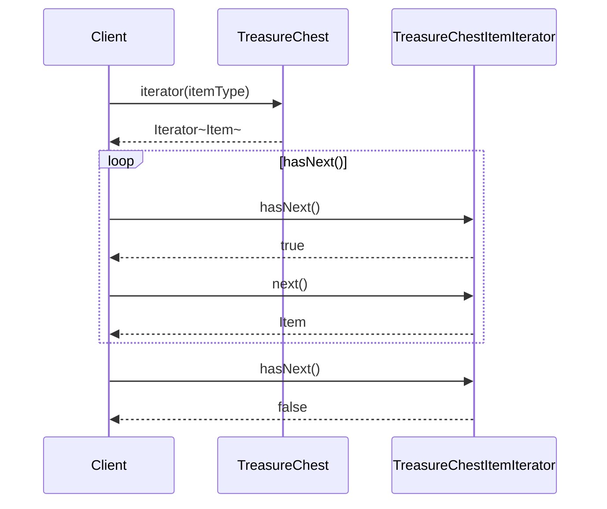
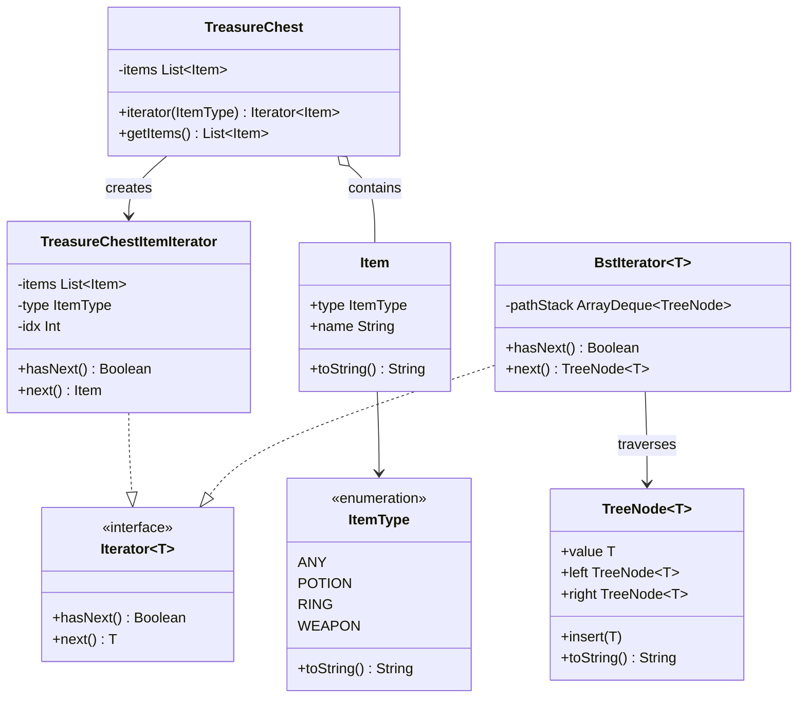

## Also known as

- Cursor

## Intent

Provide a way to access elements of an aggregate object
sequentially without exposing its underlying representation.

## Explanation

### Real-world example

> Imagine visiting a library with a vast collection of
> books organized in different sections such as fiction,
> non-fiction, science, etc. Instead of searching through
> every shelf yourself, the librarian provides you with a
> specific guidebook or a digital catalog for each section.
> This guidebook acts as an "iterator," allowing you to go
> through the books section by section, or even skip to
> specific types of books, without needing to know how the
> books are organized on the shelves.

### In plain words

> The Iterator pattern provides a method to sequentially
> access elements of a collection without exposing its
> underlying structure.

### Wikipedia says

> In object-oriented programming, the iterator pattern is
> a design pattern in which an iterator is used to traverse
> a container and access the container's elements.

### Sequence diagram



### **Programmatic Example**

The main class in our example is the `TreasureChest`
that contains items.

```kotlin
data class Item(val type: ItemType, val name: String) {
    override fun toString() = name
}

enum class ItemType {
    ANY,
    POTION,
    RING,
    WEAPON,
    ;

    override fun toString() = name.lowercase()
}
```

The `TreasureChest` class stores items and returns a
filtered iterator.

```kotlin
class TreasureChest {
    private val items: List<Item> =
        listOf(
            Item(ItemType.POTION, "Potion of courage"),
            Item(ItemType.RING, "Ring of shadows"),
            Item(ItemType.POTION, "Potion of wisdom"),
            Item(ItemType.POTION, "Potion of blood"),
            Item(ItemType.WEAPON, "Sword of silver +1"),
            Item(ItemType.POTION, "Potion of rust"),
            Item(ItemType.POTION, "Potion of healing"),
            Item(ItemType.RING, "Ring of armor"),
            Item(ItemType.WEAPON, "Steel halberd"),
            Item(ItemType.WEAPON, "Dagger of poison"),
        )

    fun iterator(itemType: ItemType): Iterator<Item> =
        TreasureChestItemIterator(items, itemType)

    fun getItems(): List<Item> = items.toList()
}
```

The `TreasureChestItemIterator` implements Kotlin's
built-in `Iterator` interface, filtering items by type.

```kotlin
internal class TreasureChestItemIterator(
    private val items: List<Item>,
    private val type: ItemType,
) : Iterator<Item> {
    private var idx = -1

    override fun hasNext(): Boolean = findNextIdx() != -1

    override fun next(): Item {
        idx = findNextIdx()
        check(idx != -1) { "No more items" }
        return items[idx]
    }

    private fun findNextIdx(): Int {
        var tempIdx = idx
        while (true) {
            tempIdx++
            if (tempIdx >= items.size) return -1
            if (type == ItemType.ANY ||
                items[tempIdx].type == type
            ) {
                return tempIdx
            }
        }
    }
}
```

A second example demonstrates iteration over a binary
search tree. The `TreeNode` class represents a BST node.

```kotlin
class TreeNode<T : Comparable<T>>(val value: T) {
    var left: TreeNode<T>? = null
        private set
    var right: TreeNode<T>? = null
        private set

    fun insert(newValue: T) {
        val parent = parentNodeFor(newValue)
        parent.insertChild(newValue)
    }

    override fun toString(): String = value.toString()
}
```

The `BstIterator` performs an in-order traversal using
a stack, achieving O(h) extra space.

```kotlin
class BstIterator<T : Comparable<T>>(
    root: TreeNode<T>?,
) : Iterator<TreeNode<T>> {
    private val pathStack = ArrayDeque<TreeNode<T>>()

    init {
        pushPathToNextSmallest(root)
    }

    override fun hasNext(): Boolean =
        pathStack.isNotEmpty()

    override fun next(): TreeNode<T> {
        if (pathStack.isEmpty()) {
            throw NoSuchElementException()
        }
        val next = pathStack.pop()
        pushPathToNextSmallest(next.right)
        return next
    }
}
```

Here is the full example in action.

```kotlin
val treasureChest = TreasureChest()

logger.info("Item Iterator for ItemType ring: ")
val ringIterator = treasureChest.iterator(ItemType.RING)
ringIterator.forEach { logger.info(it.toString()) }

logger.info("BST Iterator: ")
val root = TreeNode(8).apply {
    insert(3)
    insert(10)
    insert(1)
    insert(6)
    insert(14)
    insert(4)
    insert(7)
    insert(13)
}
val bstIterator = BstIterator(root)
bstIterator.forEach { logger.info("Next node: ${it.value}") }
```

Program output:

```text
Item Iterator for ItemType ring:
Ring of shadows
Ring of armor
BST Iterator:
Next node: 1
Next node: 3
Next node: 4
Next node: 6
Next node: 7
Next node: 8
Next node: 10
Next node: 13
Next node: 14
```

## Class diagram



## Applicability

Use the Iterator pattern when:

- You need to access an aggregate object's contents
  without exposing its internal representation.
- You want to support multiple traversals of aggregate
  objects.
- You want to provide a uniform interface for traversing
  different aggregate structures.

## Consequences

Benefits:

- Reduces the coupling between data structures and
  algorithms used for iteration.
- Provides a uniform interface for iterating over various
  types of data structures, enhancing code reusability
  and flexibility.

Trade-offs:

- Overhead of using an iterator object may slightly
  reduce performance compared to direct traversal.
- Complex aggregate structures may require complex
  iterators that can be difficult to manage or extend.

## Credits

- [Design Patterns: Elements of Reusable
  Object-Oriented Software](https://amzn.to/3w0pvKI)
- [Head First Design Patterns: Building Extensible and
  Maintainable Object-Oriented
  Software](https://amzn.to/49NGldq)
