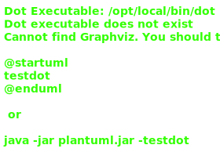

## Also known as

* Cursor

## Intent

Provide a way to access the elements of an aggregate object sequentially without
exposing its underlying representation.

## Explanation

Real-world example

> Imagine visiting a library with a vast collection of books organized in
> different sections such as fiction, non-fiction, science, etc. Instead of
> searching through every shelf yourself, the librarian provides you with a
> specific guidebook or a digital catalog for each section. This guidebook acts
> as an "iterator," allowing you to go through the books section by section, or
> even skip to specific types of books, without needing to know how the books are
> organized on the shelves.

In plain words

> Iterator provides a standard way to loop through a collection without exposing
> its internal structure.

Wikipedia says

> In object-oriented programming, the iterator pattern is a design pattern in
> which an iterator is used to traverse a container and access the container's
> elements.

**Programmatic Example**

The main class in our example is the `TreasureChest` that contains items.

```kotlin
class TreasureChest {
    val items = listOf(
        Item(ItemType.POTION, "Potion of courage"),
        Item(ItemType.RING, "Ring of shadows"),
        Item(ItemType.POTION, "Potion of wisdom"),
        Item(ItemType.POTION, "Potion of blood"),
        Item(ItemType.WEAPON, "Sword of silver +1"),
        Item(ItemType.POTION, "Potion of rust"),
        Item(ItemType.POTION, "Potion of healing"),
        Item(ItemType.RING, "Ring of armor"),
        Item(ItemType.WEAPON, "Steel halberd"),
        Item(ItemType.WEAPON, "Dagger of poison"),
    )

    fun iterator(itemType: ItemType): Iterator<Item> =
        TreasureChestItemIterator(items, itemType)
}
```

Here's the `Item` class:

```kotlin
data class Item(
    val type: ItemType,
    val name: String,
) {
    override fun toString() = name
}

enum class ItemType {
    ANY,
    POTION,
    RING,
    WEAPON,
}
```

The `TreasureChestItemIterator` implements `kotlin.collections.Iterator` and
filters items by type.

```kotlin
class TreasureChestItemIterator(
    private val items: List<Item>,
    private val type: ItemType,
) : Iterator<Item> {
    private var currentIndex: Int = -1

    override fun hasNext(): Boolean = findNextIndex() != -1

    override fun next(): Item {
        currentIndex = findNextIndex()
        if (currentIndex == -1) {
            throw NoSuchElementException()
        }
        return items[currentIndex]
    }

    private fun findNextIndex(): Int =
        (currentIndex + 1..items.lastIndex).firstOrNull { idx ->
            type == ItemType.ANY || items[idx].type == type
        } ?: -1
}
```

The example also includes a `TreeNode` for building a binary search tree and a
`BstIterator` that traverses it in-order.

```kotlin
class TreeNode<T : Comparable<T>>(
    val value: T,
    var left: TreeNode<T>? = null,
    var right: TreeNode<T>? = null,
) {
    fun insert(newValue: T) {
        val parent = findParentFor(newValue)
        if (newValue <= parent.value) {
            parent.left = TreeNode(newValue)
        } else {
            parent.right = TreeNode(newValue)
        }
    }
}

class BstIterator<T : Comparable<T>>(
    root: TreeNode<T>,
) : Iterator<TreeNode<T>> {
    private val stack = ArrayDeque<TreeNode<T>>()

    init {
        pushLeftPath(root)
    }

    override fun hasNext(): Boolean = stack.isNotEmpty()

    override fun next(): TreeNode<T> {
        if (!hasNext()) {
            throw NoSuchElementException()
        }
        val node = stack.removeLast()
        node.right?.let { pushLeftPath(it) }
        return node
    }

    private fun pushLeftPath(node: TreeNode<T>?) {
        var current = node
        while (current != null) {
            stack.addLast(current)
            current = current.left
        }
    }
}
```

In the following example, we demonstrate different kinds of iterators.

```kotlin
val chest = TreasureChest()

val ringIterator = chest.iterator(ItemType.RING)
while (ringIterator.hasNext()) {
    logger.info(ringIterator.next().toString())
}

val potionIterator = chest.iterator(ItemType.POTION)
while (potionIterator.hasNext()) {
    logger.info(potionIterator.next().toString())
}

val weaponIterator = chest.iterator(ItemType.WEAPON)
while (weaponIterator.hasNext()) {
    logger.info(weaponIterator.next().toString())
}

val root = TreeNode(8)
listOf(3, 10, 1, 6, 14, 4, 7, 13).forEach { root.insert(it) }
val bstIterator = BstIterator(root)
while (bstIterator.hasNext()) {
    logger.info("Next node: ${bstIterator.next().value}")
}
```

Program output:

```
Ring of shadows
Ring of armor
Potion of courage
Potion of wisdom
Potion of blood
Potion of rust
Potion of healing
Sword of silver +1
Steel halberd
Dagger of poison
Next node: 1
Next node: 3
Next node: 4
Next node: 6
Next node: 7
Next node: 8
Next node: 10
Next node: 13
Next node: 14
```

## Class diagram



## Applicability

Use the Iterator pattern when

* You want to access an aggregate object's contents without exposing its
  internal representation
* You want to support multiple traversals of aggregate objects
* You want to provide a uniform interface for traversing different aggregate
  structures (polymorphic iteration)

## Consequences

Benefits:

* Reduces the coupling between data structures and algorithms used for iteration
* Provides a uniform interface for iterating over various types of data
  structures, enhancing code reusability and flexibility

Trade-offs:

* Overhead of using an iterator object may slightly reduce performance compared
  to direct traversal methods
* Complex aggregate structures may require complex iterators that can be
  difficult to manage or extend

## Credits

* [Design Patterns: Elements of Reusable Object-Oriented Software](https://www.amazon.com/gp/product/0201633612/ref=as_li_tl?ie=UTF8&camp=1789&creative=9325&creativeASIN=0201633612&linkCode=as2&tag=javadesignpat-20&linkId=675d49790ce11db99d90bde47f1aeb59)
* [Head First Design Patterns: A Brain-Friendly Guide](https://www.amazon.com/gp/product/0596007124/ref=as_li_tl?ie=UTF8&camp=1789&creative=9325&creativeASIN=0596007124&linkCode=as2&tag=javadesignpat-20&linkId=6b8b6eea86021af6c8e3cd3fc382cb5b)