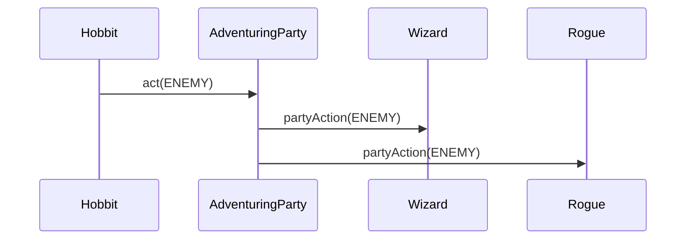
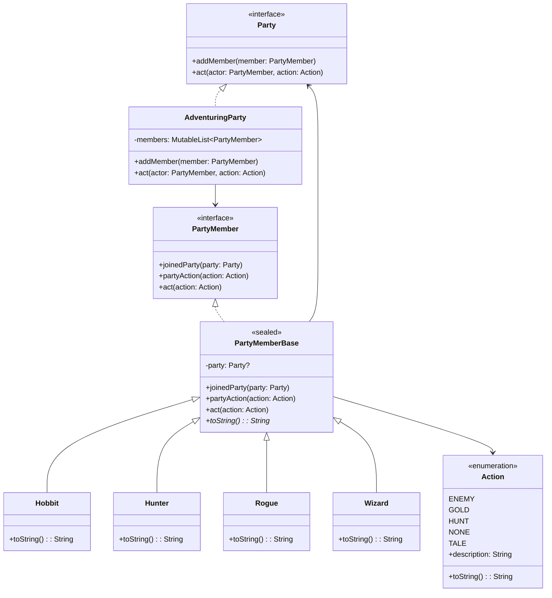

## Also known as

- Controller

## Intent

Reduce the complexity of communication between multiple objects
by providing a centralized mediator class that handles the
interactions between different classes, reducing their direct
dependencies on each other.

## Explanation

Real-world example

> Imagine an air traffic control system at a busy airport,
> where the air traffic controller acts as a mediator. Instead
> of each pilot communicating directly with every other pilot,
> all communication goes through the air traffic controller.
> The controller receives requests, processes them, and gives
> clear, organized instructions to each pilot.

In plain words

> Mediator decouples a set of classes by forcing their
> communications to flow through a mediating object.

Wikipedia says

> In software engineering, the mediator pattern defines an
> object that encapsulates how a set of objects interact.
> This pattern is considered to be a behavioral pattern due
> to the way it can alter the program's running behavior.
> With the mediator pattern, communication between objects is
> encapsulated within a mediator object. Objects no longer
> communicate directly with each other, but instead
> communicate through the mediator. This reduces the
> dependencies between communicating objects, thereby
> reducing coupling.

Sequence diagram



**Programmatic Example**

The party members `Rogue`, `Wizard`, `Hobbit`, and `Hunter`
all inherit from the sealed `PartyMemberBase` class which
implements the `PartyMember` interface.

```kotlin
interface PartyMember {
    fun joinedParty(party: Party)
    fun partyAction(action: Action)
    fun act(action: Action)
}

sealed class PartyMemberBase : PartyMember {
    private val logger = LoggerFactory.getLogger(javaClass)
    private var party: Party? = null

    override fun joinedParty(party: Party) {
        logger.info("$this joins the party")
        this.party = party
    }

    override fun partyAction(action: Action) {
        logger.info("$this ${action.description}")
    }

    override fun act(action: Action) {
        party?.let {
            logger.info("$this $action")
            it.act(this, action)
        }
    }

    abstract override fun toString(): String
}

internal class Hobbit : PartyMemberBase() {
    override fun toString(): String = "Hobbit"
}

// Hunter, Rogue, and Wizard are implemented similarly
```

The mediator system consists of the `Party` interface and its
`AdventuringParty` implementation.

```kotlin
interface Party {
    fun addMember(member: PartyMember)
    fun act(actor: PartyMember, action: Action)
}

internal class AdventuringParty : Party {
    private val members = mutableListOf<PartyMember>()

    override fun addMember(member: PartyMember) {
        members.add(member)
        member.joinedParty(this)
    }

    override fun act(actor: PartyMember, action: Action) {
        members
            .filter { it != actor }
            .forEach { it.partyAction(action) }
    }
}
```

Here is a demo showing the mediator pattern in action.

```kotlin
fun main() {
    val party: Party = AdventuringParty()
    val hobbit = Hobbit()
    val wizard = Wizard()
    val rogue = Rogue()
    val hunter = Hunter()

    party.addMember(hobbit)
    party.addMember(wizard)
    party.addMember(rogue)
    party.addMember(hunter)

    hobbit.act(Action.ENEMY)
    wizard.act(Action.TALE)
    rogue.act(Action.GOLD)
    hunter.act(Action.HUNT)
}
```

Program output:

```text
Hobbit joins the party
Wizard joins the party
Rogue joins the party
Hunter joins the party
Hobbit spotted enemies
Wizard runs for cover
Rogue runs for cover
Hunter runs for cover
Wizard tells a tale
Hobbit comes to listen
Rogue comes to listen
Hunter comes to listen
Rogue found gold
Hobbit takes his share of the gold
Wizard takes his share of the gold
Hunter takes his share of the gold
Hunter hunted a rabbit
Hobbit arrives for dinner
Wizard arrives for dinner
Rogue arrives for dinner
```

## Class diagram



## Applicability

Use the Mediator pattern when:

- A set of objects communicate in well-defined but complex
  ways and the resulting interdependencies are unstructured
  and difficult to understand
- Reusing an object is difficult because it refers to and
  communicates with many other objects
- A behavior that is distributed between several classes
  should be customizable without a lot of subclassing

## Consequences

Benefits:

- Reduces coupling between components of a program, fostering
  better organization and easier maintenance
- Centralizes control: the mediator pattern centralizes the
  control logic, making it easier to comprehend and manage

Trade-offs:

- The mediator can become a god object coupled with all
  classes in the system, gaining too much responsibility and
  complexity

## Credits

- [Design Patterns: Elements of Reusable Object-Oriented Software](https://amzn.to/3w0pvKI)
- [Head First Design Patterns: Building Extensible and Maintainable Object-Oriented Software](https://amzn.to/49NGldq)
