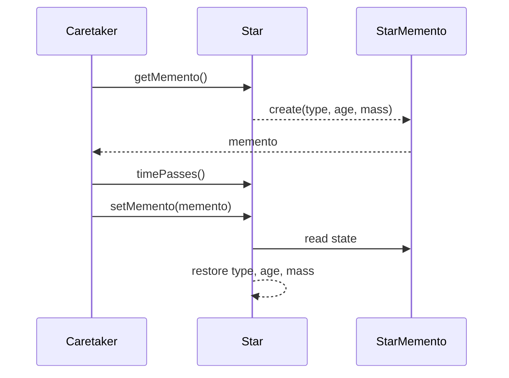
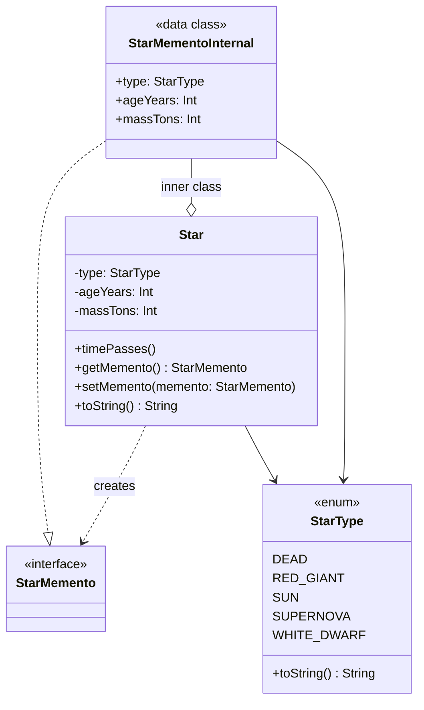

## Also known as

- Snapshot
- Token

## Intent

Capture and externalize an object's internal state so that it
can be restored later, without violating encapsulation.

## Explanation

Real-world example

> A text editor captures the current state of a document as a
> memento each time a change is made. The snapshots are stored
> in a history list. When the user clicks undo, the editor
> restores the document to the state saved in the most recent
> memento, without exposing or altering the internal data
> structures.

In plain words

> The Memento pattern captures an object's internal state so
> it can be stored and restored at any point in time.

Wikipedia says

> The memento pattern is a software design pattern that
> provides the ability to restore an object to its previous
> state (undo via rollback).

Sequence diagram



**Programmatic Example**

First we define the lifecycle stages of a star.

```kotlin
internal enum class StarType(private val title: String) {
    DEAD("dead star"),
    RED_GIANT("red giant"),
    SUN("sun"),
    SUPERNOVA("supernova"),
    WHITE_DWARF("white dwarf"),
    ;

    override fun toString(): String = title
}
```

The [StarMemento] interface is an opaque handle that hides the
actual state from the caretaker.

```kotlin
interface StarMemento
```

The [Star] class is the originator. It stores its state in a
private `data class` that implements [StarMemento], so outside
code cannot inspect or modify the saved state.

```kotlin
internal class Star(
    private var type: StarType,
    private var ageYears: Int,
    private var massTons: Int,
) {
    fun timePasses() {
        ageYears *= 2
        massTons *= 8
        when (type) {
            StarType.SUN -> type = StarType.RED_GIANT
            StarType.RED_GIANT -> type = StarType.WHITE_DWARF
            StarType.WHITE_DWARF -> type = StarType.SUPERNOVA
            StarType.SUPERNOVA -> type = StarType.DEAD
            StarType.DEAD -> {
                ageYears *= 2
                massTons = 0
            }
        }
    }

    fun getMemento(): StarMemento =
        StarMementoInternal(
            type = type,
            ageYears = ageYears,
            massTons = massTons,
        )

    fun setMemento(memento: StarMemento) {
        val state = memento as StarMementoInternal
        type = state.type
        ageYears = state.ageYears
        massTons = state.massTons
    }

    override fun toString(): String =
        "$type age: $ageYears years mass: $massTons tons"

    private data class StarMementoInternal(
        val type: StarType,
        val ageYears: Int,
        val massTons: Int,
    ) : StarMemento
}
```

Here is how the caretaker uses a stack of mementos to save and
restore star states.

```kotlin
fun main() {
    val states = ArrayDeque<StarMemento>()

    val star = Star(StarType.SUN, 10_000_000, 500_000)
    logger.info(star.toString())
    states.push(star.getMemento())

    star.timePasses()
    logger.info(star.toString())
    states.push(star.getMemento())

    star.timePasses()
    logger.info(star.toString())
    states.push(star.getMemento())

    star.timePasses()
    logger.info(star.toString())
    states.push(star.getMemento())

    star.timePasses()
    logger.info(star.toString())

    while (states.isNotEmpty()) {
        star.setMemento(states.pop())
        logger.info(star.toString())
    }
}
```

Program output:

```text
sun age: 10000000 years mass: 500000 tons
red giant age: 20000000 years mass: 4000000 tons
white dwarf age: 40000000 years mass: 32000000 tons
supernova age: 80000000 years mass: 256000000 tons
dead star age: 160000000 years mass: 2048000000 tons
supernova age: 80000000 years mass: 256000000 tons
white dwarf age: 40000000 years mass: 32000000 tons
red giant age: 20000000 years mass: 4000000 tons
sun age: 10000000 years mass: 500000 tons
```

## Class diagram



## Applicability

Use the Memento pattern when:

- You need to capture an object's state and restore it later
  without exposing its internal structure
- A direct interface to obtaining the state would expose
  implementation details and break encapsulation

## Consequences

Benefits:

- Preserves encapsulation boundaries
- Simplifies the originator by removing the need to manage
  version history or undo functionality directly

Trade-offs:

- Can be expensive in terms of memory if a large number of
  states are saved
- Care must be taken to manage the lifecycle of mementos to
  avoid memory leaks

## Credits

- [Design Patterns: Elements of Reusable Object-Oriented Software](https://amzn.to/3w0pvKI)
- [Head First Design Patterns: Building Extensible and Maintainable Object-Oriented Software](https://amzn.to/49NGldq)
