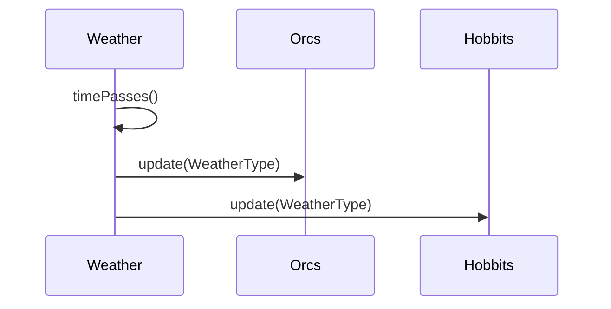
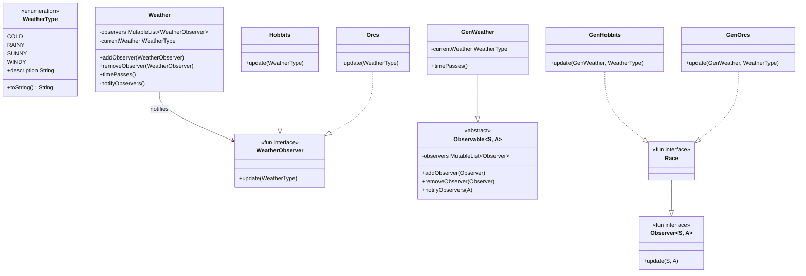

## Also known as

- Dependents

## Intent

Define a one-to-many dependency between objects so
that when one object changes state, all its dependents
are notified and updated automatically.

## Explanation

### Real-world example

> In a land far away live the races of hobbits and
> orcs. Both of them are mostly outdoors, so they
> closely follow the weather changes. One could say
> they are constantly observing the weather.

### In plain words

> Register as an observer to receive state changes
> from the subject you are interested in.

### Wikipedia says

> The observer pattern is a software design pattern in
> which an object, called the subject, maintains a list
> of its dependents, called observers, and notifies
> them automatically of any state changes, usually by
> calling one of their methods.

### Sequence diagram



### **Programmatic Example**

Let's first introduce the `WeatherObserver` functional
interface and our races, `Orcs` and `Hobbits`.

```kotlin
fun interface WeatherObserver {
    fun update(currentWeather: WeatherType)
}

internal class Orcs : WeatherObserver {
    private val logger =
        LoggerFactory.getLogger(javaClass)

    override fun update(currentWeather: WeatherType) {
        logger.info(
            "The orcs are facing {} weather now",
            currentWeather.description,
        )
    }
}

internal class Hobbits : WeatherObserver {
    private val logger =
        LoggerFactory.getLogger(javaClass)

    override fun update(currentWeather: WeatherType) {
        logger.info(
            "The hobbits are facing {} weather now",
            currentWeather.description,
        )
    }
}
```

Then here is the `Weather` that is constantly changing.

```kotlin
class Weather {
    private val logger =
        LoggerFactory.getLogger(javaClass)

    private val observers =
        mutableListOf<WeatherObserver>()
    private var currentWeather = WeatherType.SUNNY

    fun addObserver(observer: WeatherObserver) {
        observers.add(observer)
    }

    fun removeObserver(observer: WeatherObserver) {
        observers.remove(observer)
    }

    fun timePasses() {
        val values = WeatherType.entries
        currentWeather =
            values[
                (currentWeather.ordinal + 1) % values.size,
            ]
        logger.info(
            "The weather changed to {}.",
            currentWeather,
        )
        notifyObservers()
    }

    private fun notifyObservers() {
        observers.forEach { it.update(currentWeather) }
    }
}
```

Here is the full example in action.

```kotlin
val weather = Weather()
weather.addObserver(Orcs())
weather.addObserver(Hobbits())

weather.timePasses()
weather.timePasses()
weather.timePasses()
weather.timePasses()
```

Program output:

```text
The weather changed to rainy.
The orcs are facing Rainy weather now
The hobbits are facing Rainy weather now
The weather changed to windy.
The orcs are facing Windy weather now
The hobbits are facing Windy weather now
The weather changed to cold.
The orcs are facing Cold weather now
The hobbits are facing Cold weather now
The weather changed to sunny.
The orcs are facing Sunny weather now
The hobbits are facing Sunny weather now
```

A generic-observer variant uses type parameters so that
the observer receives both the subject reference and an
argument describing the change:

```kotlin
fun interface Observer<S, A> {
    fun update(subject: S, argument: A)
}

abstract class Observable<S : Observable<S, A>, A> {
    private val observers =
        mutableListOf<Observer<S, A>>()

    fun addObserver(observer: Observer<S, A>) {
        observers.add(observer)
    }

    fun removeObserver(observer: Observer<S, A>) {
        observers.remove(observer)
    }

    fun notifyObservers(argument: A) {
        observers.forEach {
            it.update(this as S, argument)
        }
    }
}
```

## Class diagram



## Applicability

Use the Observer pattern when:

- An abstraction has two aspects, one dependent on
  the other. Encapsulating these aspects in separate
  objects lets you vary and reuse them independently.
- A change to one object requires changing others,
  and you don't know how many objects need changing.
- An object should be able to notify other objects
  without making assumptions about who those objects
  are -- you don't want these objects tightly coupled.

## Consequences

Benefits:

- Promotes loose coupling between the subject and its
  observers.
- Allows dynamic subscription and unsubscription of
  observers at runtime.

Trade-offs:

- Can lead to memory leaks if observers are not
  properly deregistered.
- The order of notification is not specified, which
  may lead to unexpected behaviour.
- Potential for performance issues with a large number
  of observers.

## Credits

- [Design Patterns: Elements of Reusable
  Object-Oriented Software](https://amzn.to/3w0pvKI)
- [Java Generics and
  Collections](https://amzn.to/3VhOBxp)
- [Head First Design Patterns: Building Extensible
  and Maintainable Object-Oriented
  Software](https://amzn.to/49NGldq)
- [Refactoring to Patterns](https://amzn.to/3VOO4F5)
