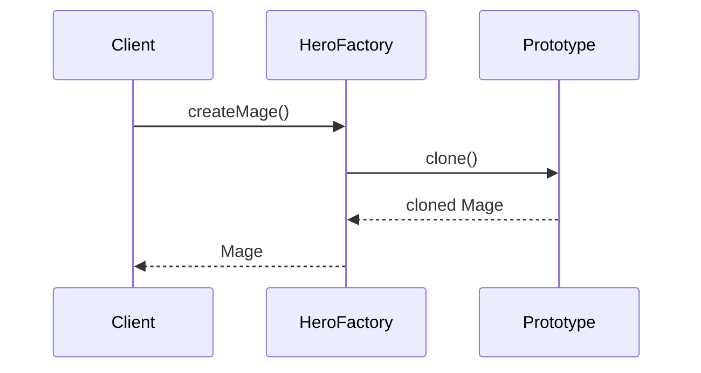
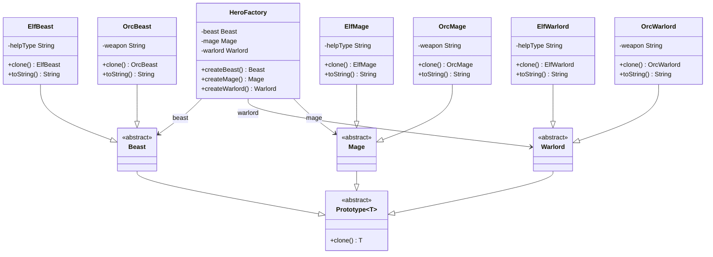

## Also known as

- Clone

## Intent

Specify the kinds of objects to create using a
prototypical instance, and create new objects by
copying this prototype.

## Explanation

### Real-world example

> Imagine a company that manufactures custom-designed
> furniture. Instead of creating each piece from scratch
> every time an order is placed, they keep prototypes of
> their most popular designs. When a customer places an
> order, the company clones the prototype and makes the
> necessary customizations.

### In plain words

> Create an object based on an existing object through
> cloning.

### Wikipedia says

> The prototype pattern is a creational design pattern
> in software development. It is used when the type of
> objects to create is determined by a prototypical
> instance, which is cloned to produce new objects.



### **Programmatic Example**

In Kotlin, the prototype pattern leverages `data class`
`copy()` for cloning. First, create an abstract base
with a `clone` method.

```kotlin
abstract class Prototype<T> {
    abstract fun clone(): T
}
```

Our example contains a hierarchy of different
creatures. For example, let's look at `Beast` and
`OrcBeast` classes.

```kotlin
abstract class Beast : Prototype<Beast>()

data class OrcBeast(
    private val weapon: String,
) : Beast() {
    override fun clone() = copy()

    override fun toString() =
        "Orcish wolf attacks with $weapon"
}
```

The full example also contains `Mage` and `Warlord`
base classes with elven and orcish implementations.

To take full advantage of the prototype pattern, we
create `HeroFactory` to produce different kinds of
creatures from prototypes.

```kotlin
class HeroFactory(
    private val mage: Mage,
    private val warlord: Warlord,
    private val beast: Beast,
) {
    fun createMage() = mage.clone()
    fun createWarlord() = warlord.clone()
    fun createBeast() = beast.clone()
}
```

Now we can produce new creatures by cloning existing
instances.

```kotlin
val elfFactory = HeroFactory(
    ElfMage("cooking"),
    ElfWarlord("cleaning"),
    ElfBeast("protecting")
)

val elfMage = elfFactory.createMage()
val elfWarlord = elfFactory.createWarlord()
val elfBeast = elfFactory.createBeast()

logger.info(elfMage.toString())
logger.info(elfWarlord.toString())
logger.info(elfBeast.toString())

val orcFactory = HeroFactory(
    OrcMage("axe"),
    OrcWarlord("sword"),
    OrcBeast("laser")
)

val orcMage = orcFactory.createMage()
val orcWarlord = orcFactory.createWarlord()
val orcBeast = orcFactory.createBeast()

logger.info(orcMage.toString())
logger.info(orcWarlord.toString())
logger.info(orcBeast.toString())
```

Program output:

```text
Elven mage helps in cooking
Elven warlord helps in cleaning
Elven eagle helps in protecting
Orcish mage attacks with axe
Orcish warlord attacks with sword
Orcish wolf attacks with laser
```

## Class diagram



## Applicability

Use the Prototype pattern when:

- The classes to instantiate are specified at run-time,
  for example by dynamic loading.
- To avoid building a class hierarchy of factories
  that parallels the class hierarchy of products.
- When instances of a class can have one of only a few
  different combinations of state. It may be more
  convenient to install a corresponding number of
  prototypes and clone them rather than instantiating
  the class manually each time.
- When object creation is expensive compared to
  cloning.

## Consequences

Benefits:

- Hides the complexities of instantiating new objects.
- Reduces the number of classes.
- Allows adding and removing objects at runtime.

Trade-offs:

- Requires implementing a cloning mechanism which
  might be complex.
- Deep cloning can be difficult to implement correctly,
  especially with complex object graphs or circular
  references.

## Related Patterns

- [Abstract Factory](../abstract-factory/README.md):
  Both create objects, but Prototype uses cloning
  whereas Abstract Factory uses factory methods.
- [Factory Method](../factory-method/README.md): A
  factory method that returns a new instance cloned
  from a prototype.

## Credits

- [Design Patterns: Elements of Reusable Object-Oriented
  Software](https://amzn.to/3w0pvKI)
- [Head First Design Patterns: Building Extensible and
  Maintainable Object-Oriented
  Software](https://amzn.to/49NGldq)
