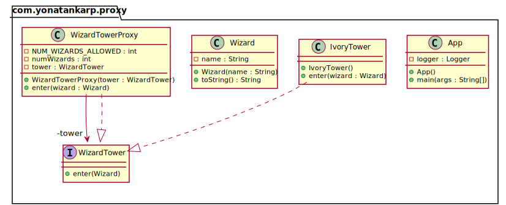

## Also known as

- Surrogate

## Intent

Provide a surrogate or placeholder for another object to control access to it.

## Explanation

Real-world example

> Imagine a tower where the local wizards go to study their spells. The ivory
> tower can only be accessed through a proxy which ensures that only the first
> three wizards can enter. Here the proxy represents the functionality of the
> tower and adds access control to it.

In plain words

> Using the proxy pattern, a class represents the functionality of another
> class.

Wikipedia says

> A proxy, in its most general form, is a class functioning as an interface to
> something else. A proxy is a wrapper or agent object that is being called by
> the client to access the real serving object behind the scenes. Use of the
> proxy can simply be forwarding to the real object, or can provide additional
> logic. In the proxy extra functionality can be provided, for example caching
> when operations on the real object are resource intensive, or checking
> preconditions before operations on the real object are invoked.

**Programmatic Example**

Taking our wizard tower example from above. Firstly we have the `WizardTower`
interface and the `IvoryTower` class.

```kotlin
interface WizardTower {
  fun enter(wizard: Wizard)
}

class IvoryTower : WizardTower {
  override fun enter(wizard: Wizard) =
      logger.info("$wizard enters the tower.")
}
```

Then a simple `Wizard` class.

```kotlin
class Wizard(private val name: String) {
  override fun toString() = name
}
```

Then we have the `WizardTowerProxy` to add access control to `WizardTower`.

```kotlin
class WizardTowerProxy(private val tower: WizardTower) : WizardTower {
  private var numWizards = 0

  override fun enter(wizard: Wizard) {
    if (numWizards < NUM_WIZARDS_ALLOWED) {
      tower.enter(wizard)
      numWizards++
    } else {
      logger.info("$wizard is not allowed to enter!")
    }
  }

  companion object {
    private const val NUM_WIZARDS_ALLOWED = 3
  }
}
```

And here is the tower entering scenario.

```kotlin
val proxy = WizardTowerProxy(IvoryTower())
proxy.enter(Wizard("Red wizard"))
proxy.enter(Wizard("White wizard"))
proxy.enter(Wizard("Black wizard"))
proxy.enter(Wizard("Green wizard"))
proxy.enter(Wizard("Brown wizard"))
```

Program output:

```text
Red wizard enters the tower.
White wizard enters the tower.
Black wizard enters the tower.
Green wizard is not allowed to enter!
Brown wizard is not allowed to enter!
```

## Class diagram



## Applicability

Proxy is applicable whenever there is a need for a more versatile or
sophisticated reference to an object than a simple pointer. Here are several
common situations in which the Proxy pattern is applicable.

* Remote proxy provides a local representative for an object in a different
  address space.
* Virtual proxy creates expensive objects on demand.
* Protection proxy controls access to the original object. Protection proxies
  are useful when objects should have different access rights.

Typically, the proxy pattern is used to

* Control access to another object
* Lazy initialization
* Implement logging
* Facilitate network connection
* Count references to an object

## Tutorials

* [Controlling Access With Proxy Pattern](http://java-design-patterns.com/blog/controlling-access-with-proxy-pattern/)

## Related patterns

[//]: # (TODO: Update once the pattern is set)
* [Ambassador](https://java-design-patterns.com/patterns/ambassador/)

## Credits

* [Design Patterns: Elements of Reusable Object-Oriented Software](https://www.amazon.com/gp/product/0201633612/ref=as_li_tl?ie=UTF8&camp=1789&creative=9325&creativeASIN=0201633612&linkCode=as2&tag=javadesignpat-20&linkId=675d49790ce11db99d90bde47f1aeb59)
* [Head First Design Patterns: A Brain-Friendly Guide](https://www.amazon.com/gp/product/0596007124/ref=as_li_tl?ie=UTF8&camp=1789&creative=9325&creativeASIN=0596007124&linkCode=as2&tag=javadesignpat-20&linkId=6b8b6eea86021af6c8e3cd3fc382cb5b)
