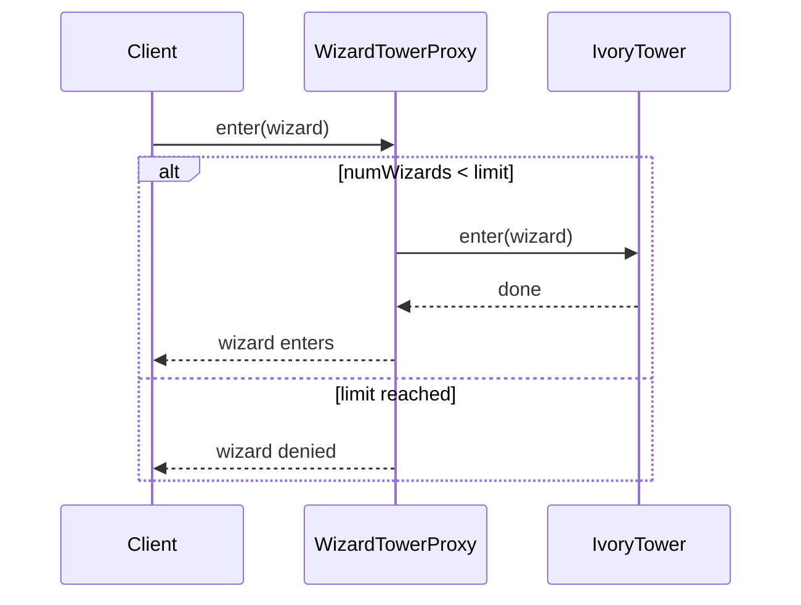
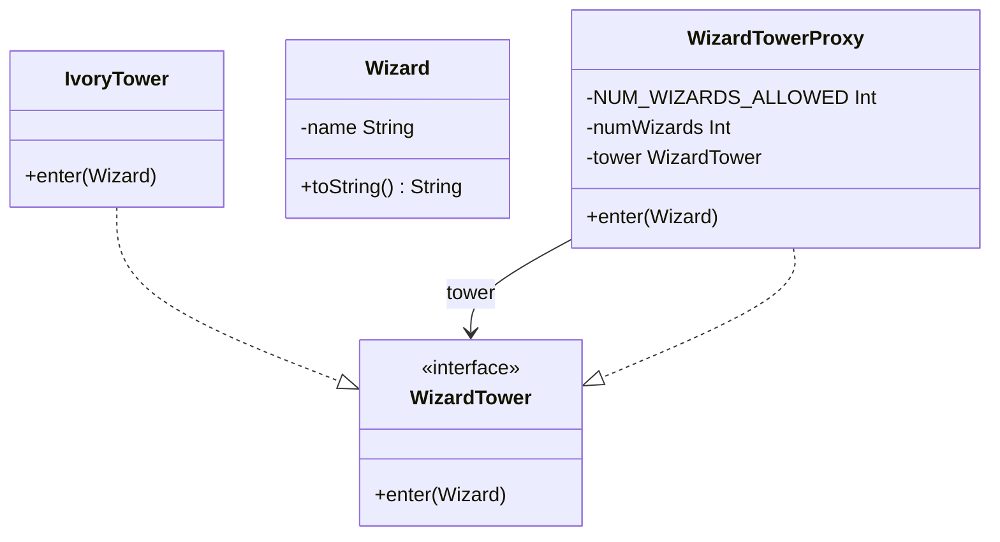

## Also known as

- Surrogate

## Intent

Provide a surrogate or placeholder for another object
to control access to it.

## Explanation

### Real-world example

> Imagine a tower where the local wizards go to study
> their spells. The ivory tower can only be accessed
> through a proxy which ensures that only the first
> three wizards can enter. Here the proxy represents
> the functionality of the tower and adds access
> control to it.

### In plain words

> Using the proxy pattern, a class represents the
> functionality of another class.

### Wikipedia says

> A proxy, in its most general form, is a class
> functioning as an interface to something else. A
> proxy is a wrapper or agent object that is being
> called by the client to access the real serving
> object behind the scenes. Use of the proxy can simply
> be forwarding to the real object, or can provide
> additional logic. In the proxy extra functionality
> can be provided, for example caching when operations
> on the real object are resource intensive, or checking
> preconditions before operations on the real object
> are invoked.


```mermaid
sequenceDiagram
    participant Client
    participant WizardTowerProxy
    participant IvoryTower

    Client->>WizardTowerProxy: enter(wizard)
    alt numWizards < limit
        WizardTowerProxy->>IvoryTower: enter(wizard)
        IvoryTower-->>WizardTowerProxy: done
        WizardTowerProxy-->>Client: wizard enters
    else limit reached
        WizardTowerProxy-->>Client: wizard denied
    end
```

### **Programmatic Example**

Taking our wizard tower example from above. Firstly
we have the `WizardTower` interface and the
`IvoryTower` class.

```kotlin
internal interface WizardTower {
    fun enter(wizard: Wizard)
}

internal class IvoryTower : WizardTower {
    override fun enter(wizard: Wizard) =
        logger.info("$wizard enters the tower.")
}
```

Then a simple `Wizard` class.

```kotlin
internal class Wizard(private val name: String) {
    override fun toString() = name
}
```

Then we have the `WizardTowerProxy` to add access
control to `WizardTower`.

```kotlin
internal class WizardTowerProxy(
    private val tower: WizardTower,
) : WizardTower {
    private var numWizards = 0

    override fun enter(wizard: Wizard) {
        if (numWizards < NUM_WIZARDS_ALLOWED) {
            tower.enter(wizard)
            numWizards++
        } else {
            logger.info(
                "$wizard is not allowed to enter!"
            )
        }
    }

    companion object {
        private const val NUM_WIZARDS_ALLOWED = 3
    }
}
```

And here is the tower entering scenario.

```kotlin
val proxy = WizardTowerProxy(IvoryTower())
proxy.enter(Wizard("Red wizard"))
proxy.enter(Wizard("White wizard"))
proxy.enter(Wizard("Black wizard"))
proxy.enter(Wizard("Green wizard"))
proxy.enter(Wizard("Brown wizard"))
```

Program output:

```text
Red wizard enters the tower.
White wizard enters the tower.
Black wizard enters the tower.
Green wizard is not allowed to enter!
Brown wizard is not allowed to enter!
```

## Class diagram


```mermaid
classDiagram
    class WizardTower {
        <<interface>>
        +enter(Wizard)
    }
    class IvoryTower {
        +enter(Wizard)
    }
    class Wizard {
        -name String
        +toString() String
    }
    class WizardTowerProxy {
        -NUM_WIZARDS_ALLOWED Int
        -numWizards Int
        -tower WizardTower
        +enter(Wizard)
    }
    WizardTowerProxy --> WizardTower : tower
    IvoryTower ..|> WizardTower
    WizardTowerProxy ..|> WizardTower
```

## Applicability

Use the Proxy pattern when:

- A remote proxy provides a local representative for
  an object in a different address space.
- A virtual proxy creates expensive objects on demand.
- A protection proxy controls access to the original
  object when objects should have different access
  rights.

## Consequences

Benefits:

- Controls access to the real object without clients
  knowing.
- Can add functionality (logging, caching, access
  control) transparently.

Trade-offs:

- Introduces an additional layer of indirection.
- May add latency to object access.

## Related Patterns

- [Decorator](../decorator/README.md): Decorator adds
  responsibilities to objects, while Proxy controls
  access to them.
- [Adapter](../adapter/README.md): Adapter provides a
  different interface, while Proxy provides the same
  interface with controlled access.

## Credits

- [Design Patterns: Elements of Reusable Object-Oriented
  Software](https://amzn.to/3w0pvKI)
- [Head First Design Patterns: Building Extensible and
  Maintainable Object-Oriented
  Software](https://amzn.to/49NGldq)
