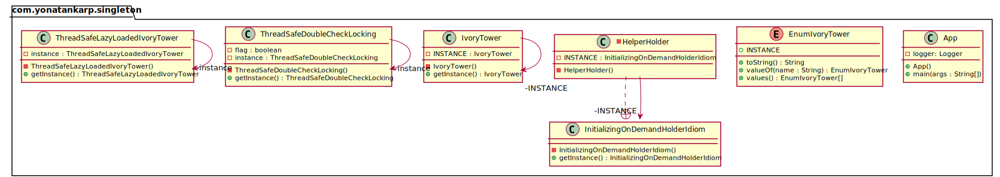

## Intent

Ensure a class only has one instance, and provide a global point of access to
it.

## Explanation

Real-world example

> There can only be one ivory tower where the wizards study their magic. The
> same enchanted ivory tower is always used by the wizards. The ivory tower
> here is a singleton.

In plain words

> Ensures that only one object of a particular class is ever created.

Wikipedia says

> In software engineering, the singleton pattern is a software design pattern
> that restricts the instantiation of a class to one object. This is useful
> when exactly one object is needed to coordinate actions across the system.

**Programmatic Example**

Kotlin makes it externally easy to create singletons by introducing the language
keyword `object`. By using this keyword we will get from the compiler an 
implementation of the Singleton pattern, that contains all of our requirements.

```kotlin
data object IvoryTower
```

One of the key differences between a `class` and a `object` is that the latter
does not allow constructor arguments. If your implementation needs
initialization for your Singleton (e.g. to load data) you can use an `init`
block.

```kotlin
data object IvoryTower {
  init {
    logger.info("Initializing Ivory Tower...")
  }
}
```

Note that if the Singleton object is never invoked, it won't run its
initialization block at all. This is called lazy initialization.

Then in order to use:

```kotlin
val ivoryTower1 = IvoryTower
val ivoryTower2 = IvoryTower
logger.info("ivoryTower1={}", ivoryTower1)
logger.info("ivoryTower2={}", ivoryTower2)
```

The output on console:

```console
09:21:31.107 [main] INFO Singlton -- Initializing Ivory Tower...
09:21:31.109 [main] INFO Singlton -- ivoryTower1=com.yonatankarp.singleton.IvoryTower@1207938418
09:21:31.111 [main] INFO Singlton -- ivoryTower2=com.yonatankarp.singleton.IvoryTower@1207938418
```

## Class diagram



## Applicability

Use the Singleton pattern when

* There must be exactly one instance of a class, and it must be accessible to
  clients from a well-known access point
* When the sole instance should be extensible by subclassing, and clients should
  be able to use an extended instance without modifying their code

Some typical use cases for the Singleton

* The logging class
* Managing a connection to a database
* File manager

## Consequences

* Violates Single Responsibility Principle (SRP) by controlling their creation
  and lifecycle.
* Encourages using a globally shared instance which prevents an object and
  resources used by this object from being deallocated.
* Creates tightly coupled code. The clients of the Singleton become difficult
  to test.
* Makes it almost impossible to subclass a Singleton.

## Credits

* [Kotlin Design Patterns and Best Practices](https://www.amazon.de/Kotlin-Design-Patterns-Best-Practices/dp/1801815720/ref=sr_1_1?keywords=kotlin+design+patterns+and+best+practices&qid=1694244553&sprefix=kotlin+design%2Caps%2C101&sr=8-1)

