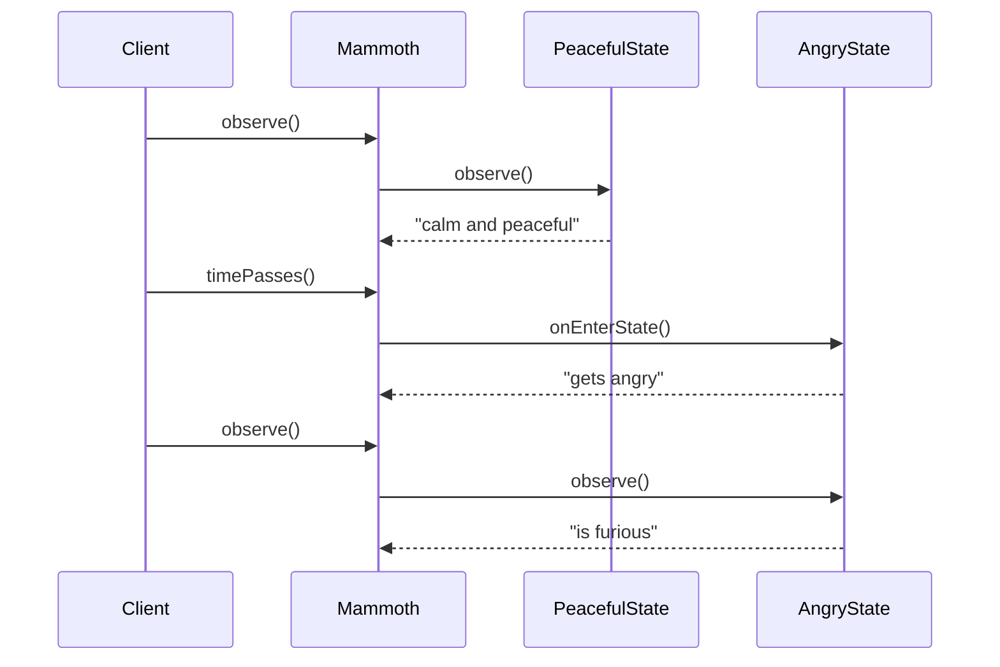
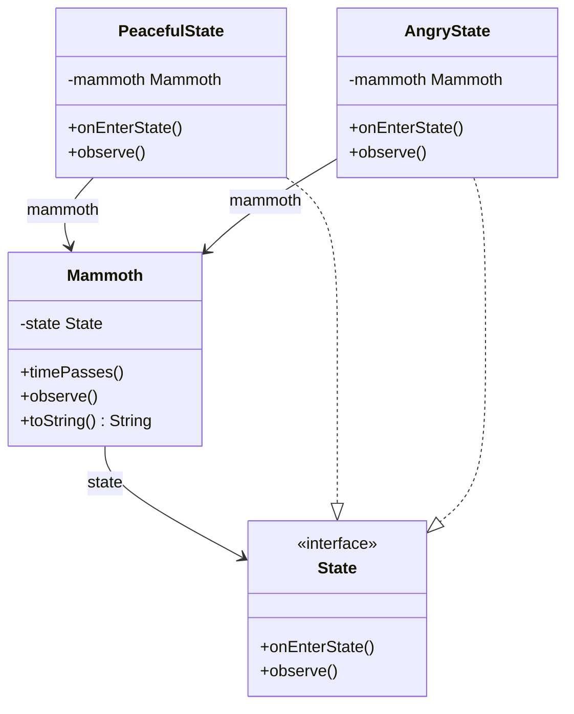

## Also known as

- Objects for States

## Intent

Allow an object to alter its behavior when its internal
state changes. The object will appear to change its
class.

## Explanation

### Real-world example

> Imagine a traffic light system at an intersection.
> The traffic light can be in one of three states:
> Green, Yellow, or Red. Depending on the current
> state, the traffic light's behavior changes. Each
> state is represented by a different object that
> defines what happens in that particular state. When
> the state changes, the traffic light updates its
> state object and changes its behavior accordingly.

### In plain words

> State pattern allows an object to change its behavior
> when its internal state changes.

### Wikipedia says

> The state pattern is a behavioral software design
> pattern that allows an object to alter its behavior
> when its internal state changes. This pattern is
> close to the concept of finite-state machines. The
> state pattern can be interpreted as a strategy
> pattern, which is able to switch a strategy through
> invocations of methods defined in the pattern's
> interface.



### **Programmatic Example**

In our example there is a mammoth with alternating
moods. First, here is the state interface and its
concrete implementations.

```kotlin
internal interface State {
    fun onEnterState()
    fun observe()
}

internal class PeacefulState(
    private val mammoth: Mammoth,
) : State {
    override fun observe() {
        logger.info("$mammoth is calm and peaceful.")
    }

    override fun onEnterState() {
        logger.info("$mammoth calms down.")
    }
}

internal class AngryState(
    private val mammoth: Mammoth,
) : State {
    override fun observe() {
        logger.info("$mammoth is furious!")
    }

    override fun onEnterState() {
        logger.info("$mammoth gets angry!")
    }
}
```

And here is the mammoth containing the state. The
state changes via calls to the `timePasses` method.

```kotlin
internal class Mammoth {
    private var state: State = PeacefulState(this)

    fun timePasses() {
        val newState = when (state) {
            is PeacefulState -> AngryState(this)
            else -> PeacefulState(this)
        }
        changeStateTo(newState)
    }

    fun observe() {
        state.observe()
    }

    private fun changeStateTo(newState: State) {
        state = newState
        state.onEnterState()
    }

    override fun toString() = "The mammoth"
}
```

Here is how the mammoth behaves over time.

```kotlin
val mammoth = Mammoth()
mammoth.observe()
mammoth.timePasses()
mammoth.observe()
mammoth.timePasses()
mammoth.observe()
```

Program output:

```text
The mammoth is calm and peaceful.
The mammoth gets angry!
The mammoth is furious!
The mammoth calms down.
The mammoth is calm and peaceful.
```

## Class diagram



## Applicability

Use the State pattern when:

- An object's behavior depends on its state, and it
  must change its behavior at runtime depending on
  that state.
- Operations have large, multipart conditional
  statements that depend on the object's state.

## Consequences

Benefits:

- Localizes state-specific behavior and partitions
  behavior for different states.
- Makes state transitions explicit.
- State objects can be shared if they carry no
  instance variables.

Trade-offs:

- Can result in a large number of state classes.
- Context class can become complicated with transition
  logic.

## Related Patterns

- [Strategy](../strategy/README.md): Both patterns
  have similar structures, but Strategy lets you choose
  an algorithm while State changes behavior based on
  internal state.
- [Flyweight](../flyweight/README.md): State objects
  may be shared between contexts using Flyweight.
- [Singleton](../singleton/README.md): State objects
  are often singletons.

## Credits

- [Design Patterns: Elements of Reusable Object-Oriented
  Software](https://amzn.to/3w0pvKI)
- [Head First Design Patterns: Building Extensible and
  Maintainable Object-Oriented
  Software](https://amzn.to/49NGldq)
- [Refactoring to Patterns](https://amzn.to/3VOO4F5)
