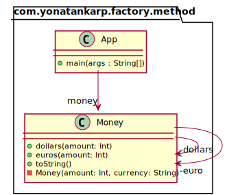

## Intent

Provide a centralized way to create objects, encapsulating the creation logic
and allowing for improved control and flexibility in object instantiation.

## Explanation

Real-world example

> Money representation object that can be instantiated for a specific currency,
> while encapsulating the construction details and providing a clean and
> descriptive API for clients.

In plain words

> It enables instantiation with different approaches depending on the
> circumstances.

Programmatic Example

Taking our server example from above. We can first define a Money class, and
implement the static factory methods on the companion object


```kotlin
class Money private constructor(
    val amount: Int,
    val currency: String
) {
    companion object {
        fun dollars(amount: Int) = Money(amount, "USD")
        fun euros(amount: Int) = Money(amount, "EUR")
    }
}
```

We can now use the Money class as follows:

```kotlin
val dollars = Money.dollars(5)
logger.info(dollars.toString())

val euros = Money.euros(5)
logger.info(euros.toString())
```

Program output

```shell
5 USD
5 EUR
```

## Class diagram



## Applicability

Use the Static Factory Method pattern when:

- Class creation is complex or unclear.
- Caching of class instance is required due to limited or heavy resources.
- Class have subclasses, but need to control their creation.

## Credits

* [Kotlin Design Patterns and Best Practices](https://www.amazon.de/Kotlin-Design-Patterns-Best-Practices/dp/1801815720/ref=sr_1_1?keywords=kotlin+design+patterns+and+best+practices&qid=1694244553&sprefix=kotlin+design%2Caps%2C101&sr=8-1)
