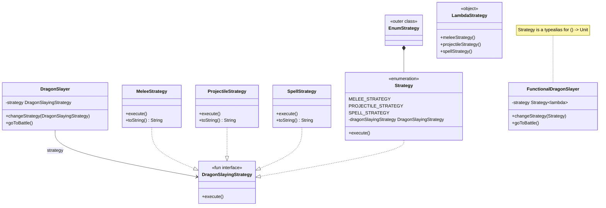

## Also known as

- Policy

## Intent

Define a family of algorithms, encapsulate each one,
and make them interchangeable. Strategy lets the
algorithm vary independently of the clients that use it.

## Explanation

### Real-world example

> Slaying dragons is a dangerous job. With experience,
> it becomes easier. Veteran dragonslayers have developed
> different fighting strategies against different types
> of dragons.

### In plain words

> Strategy pattern allows choosing the best-suited
> algorithm at runtime.

### Wikipedia says

> In computer programming, the strategy pattern (also
> known as the policy pattern) is a behavioral software
> design pattern that enables selecting an algorithm at
> runtime.

### **Programmatic Example**

Let's first introduce the dragon-slaying strategy
interface and its implementations.

```kotlin
fun interface DragonSlayingStrategy {
    fun execute()
}

internal class MeleeStrategy : DragonSlayingStrategy {
    override fun execute() {
        logger.info(
            "With your Excalibur you sever the dragon's head!"
        )
    }
}

internal class ProjectileStrategy : DragonSlayingStrategy {
    override fun execute() {
        logger.info(
            "You shoot the dragon with the magical crossbow"
                + " and it falls dead on the ground!"
        )
    }
}

internal class SpellStrategy : DragonSlayingStrategy {
    override fun execute() {
        logger.info(
            "You cast the spell of disintegration"
                + " and the dragon vaporizes in a pile of dust!"
        )
    }
}
```

And here is the mighty `DragonSlayer`, who can pick
his fighting strategy based on the opponent.

```kotlin
internal class DragonSlayer(
    private var strategy: DragonSlayingStrategy,
) {
    fun changeStrategy(strategy: DragonSlayingStrategy) {
        this.strategy = strategy
    }

    fun goToBattle() {
        strategy.execute()
    }
}
```

Finally, here's the dragonslayer in action.

```kotlin
logger.info(GREEN_DRAGON_SPOTTED)
val gofDragonSlayer = DragonSlayer(MeleeStrategy())
gofDragonSlayer.goToBattle()

logger.info(RED_DRAGON_EMERGES)
gofDragonSlayer.changeStrategy(ProjectileStrategy())
gofDragonSlayer.goToBattle()

logger.info(BLACK_DRAGON_LANDS)
gofDragonSlayer.changeStrategy(SpellStrategy())
gofDragonSlayer.goToBattle()
```

Program output:

```text
Green dragon spotted ahead!
With your Excalibur you sever the dragon's head!
Red dragon emerges.
You shoot the dragon with the magical crossbow and it falls dead on the ground!
Black dragon lands before you.
You cast the spell of disintegration and the dragon vaporizes in a pile of dust!
```

Because `DragonSlayingStrategy` is a `fun interface`,
strategies can also be expressed as lambdas:

```kotlin
val functionalDragonSlayer = DragonSlayer {
    logger.info(
        "With your Excalibur you sever the dragon's head!"
    )
}
functionalDragonSlayer.goToBattle()
```

An enum-based variant delegates each entry to a
`DragonSlayingStrategy` lambda:

```kotlin
internal class EnumStrategy {
    internal enum class Strategy(
        private val dragonSlayingStrategy: DragonSlayingStrategy,
    ) : DragonSlayingStrategy {
        MELEE_STRATEGY(
            DragonSlayingStrategy {
                logger.info(
                    "With your Excalibur you sever"
                        + " the dragon's head!"
                )
            }
        ),
        PROJECTILE_STRATEGY(
            DragonSlayingStrategy {
                logger.info(
                    "You shoot the dragon with the magical"
                        + " crossbow and it falls dead"
                        + " on the ground!"
                )
            }
        ),
        SPELL_STRATEGY(
            DragonSlayingStrategy {
                logger.info(
                    "You cast the spell of disintegration"
                        + " and the dragon vaporizes"
                        + " in a pile of dust!"
                )
            }
        ),
        ;

        override fun execute() {
            dragonSlayingStrategy.execute()
        }
    }
}
```

A fully functional approach uses a type alias and
method references:

```kotlin
internal typealias Strategy = () -> Unit

internal class FunctionalDragonSlayer(
    private var strategy: Strategy,
) {
    fun changeStrategy(strategy: Strategy) {
        this.strategy = strategy
    }

    fun goToBattle() {
        strategy()
    }
}

internal object LambdaStrategy {
    fun meleeStrategy() =
        logger.info(
            "With your Excalibur you sever the dragon's head!"
        )

    fun projectileStrategy() =
        logger.info(
            "You shoot the dragon with the magical crossbow"
                + " and it falls dead on the ground!"
        )

    fun spellStrategy() =
        logger.info(
            "You cast the spell of disintegration"
                + " and the dragon vaporizes in a pile of dust!"
        )
}
```

```kotlin
val lambdaDragonSlayer =
    FunctionalDragonSlayer(LambdaStrategy::meleeStrategy)
lambdaDragonSlayer.goToBattle()

lambdaDragonSlayer.changeStrategy(
    LambdaStrategy::projectileStrategy
)
lambdaDragonSlayer.goToBattle()
```

The program output is the same as the above.

## Class diagram



## Applicability

Use the Strategy pattern when:

- You need to use different variants of an algorithm
  within an object and want to switch algorithms at
  runtime.
- Many related classes differ only in their behavior.
  Strategies provide a way to configure a class with
  one of many behaviors.
- An algorithm uses data that clients shouldn't know
  about. Use the Strategy pattern to avoid exposing
  complex algorithm-specific data structures.
- A class defines many behaviors, and these appear as
  multiple conditional statements in its operations.
  Instead of many conditionals, move the related
  conditional branches into their own Strategy class.

## Consequences

Benefits:

- Families of related algorithms are reused.
- An alternative to subclassing for extending behavior.
- Avoids conditional statements for selecting desired
  behavior.
- Allows clients to choose algorithm implementation.

Trade-offs:

- Clients must be aware of different strategies.
- Increases the number of objects.

## Related Patterns

- [Decorator](../decorator/README.md): Enhances an
  object without changing its interface but is more
  concerned with responsibilities than algorithms.
- [State](../state/README.md): Similar in structure
  but used to represent state-dependent behavior rather
  than interchangeable algorithms.

## Credits

- [Design Patterns: Elements of Reusable Object-Oriented
  Software](https://amzn.to/3w0pvKI)
- [Functional Programming in
  Java](https://amzn.to/3JUIc5Q)
- [Head First Design Patterns: Building Extensible and
  Maintainable Object-Oriented
  Software](https://amzn.to/49NGldq)
- [Refactoring to Patterns](https://amzn.to/3VOO4F5)
