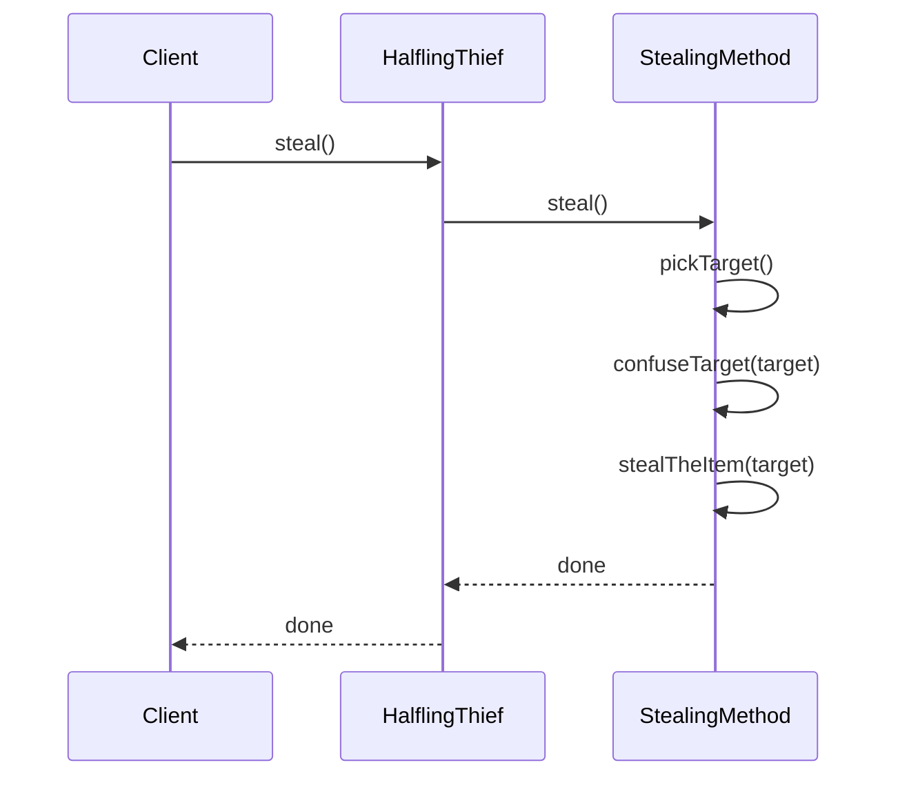
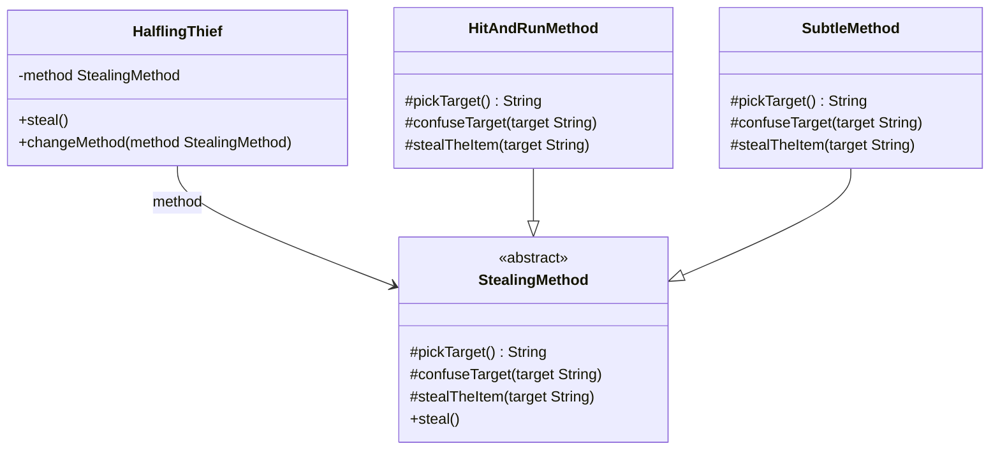

## Intent

Define the skeleton of an algorithm in an operation,
deferring some steps to subclasses. Template Method lets
subclasses redefine certain steps of an algorithm without
changing the algorithm's structure.

## Explanation

### Real-world example

> A real-world analogy for the Template Method pattern can
> be seen in the preparation of a cup of tea or coffee.
> The overall process is the same: boil water, brew the
> beverage, pour into a cup, and add condiments. However,
> the specific brewing step differs. For tea you steep
> leaves in hot water, while for coffee you brew ground
> beans. The Template Method encapsulates the invariant
> steps in a base class while allowing subclasses to
> define the brewing step.

### In plain words

> Template Method outlines the core steps in the parent
> class, allowing child classes to tailor the detailed
> implementations.

### Wikipedia says

> In object-oriented programming, the template method is
> one of the behavioral design patterns identified by
> Gamma et al. in the book Design Patterns. The template
> method is a method in a superclass, usually an abstract
> superclass, and defines the skeleton of an operation in
> terms of a number of high-level steps. These steps are
> themselves implemented by additional helper methods in
> the same class as the template method.

### Sequence diagram



### **Programmatic Example**

The general steps in stealing an item are always the
same. First you pick the target, then you confuse them,
and finally you steal the item. However, there are many
ways to implement these steps.

Let's first introduce the template method class
`StealingMethod` along with its concrete implementations
`SubtleMethod` and `HitAndRunMethod`. Because Kotlin
methods are final by default, the template method
`steal()` cannot be overridden by subclasses.

```kotlin
abstract class StealingMethod {

    protected abstract fun pickTarget(): String
    protected abstract fun confuseTarget(target: String)
    protected abstract fun stealTheItem(target: String)

    fun steal() {
        val target = pickTarget()
        logger.info("The target has been chosen as $target.")
        confuseTarget(target)
        stealTheItem(target)
    }
}
```

```kotlin
internal class SubtleMethod : StealingMethod() {
  private val logger = LoggerFactory.getLogger(javaClass)

  override fun pickTarget(): String = "shop keeper"

  override fun confuseTarget(target: String) {
    logger.info("Approach the $target with tears running and hug him!")
  }

  override fun stealTheItem(target: String) {
    logger.info("While in close contact grab the $target's wallet.")
  }
}
```

```kotlin
internal class HitAndRunMethod : StealingMethod() {

    override fun pickTarget(): String = "old goblin woman"

    override fun confuseTarget(target: String) {
        logger.info("Approach the $target from behind.")
    }

    override fun stealTheItem(target: String) {
        logger.info("Grab the handbag and run away fast!")
    }
}
```

Here is the `HalflingThief` class that uses a
`StealingMethod`.

```kotlin
internal class HalflingThief(
    private var method: StealingMethod,
) {
    fun steal() {
        method.steal()
    }

    fun changeMethod(method: StealingMethod) {
        this.method = method
    }
}
```

And finally, here is the halfling thief in action.

```kotlin
val thief = HalflingThief(HitAndRunMethod())
thief.steal()
thief.changeMethod(SubtleMethod())
thief.steal()
```

Program output:

```text
The target has been chosen as old goblin woman.
Approach the old goblin woman from behind.
Grab the handbag and run away fast!
The target has been chosen as shop keeper.
Approach the shop keeper with tears running and hug him!
While in close contact grab the shop keeper's wallet.
```

## Class diagram



## Applicability

Use the Template Method pattern when:

- You want to implement the invariant parts of an
  algorithm once and leave it up to subclasses to
  implement the behaviour that can vary.
- Common behaviour among subclasses should be factored
  and localised in a common class to avoid code
  duplication.
- You want to control subclass extensions by defining
  a template method that calls hook operations at
  specific points, permitting extensions only at those
  points.

## Consequences

Benefits:

- Promotes code reuse by defining invariant parts of an
  algorithm in a base class.
- Simplifies code maintenance by encapsulating common
  behaviour in one place.
- Enhances flexibility by allowing subclasses to override
  specific steps of an algorithm.

Trade-offs:

- Can lead to an increase in the number of classes,
  making the system more complex.
- Requires careful design to ensure that the steps
  exposed to subclasses are useful and meaningful.

## Credits

- [Design Patterns: Elements of Reusable
  Object-Oriented Software](https://amzn.to/3w0pvKI)
- [Effective Java](https://amzn.to/4cGk2Jz)
- [Head First Design Patterns: Building Extensible and
  Maintainable Object-Oriented
  Software](https://amzn.to/49NGldq)
- [Refactoring to Patterns](https://amzn.to/3VOO4F5)
