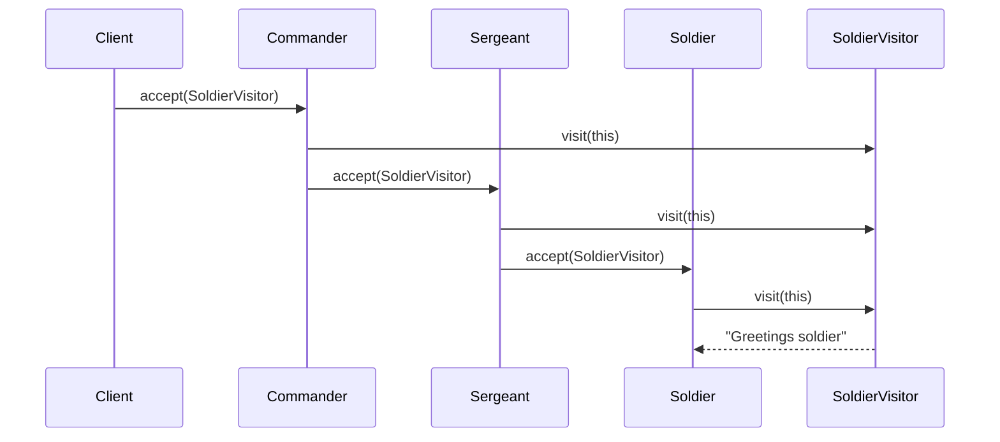
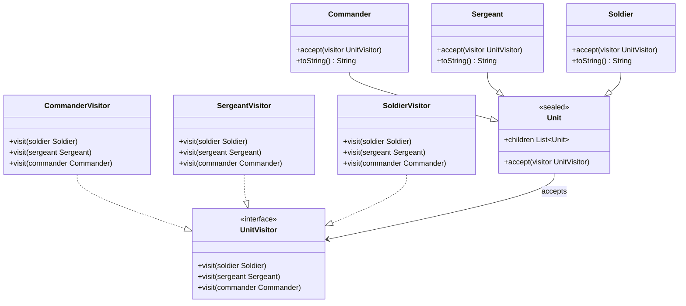

## Intent

Represent an operation to be performed on the elements
of an object structure. Visitor lets you define a new
operation without changing the classes of the elements
on which it operates.

## Explanation

### Real-world example

> Imagine a museum where visitors can take guided tours
> to learn about different types of exhibits such as
> paintings, sculptures, and historical artifacts. Each
> exhibit type requires a different explanation, which
> is provided by specialized tour guides.
>
> The exhibits are like the elements in the Visitor
> pattern, and the tour guides are like the visitors.
> New guides with new types of tours can be added
> without modifying the exhibits themselves. Each guide
> implements a specific way to interact with the
> exhibits, separating the operations from the objects
> they operate on.

### In plain words

> The Visitor pattern defines operations that can be
> performed on nodes of a data structure without
> changing the node classes.

### Wikipedia says

> In object-oriented programming and software
> engineering, the visitor design pattern is a way of
> separating an algorithm from an object structure on
> which it operates. A practical result of this
> separation is the ability to add new operations to
> existing object structures without modifying the
> structures.

### Sequence diagram



### **Programmatic Example**

Consider a tree structure with army units. A commander
has two sergeants under it, and each sergeant has three
soldiers under them. Given that the hierarchy
implements the visitor pattern, we can easily create
new objects that interact with the commander, sergeants,
soldiers, or all of them.

First, we have the `Unit` sealed class hierarchy and
the `UnitVisitor` interface.

```kotlin
sealed class Unit(
    val children: List<Unit> = emptyList(),
) {
    open fun accept(visitor: UnitVisitor) {
        children.forEach { it.accept(visitor) }
    }
}

interface UnitVisitor {
    fun visit(soldier: Soldier)
    fun visit(sergeant: Sergeant)
    fun visit(commander: Commander)
}
```

Then we have the concrete units `Commander`, `Sergeant`,
and `Soldier`.

```kotlin
internal class Commander(
    children: List<Unit> = emptyList(),
) : Unit(children) {
    override fun accept(visitor: UnitVisitor) {
        visitor.visit(this)
        super.accept(visitor)
    }

    override fun toString() = "commander"
}

internal class Sergeant(
    children: List<Unit> = emptyList(),
) : Unit(children) {
    override fun accept(visitor: UnitVisitor) {
        visitor.visit(this)
        super.accept(visitor)
    }

    override fun toString() = "sergeant"
}

internal class Soldier(
    children: List<Unit> = emptyList(),
) : Unit(children) {
    override fun accept(visitor: UnitVisitor) {
        visitor.visit(this)
        super.accept(visitor)
    }

    override fun toString() = "soldier"
}
```

Here are the concrete visitors `CommanderVisitor`,
`SergeantVisitor`, and `SoldierVisitor`.

```kotlin
internal class CommanderVisitor : UnitVisitor {
    override fun visit(soldier: Soldier) {}
    override fun visit(sergeant: Sergeant) {}
    override fun visit(commander: Commander) {
        logger.info("Good to see you {}", commander)
    }
}

internal class SergeantVisitor : UnitVisitor {
    override fun visit(soldier: Soldier) {}
    override fun visit(sergeant: Sergeant) {
        logger.info("Hello {}", sergeant)
    }
    override fun visit(commander: Commander) {}
}

internal class SoldierVisitor : UnitVisitor {
    override fun visit(soldier: Soldier) {
        logger.info("Greetings {}", soldier)
    }
    override fun visit(sergeant: Sergeant) {}
    override fun visit(commander: Commander) {}
}
```

Finally, we can show the power of visitors in action.

```kotlin
val commander = Commander(
    listOf(
        Sergeant(listOf(Soldier(), Soldier(), Soldier())),
        Sergeant(listOf(Soldier(), Soldier(), Soldier())),
    ),
)

commander.accept(SoldierVisitor())
commander.accept(SergeantVisitor())
commander.accept(CommanderVisitor())
```

Program output:

```text
Greetings soldier
Greetings soldier
Greetings soldier
Greetings soldier
Greetings soldier
Greetings soldier
Hello sergeant
Hello sergeant
Good to see you commander
```

## Class diagram



## Applicability

Use the Visitor pattern when:

- You need to perform operations across a group of
  similar objects without modifying their classes.
- The class structure is stable, but you need to
  perform new operations on the structure without
  changing it.
- The set of classes is fixed and only the operations
  need to be extended.

## Consequences

Benefits:

- Adding a new operation is straightforward because
  you can add a new visitor without changing existing
  code.
- Single Responsibility Principle: the Visitor pattern
  allows you to move related behavior into one class.
- Open/Closed Principle: elements stay closed to
  modification while visitors are open to extension.

Trade-offs:

- Adding new element classes requires changing both
  the visitor interface and all of its concrete
  visitors.
- In complex systems, this pattern can introduce
  circular dependencies between visitor and element
  classes.
- Visitor pattern requires that element classes expose
  enough details to allow the visitor to do its job,
  potentially breaking encapsulation.

## Related Patterns

- [Composite](../composite/README.md): The Visitor
  pattern is often used in conjunction with the
  Composite pattern, where the visitor can perform
  operations over a composite structure.
- [Strategy](../strategy/README.md): Visitor can be
  considered a way of making strategies work on
  objects that they were not designed to operate on.

## Credits

- [Design Patterns: Elements of Reusable
  Object-Oriented Software](https://amzn.to/3w0pvKI)
- [Head First Design Patterns: Building Extensible
  and Maintainable Object-Oriented
  Software](https://amzn.to/49NGldq)
- [Refactoring to Patterns](https://amzn.to/3VOO4F5)
